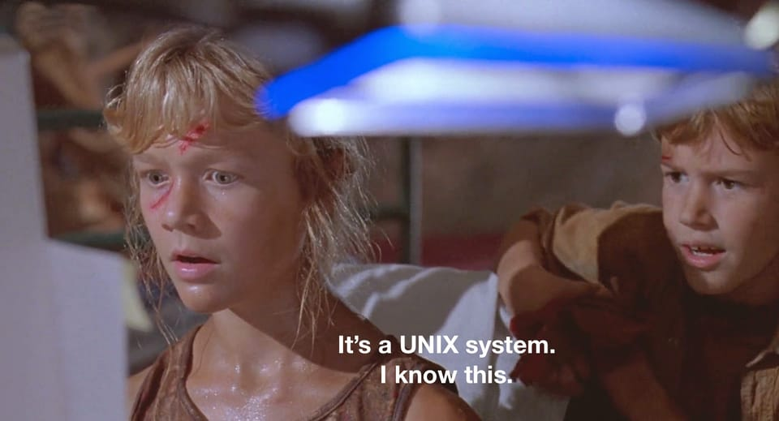
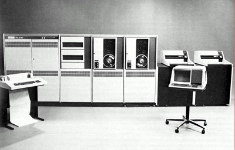

+++
title = "Un pan de l'histoire: 4.3 BSD sur VAX 11/780 avec SIMH"
tags = ["unix", "bsd"]
date = "2025-05-28"
+++

Ça fait un bout de temps que j'avais envie d'installer des vieilles versions d'Unix car c'est quand même de là que démarre toute l'informatique moderne, les concepts sous-jacents des systèmes d'exploitation et l'essor même d'Internet (DARPA, TCP/IP, ...).

Entre temps je suis tombé sur des anciennes [vidéos Youtube de Emile `iMil' Heitor](https://www.youtube.com/@emileimilheitor3456) sur le monde BSD, Unix qui sont super intéressantes.

Et donc je me suis lancé dans l'aventure: quoi de mieux pour cela que d'installer et faire tourner un **4.3 BSD**, dérivé d'Unix, un sacré morceau d'histoire!

4.3 BSD est d'ailleurs cité comme étant le _[The Greatest Software Ever Written](https://www.informationweek.com/software-services/what-s-the-greatest-software-ever-written-)_

> The single Greatest Piece of Software Ever, with the broadest impact on the world, was BSD 4.3. Other Unixes were bigger commercial successes. But as the cumulative accomplishment of the BSD systems, 4.3 represented an
> unmatched peak of innovation. BSD 4.3 represents the single biggest theoretical undergirder of the Internet. Moreover, the passion that surrounds Linux and open source code is a direct offshoot of the ideas that created BSD:
> a love for the power of computing and a belief that it should be a freely available extension of man's intellectual powers--a force that changes his place in the universe.

## Installation et configuration

Je ne vais pas rentrer dans le détail de l'installation car j'ai suivi à lettre ce guide: <https://gunkies.org/wiki/Installing_4.3_BSD_on_SIMH> et cela a parfaitement fonctionné  du 1er coup.

En prérequis, j'ai juste installé [Open SimH](https://opensimh.org/) (sur une VM NetBSD) ainsi que l'interpréteur Perl:

- [Open SimH - Bringing Antiquities back to life](https://opensimh.org/) est un simulateur pour les vieux ordinateurs des années 60/70/80 (VAX, PDP11, IBM 1401, Altair, etc...)
- Perl: on en a besoin pour lancer un [script perl](https://gunkies.org/wiki/Mkdisttap.pl) qui créera des images de bande de disques nécessaires à SIMH

Pour installer ces packages, on peut utiliser au choix **pkg_add** ou bien **pkgin** (ce dernier me concernant, il installera également les dépendances).

Les packages que j'ai installé sont les suivants:

- perl-5.40.2
- open-simh-4.1.0.20250117nb2

## 1er démarrage du système 4.3 BSD

Après avoir suivi le tutoriel et initialisé le système en restorant des dumps, il ne reste plus qu'à démarrer notre illustre **4.3 BSD** depuis la ligne de commande:

```sh
simh-vax780 boot.ini
```

Et là on ouvre grand les yeux et on retourne près de 40 ans en arrière.

Rien que ça!

```sh
VAX 11/780 simulator Open SIMH V4.1-0 Current        simh git commit id: feb155fb        Build: Unsupported=include+lib
/home/vince/simh/43bsd/boot.ini-11> att ts 43.tap
%SIM-INFO: TS: Tape Image '43.tap' scanned as SIMH format
loading ra(0,0)boot
Boot
: ra(0,0)vmunix
279844+80872+100324 start 0x12f8
4.3 BSD UNIX #1: Fri Jun  6 19:55:29 PDT 1986
    karels@monet.Berkeley.EDU:/usr/src/sys/GENERIC
real mem  = 8388608
SYSPTSIZE limits number of buffers to 140
avail mem = 7187456
using 140 buffers containing 524288 bytes of memory
mcr0 at tr1
mcr1 at tr2
uba0 at tr3
hk0 at uba0 csr 177440 vec 210, ipl 15
rk0 at hk0 slave 0
rk1 at hk0 slave 1
rk2 at hk0 slave 2
rk3 at hk0 slave 3
uda0 at uba0 csr 172150 vec 774, ipl 15
ra0 at uda0 slave 0
zs0 at uba0 csr 172520 vec 224, ipl 15
ts0 at zs0 slave 0
dz0 at uba0 csr 160100 vec 300, ipl 15
dz1 at uba0 csr 160110 vec 310, ipl 15
dz2 at uba0 csr 160120 vec 320, ipl 15
dz3 at uba0 csr 160130 vec 330, ipl 15
Changing root device to ra0a
Automatic reboot in progress...
Wed May 28 07:21:16 PDT 1986
/dev/ra0a: 334 files, 4221 used, 3208 free (8 frags, 400 blocks, 0.1% fragmentation)
/dev/rra0h: 4651 files, 35659 used, 102925 free (453 frags, 12809 blocks, 0.3% fragmentation)
/dev/rra0g: 2 files, 9 used, 245216 free (16 frags, 30650 blocks, 0.0% fragmentation)
Wed May 28 07:21:18 PDT 1986
checking quotas: done.
starting system logger
checking for core dump... /a/crash: No such file or directory
May 28 07:21:18 myname savecore: /a/crash: No such file or directory

starting local daemons:May 28 07:21:19 myname named[53]: /etc/named.boot: No such file or directory
 named sendmail.
preserving editor files
clearing /tmp
standard daemons: update         cronWed May 28 07:21:19 PDT 1986
 accounting.
starting network daemons: rwhod inetd printer.
Wed May 28 07:21:19 PDT 1986
May 28 07:21:21 myname getty: /dev/tty07: No such file or directory
May 28 07:21:21 myname getty: /dev/tty05: No such file or directory
May 28 07:21:21 myname getty: /dev/tty04: No such file or directory
May 28 07:21:21 myname getty: /dev/tty01: No such file or directory
May 28 07:21:21 myname getty: /dev/tty02: No such file or directory
May 28 07:21:21 myname getty: /dev/tty03: No such file or directory


4.3 BSD UNIX (myname.my.domain) (console)

login: May 28 07:21:21 myname getty: /dev/tty06: No such file or directory
May 28 07:21:21 myname getty: /dev/tty00: No such file or directory
root
Last login: Wed May 28 04:22:35 on console
May 28 07:22:06 myname login: ROOT LOGIN console
4.3 BSD UNIX #1: Fri Jun  6 19:55:29 PDT 1986

Would you like to play a game?

Don't login as root, use su
myname# date
Wed May 28 07:22:31 PDT 1986
```

La dinguerie: nous voici revenus le 28 Mai 1986 avec 4.3 BSD et une implémentation de la pile TCP/IP!

Rien que ça!



## On fait un tour rapide

On tape quelques commandes pour en savoir un peu plus.

```sh
myname# date
Wed May 28 08:20:04 PDT 1986
```

Tiens c'est marrant, on a le **owner** mais pas le **group** sur la sortie standard de la commande **ls**.

```sh
myname# ls -l /
total 959
-rw-r--r--  1 root          995 Sep 16  1985 .cshrc
-rw-r--r--  1 root          137 Jun 23  1985 .login
-rw-r--r--  1 root          121 Jun 23  1985 .profile
drwxrwxr-x  2 root          512 Jun 23  1985 a/
drwxr-xr-x  2 root         1024 Jun  6  1986 bin/
-rw-r--r--  1 root        27648 Jun  6  1986 boot
-rwxrwxr-x  1 root        24184 Jun  6  1986 copy*
drwxrwxr-x  2 root         2048 May 28 08:18 dev/
-rwxrwxr-x  1 root        16000 Jun  6  1986 drtest*
drwxrwxr-x  2 root         2560 May 28 08:18 etc/
-rwxrwxr-x  1 root        21104 Jun  6  1986 format*
-rwxr-xr-x  2 root       407552 Jun  6  1986 genvmunix*
drwxr-xr-x  2 root          512 Jun  5  1986 lib/
drwxr-xr-x  2 root         8192 Feb  1 21:42 lost+found/
drwxr-xr-x  3 root          512 May 28 03:35 mnt/
-r--r--r--  1 root        11264 Jun  6  1986 pcs750.bin
-rw-r--r--  1 root        20740 May 28 03:27 restoresymtable
lrwxr-xr-x  1 root            8 May 28 03:34 sys@ -> /usr/sys
drwxrwxrwt  2 root          512 May 28 08:18 tmp/
drwxr-xr-x 23 root          512 May 28 03:32 usr/
-rwxr-xr-x  2 root       407552 Jun  6  1986 vmunix*
```

Sinon on reconnaît une arborescence Unix à-peu-près standard: /bin, /usr, /lib, /mnt, etc...

La commande uname n'existait pas encore à cette époque:

```sh
myname# uname
uname: Command not found.
```

Allons voir du côté du fichier _/etc/passwd_:

```sh
myname# cat /etc/passwd
root::0:10:Charlie &:/:/bin/csh
toor::0:10:Bourne-again Superuser:/:
daemon:*:1:31:The devil himself:/:
operator::2:28:System &:/usr/guest/operator:/bin/csh
uucp::66:1:UNIX-to-UNIX Copy:/usr/spool/uucppublic:/usr/lib/uucp/uucico
nobody:*:32767:9999:Unprivileged user:/nonexistent:/dev/null
notes:*:5:31:Notesfile maintainer:/usr/spool/notes:/bin/csh
karels:QOrZFUGpxDUlo:6:10:Mike &:/usr/guest/karels:/bin/csh
sam:Yd6H6R7ejeIP2:7:10:& Leffler:/usr/guest/sam:/bin/csh
wnj:ZDjXDBwXle2gc:8:10:Bill Joy:/usr/guest/wnj:/bin/csh
mckusick:6l7zMyp8dZLZU:201:10:Kirk &:/usr/guest/mckusick:/bin/csh
dmr:AiInt5qKdjmHs:10:31:Dennis Ritchie:/usr/guest/dmr:
ken:sq5UDrPlKj1nA:11:31:& Thompson:/usr/guest/ken:
shannon:NYqgD2jjeuozk:12:31:Bill &:/usr/guest/shannon:/bin/csh
peter:y5G5mbEX4HhOY:13:31:peter b. kessler:/usr/guest/peter:/bin/csh
kre:vpyVBWM3ARc0.:14:31:Robert Elz:/usr/guest/kre:/bin/csh
ingres:64c19dZOElp9I:267:74:& Group:/usr/ingres:/bin/csh
ralph:s.EZm/wQTqbro:16:31:& Campbell:/usr/guest/ralph:/bin/csh
linton:1/WWIjn5Sd8qM:19:31:Mark &:/usr/guest/linton:/bin/csh
sklower:p0taJy06Qye1g:20:31:Keith &:/usr/guest/sklower:/bin/csh
eric:PcEfNNJN.UHpM:22:31:& Allman:/usr/guest/eric:/usr/new/csh
rrh:lj1vXnxTAPnDc:23:31:Robert R. Henry:/usr/guest/rrh:/bin/csh
arnold:5vTJh54EqjZsU:25:31:Kenneth C R C &:/usr/guest/arnold:/bin/csh
jkf:G6cip/I8C792U:26:31:John Foderaro:/usr/guest/jkf:/bin/csh
ghg:FA/4weg1/wy2c:32:31:George Goble:/usr/guest/ghg:/bin/csh
bloom:n0QtVD80F82MM:33:10:Jim &:/usr/guest/bloom:/bin/csh
miriam:hnZ1ZK5H2qapE:36:10:& Amos:/usr/guest/miriam:/bin/csh
kjd:ogYPQZGnihezk:37:10:Kevin Dunlap:/usr/guest/kjd:/bin/csh
rwh:LReNSwE9gQF7w:38:10:Robert W. Henry:/usr/guest/rwh:/bin/csh
tef:OciUqGHcs9YOw:39:31:Thomas Ferrin:/usr/guest/tef:/bin/csh
van:STpwu/Ggmk78A:40:31:& Jacobson:/usr/guest/van:/bin/csh
rich:uxxJaRZvgyiPg:41:31:& Hyde:/usr/guest/rich:/bin/csh
jim:.6s.pzMqjyMrU:42:10:& McKie:/usr/guest/jim:/bin/csh
donn:5cJ5uHclmVJKA:43:31:& Seeley:/usr/guest/donn:/bin/csh
falcon:.MTZpW8TC8tqs:32766:31:Prof. Steven &:/usr/games:/usr/games/wargames
```

On reconnaît bien quelques sommités dans ce fichier, je vous laisse les retrouver!

On va faire un tour rapide dans les sources du système:

```sh
myname# cd /usr/sys/sys
myname# ls
Makefile         quota_kern.c     tty_pty.c        uipc_proto.c
init_main.c      quota_subr.c     tty_subr.c       uipc_socket.c
init_sysent.c    quota_sys.c      tty_tb.c         uipc_socket2.c
kern_acct.c      quota_ufs.c      tty_tty.c        uipc_syscalls.c
kern_clock.c     subr_log.c       ufs_alloc.c      uipc_usrreq.c
kern_descrip.c   subr_mcount.c    ufs_bio.c        vm_drum.c
kern_exec.c      subr_prf.c       ufs_bmap.c       vm_mem.c
kern_exit.c      subr_rmap.c      ufs_dsort.c      vm_mon.c
kern_fork.c      subr_xxx.c       ufs_fio.c        vm_page.c
kern_mman.c      sys_generic.c    ufs_inode.c      vm_proc.c
kern_proc.c      sys_inode.c      ufs_mount.c      vm_pt.c
kern_prot.c      sys_process.c    ufs_namei.c      vm_sched.c
kern_resource.c  sys_socket.c     ufs_subr.c       vm_subr.c
kern_sig.c       syscalls.c       ufs_syscalls.c   vm_sw.c
kern_subr.c      tags             ufs_tables.c     vm_swap.c
kern_synch.c     tty.c            ufs_xxx.c        vm_swp.c
kern_time.c      tty_bk.c         uipc_domain.c    vm_text.c
kern_xxx.c       tty_conf.c       uipc_mbuf.c
myname#
```

C'est génial de voir tout ça! Ces vestiges du passé qu'on retrouve toujours dans de très nombreux devices qu'on utilise au quotidien (ordinateur, téléphone, IoT, embarqué, consoles de jeux, etc...).

L'implémentation d'un fork:

```sh
myname# more kern_fork.c
/*
 * Copyright (c) 1982, 1986 Regents of the University of California.
 * All rights reserved.  The Berkeley software License Agreement
 * specifies the terms and conditions for redistribution.
 *
 *      @(#)kern_fork.c 7.1 (Berkeley) 6/5/86
 */

#include "../machine/reg.h"
#include "../machine/pte.h"
#include "../machine/psl.h"

#include "param.h"
#include "systm.h"
#include "map.h"
#include "dir.h"
#include "user.h"
#include "kernel.h"
#include "proc.h"
#include "inode.h"
#include "seg.h"
#include "vm.h"
#include "text.h"
#include "file.h"
#include "acct.h"
#include "quota.h"

/*
 * fork system call.
 */
fork()
{

        u.u_cdmap = zdmap;
        u.u_csmap = zdmap;
        if (swpexpand(u.u_dsize, u.u_ssize, &u.u_cdmap, &u.u_csmap) == 0) {
                u.u_r.r_val2 = 0;
                return;
        }
        fork1(0);
}

vfork()
{

        fork1(1);
}

fork1(isvfork)
        int isvfork;
{
        register struct proc *p1, *p2;
        register a;

        a = 0;
        if (u.u_uid != 0) {
                for (p1 = allproc; p1; p1 = p1->p_nxt)
                        if (p1->p_uid == u.u_uid)
                                a++;
                for (p1 = zombproc; p1; p1 = p1->p_nxt)
                        if (p1->p_uid == u.u_uid)
                                a++;
        }
        /*
         * Disallow if
         *  No processes at all;
         *  not su and too many procs owned; or
         *  not su and would take last slot.
         */
        p2 = freeproc;
        if (p2==NULL)
                tablefull("proc");
        if (p2==NULL || (u.u_uid!=0 && (p2->p_nxt == NULL || a>MAXUPRC))) {
                u.u_error = EAGAIN;
                if (!isvfork) {
                        (void) vsexpand((size_t)0, &u.u_cdmap, 1);
                        (void) vsexpand((size_t)0, &u.u_csmap, 1);
                }
                goto out;
        }
        p1 = u.u_procp;
        if (newproc(isvfork)) {
                u.u_r.r_val1 = p1->p_pid;
                u.u_r.r_val2 = 1;  /* child */
                u.u_start = time;
                u.u_acflag = AFORK;
                return;
        }
        u.u_r.r_val1 = p2->p_pid;

out:
        u.u_r.r_val2 = 0;
}

/*
 * Create a new process-- the internal version of
 * sys fork.
 * It returns 1 in the new process, 0 in the old.
 */
newproc(isvfork)
        int isvfork;
{
        register struct proc *rpp, *rip;
        register int n;
        register struct file *fp;
        static int pidchecked = 0;

        /*
         * First, just locate a slot for a process
         * and copy the useful info from this process into it.
...
...
...         
```

## Last but not least: la pile TCP/IP

Enorme ça:

```sh
cd /usr/sys/netinet
myname# ls -l
total 197
-r--r--r--  1 root          984 Jun  5  1986 icmp_var.h
-r--r--r--  1 root        13637 Jun  5  1986 if_ether.c
-r--r--r--  1 root         2286 Jun  5  1986 if_ether.h
-r--r--r--  1 root         9852 Jun  5  1986 in.c
-r--r--r--  1 root         2801 Jun  5  1986 in.h
-r--r--r--  1 root         9122 Jun  5  1986 in_pcb.c
-r--r--r--  1 root         1262 Jun  5  1986 in_pcb.h
-r--r--r--  1 root         2921 Jun  5  1986 in_proto.c
-r--r--r--  1 root          832 Jun  5  1986 in_systm.h
-r--r--r--  1 root         1456 Jun  5  1986 in_var.h
-r--r--r--  1 root         3150 Jun  5  1986 ip.h
-r--r--r--  1 root        10110 Jun  5  1986 ip_icmp.c
-r--r--r--  1 root         3427 Jun  5  1986 ip_icmp.h
-r--r--r--  1 root        22317 Jun  5  1986 ip_input.c
-r--r--r--  1 root        10531 Jun  5  1986 ip_output.c
-r--r--r--  1 root         2954 Jun  5  1986 ip_var.h
-r--r--r--  1 root         3224 Jun  5  1986 raw_ip.c
lrwxr-xr-x  1 root           11 May 28 03:33 tags@ -> ../sys/tags
-r--r--r--  1 root         1313 Jun  5  1986 tcp.h
-r--r--r--  1 root         2656 Jun  5  1986 tcp_debug.c
-r--r--r--  1 root          666 Jun  5  1986 tcp_debug.h
-r--r--r--  1 root         1956 Jun  5  1986 tcp_fsm.h
-r--r--r--  1 root        27338 Jun  5  1986 tcp_input.c
-r--r--r--  1 root        11027 Jun  5  1986 tcp_output.c
-r--r--r--  1 root         1013 Jun  5  1986 tcp_seq.h
-r--r--r--  1 root         6579 Jun  5  1986 tcp_subr.c
-r--r--r--  1 root         4992 Jun  5  1986 tcp_timer.c
-r--r--r--  1 root         4145 Jun  5  1986 tcp_timer.h
-r--r--r--  1 root        10615 Jun  5  1986 tcp_usrreq.c
-r--r--r--  1 root         3094 Jun  5  1986 tcp_var.h
-r--r--r--  1 root          885 Jun  5  1986 tcpip.h
-r--r--r--  1 root          474 Jun  5  1986 udp.h
-r--r--r--  1 root         7821 Jun  5  1986 udp_usrreq.c
-r--r--r--  1 root          912 Jun  5  1986 udp_var.h
```

Tu es plutôt TCP ou UDP?

```sh
myname# more /usr/sys/h/socket.h
/*
 * Copyright (c) 1982,1985, 1986 Regents of the University of California.
 * All rights reserved.  The Berkeley software License Agreement
 * specifies the terms and conditions for redistribution.
 *
 *      @(#)socket.h    7.1 (Berkeley) 6/4/86
 */

/*
 * Definitions related to sockets: types, address families, options.
 */

/*
 * Types
 */
#define SOCK_STREAM     1               /* stream socket */
#define SOCK_DGRAM      2               /* datagram socket */
#define SOCK_RAW        3               /* raw-protocol interface */
#define SOCK_RDM        4               /* reliably-delivered message */
#define SOCK_SEQPACKET  5               /* sequenced packet stream */
...
...
...
/*
 * Address families.
 */
#define AF_UNSPEC       0               /* unspecified */
#define AF_UNIX         1               /* local to host (pipes, portals) */
#define AF_INET         2               /* internetwork: UDP, TCP, etc. */
...
...
...
/*
 * Structure used by kernel to store most
 * addresses.
 */
struct sockaddr {
        u_short sa_family;              /* address family */
        char    sa_data[14];            /* up to 14 bytes of direct address */
};
```

Pour rigoler, voyons le contenu du fichier _/etc/hosts_:

```sh
myname# cat /etc/hosts
#
# Host Database
# This file should contain the addresses and aliases
# for local hosts that share this file.
# It is used only for "ifconfig" and other operations
# before the nameserver is started.
#
# Choose a distinguished local network address for localhost.
#
0.1             localhost localhost.my.domain
#
# Imaginary network.
0.2             myname.my.domain myname
0.3             myfriend.my.domain myfriend
```

Aller j'arrête là car je pourrais y passer des heures et jours entier!

Un coup de ```dmesg``` pour voir ce que ça raconte:

```sh
myname#    dmesg

May 28 09:00
4.3 BSD UNIX #1: Fri Jun  6 19:55:29 PDT 1986
    karels@monet.Berkeley.EDU:/usr/src/sys/GENERIC
real mem  = 8388608
SYSPTSIZE limits number of buffers to 140
avail mem = 7187456
using 140 buffers containing 524288 bytes of memory
mcr0 at tr1
mcr1 at tr2
uba0 at tr3
hk0 at uba0 csr 177440 vec 210, ipl 15
rk0 at hk0 slave 0
rk1 at hk0 slave 1
rk2 at hk0 slave 2
rk3 at hk0 slave 3
uda0 at uba0 csr 172150 vec 774, ipl 15
ra0 at uda0 slave 0
zs0 at uba0 csr 172520 vec 224, ipl 15
ts0 at zs0 slave 0
dz0 at uba0 csr 160100 vec 300, ipl 15
dz1 at uba0 csr 160110 vec 310, ipl 15
dz2 at uba0 csr 160120 vec 320, ipl 15
dz3 at uba0 csr 160130 vec 330, ipl 15
Changing root device to ra0a
```

Même si cela ne sert à rien car on est dans un simulateur, on lance un arrêt du système proprement, c'est la classe qu'en même:

```sh
myname# shutdown -h now
Shutdown at 08:45 (in 0 minutes) [pid 168]
myname#

        *** FINAL System shutdown message from root@myname.my.domain ***

System going down IMMEDIATELY


System shutdown time has arrived
May 28 08:45:31 myname shutdown: halt by root:
May 28 08:45:34 myname syslogd: going down on signal 15
syncing disks... done
halting (in tight loop); hit
	^P
	HALT


Infinite loop, PC: 8002AFCD (BRB 8002AFCD)
sim> q
Goodbye
```

## Pour en finir

Rappelons tout même que le VAX 11/780 ressemblait à ceci:



Je me suis vraiment amusé et j'ai pris beaucoup de plaisir à installer et jouer un peu avec 4.3BSD!

J'espère que vous ferez autant! Je retenterai l'expérience sur d'autres systèmes et d'autres vestiges du passé, je pense notamment au serveur web httpd du CERN !

## Références

- [The Unix Heritage Society](https://www.tuhs.org/)
- [4.3 BSD](https://gunkies.org/wiki/4.3_BSD)
- [4.3 BSD Archive Distribution](https://www.tuhs.org/Archive/Distributions/UCB/4.3BSD/)
- [Installing 4.3 BSD on SIMH](https://gunkies.org/wiki/Installing_4.3_BSD_on_SIMH)
- [VAX 11/780](https://gunkies.org/wiki/VAX-11/780)
- [Computer History Wiki](https://gunkies.org/wiki/Main_Page)
- [Open SimH - Bringing Antiquities back to life](https://opensimh.org/)
- [Blog de Emile `iMil' Heitor](https://imil.net/blog/)
- [vidéos Youtube de Emile `iMil' Heitor](https://www.youtube.com/@emileimilheitor3456)
