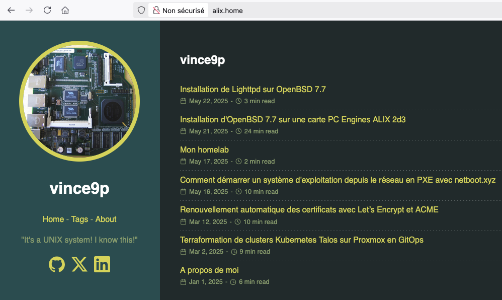
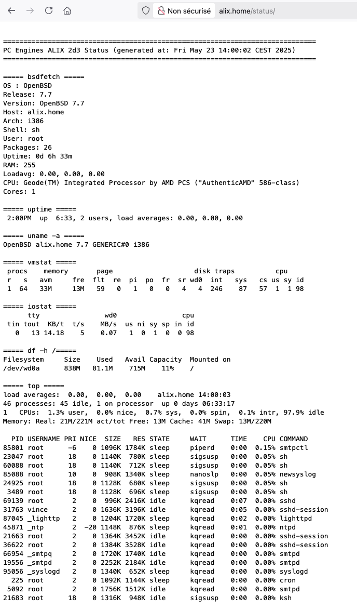

+++
title = "Hébergement de mon blog sur la carte PC Engines ALIX"
tags = ["homelab", "openbsd", "self-hosting"]
date = "2025-05-23"
+++

Comme j'ai [installé OpenBSD](/posts/install-openbsd-alix2d3) et [un serveur web lighttpd](/posts/install-lighttpd-openbsd) sur ma carte PC Engines ALIX, autant y héberger mon blog dessus!

La carte ALIX fera donc office de petit serveur web sous OpenBSD.

Pas besoin d'un cluster Kubernetes déployé sur des VMs Proxmox, avec des Ingress, du GitOps, la stack de métrologie et observabilité pour héberger quelques pages html statiques!

Mon blog est déjà hébergé sur [GitHub](https://github.com/vdupain/blog.vince9p) avec [GitHub Pages](https://pages.github.com/), il est accessible ici: <https://blog.vincentdupain.com/>.

On va donc déployer ce blog sur ce serveur web et il sera accessible depuis cette url: <https://homelab.vincentdupain.com/>.

## Déploiement du site web statique

Déjà pour commencer il faut déposer les ressources (pages html statiques, images, etc...) de mon blog (site web statique réalisé avec [Hugo](https://gohugo.io/)) dans le répertoire attendu par **lighttpd** de notre serveur web sous OpenBSD.

On crée un script shell appelé **deploy-alix.sh** à la racine de l'arborescence de sources de notre site web:

```sh
#!/bin/sh

USER=root
HOST=alix.home
DIR=/var/www/htdocs/

hugo --config hugo-alix.toml
cp public/posts/my-homelab/images/alix2d3.png public/avatar.jpg
rsync -avz --chown="root:daemon" --delete public/ ${USER}@${HOST}:${DIR}
rsync -avz --chown="root:wheel" --delete scripts-alix ${USER}@${HOST}:/${USER}/
ssh ${USER}@${HOST} /${USER}/scripts-alix/generate-status.sh

exit 0
```

Ce script shell permet de:

- générer le site web statique avec **Hugo** (commande **hugo** avec en paramètre _--config hugo-alix.toml_ car le thème graphique sera différent)
- envoyer les ressources générées du site web par la commande précédente vers le serveur web dans le répertoire _/var/www/htdocs/_
- envoyer les scripts pour générer la page de statut (on en parle après)
- exécuter le script de génération de la page de statut

Rien de compliquer, on utilise la bonne vieille commande **rsync** pour synchroniser les fichiers.

On aurait pu faire mieux et éviter d'utiliser directement le compte root et s'éviter les chown! On fera avec.

Une fois le script shell sauvegardé, il faut le rendre exécutable:

```sh
chmod +x deploy-alix.sh
```

Enfin il reste à exécuter le script pour déployer sur notre serveur web et mettre à jour le site web statique:

```sh
./deploy-alix.sh
```

Le site web est recontruit par Hugo puis déployé avec rsync:

```sh
Start building sites … 
hugo v0.147.5-7766fc62416ff95ed7768c19947ac0fcd96444cc+extended linux/amd64 BuildDate=2025-05-22T11:37:19Z VendorInfo=snap:0.147.5


                   | EN  
-------------------+-----
  Pages            | 28  
  Paginator pages  |  0  
  Non-page files   | 70  
  Static files     |  1  
  Processed images |  0  
  Aliases          |  7  
  Cleaned          |  0  

Total in 368 ms
sending incremental file list
deleting status/index.html
deleting status/
./
404.html
avatar.jpg
index.html
index.xml
robots.txt
sitemap.xml
categories/
categories/index.html
categories/index.xml
css/
css/main.min.562871a81790ee61fbc41ddb89eacf3bc0967ee9bde46cf8764c66fe91f0e6fc.css
page/
page/1/
page/1/index.html
posts/
posts/index.html
posts/index.xml
posts/about/
posts/about/index.html
posts/install-lighttpd-openbsd/
posts/install-lighttpd-openbsd/index.html
posts/install-openbsd-alix2d3/
posts/install-openbsd-alix2d3/index.html
posts/install-openbsd-alix2d3/images/
posts/install-openbsd-alix2d3/images/alix2d3.png
...
...
...
tags/
tags/index.html
tags/index.xml
tags/network/
tags/network/index.html
tags/network/index.xml
tags/network/page/
tags/network/page/1/
tags/network/page/1/index.html
tags/openbsd/
tags/openbsd/index.html
tags/openbsd/index.xml
tags/openbsd/page/
tags/openbsd/page/1/
tags/openbsd/page/1/index.html
tags/opnsense/
tags/opnsense/index.html
tags/opnsense/index.xml
tags/opnsense/page/
tags/opnsense/page/1/
tags/opnsense/page/1/index.html

sent 8,695 bytes  received 111,436 bytes  18,481.69 bytes/sec
total size is 13,542,308  speedup is 112.73
sending incremental file list

sent 175 bytes  received 17 bytes  76.80 bytes/sec
total size is 2,450  speedup is 12.76
Generating status page...
```

On peut aller vérifier directement depuis un navigateur, l'url pour accéder à mon serveur web sur mon réseau local est <http://alix.home/>



## Page de status

On va maintenant ajouter une page de statut pour afficher des informations systèmes au sujet de notre serveur web.

C'est purement informatif et ça ne sert normalement à rien!

> Sur de vrais sites, il faut même éviter car cela expose des données sensibles.

Pour cela, on appelle simplement quelques commandes et scripts en redirigeant la sortie standard (stdout) vers une page html statique (_/var/www/htdocs/status/index.html_)

Script **generate-status.sh**:

```sh
#!/usr/bin/env sh

scriptdir=$(dirname $0)
mkdir -p /var/www/htdocs/status
echo "<!doctype html>" > /var/www/htdocs/status/index.html
echo "<html><head></head><body><pre>" >> /var/www/htdocs/status/index.html
$scriptdir/status.sh >> /var/www/htdocs/status/index.html
echo "</pre></body></html>" >> /var/www/htdocs/status/index.html
```

Script **status.sh** (cf. $scriptdir/status.sh dans le script du dessus):

```sh
#!/usr/bin/env sh
scriptdir=$(dirname $0)
echo "\n============================================================================="
echo "PC Engines ALIX 2d3 Status (generated at: $(date))"
echo "============================================================================="
echo "\n===== bsdfetch ====="
$scriptdir/bsdfetch.sh
echo "\n===== uptime ====="
uptime
echo "\n===== uname -a ====="
uname -a
echo "\n===== vmstat ====="
vmstat
echo "\n===== iostat ====="
iostat
echo "\n===== df -h /====="
df -h /
echo "\n===== top ====="
top -bn1
echo "\n===== dmesg ====="
dmesg
```

On exécute juste quelques commandes unix standard: uname, df, iostat, etc...

Le script **bsdfetch.sh** quant à lui vient d'ici: <https://github.com/rilysh/bsdfetsh>

On n'oublie pas de rendre ces scripts exécutables:

```sh
chmod +x generate-status.sh
chmod +x status.sh
```

Ces 2 scripts shell sont à sauvegarder dans le répertoire **scripts-alix** à la racine de l’arborescence de sources du site web, où se trouve déjà le script de déploiement (_deploy-alix.sh_).

On a vu plus haut que ce script de déploiement envoyait les ressources et scripts vers le serveur web, ici:

```sh
rsync -avz --chown="root:wheel" --delete scripts-alix ${USER}@${HOST}:/${USER}/
```

On envoie donc tout le répertoire _scripts-alix_ et son contenu vers le serveur web (alix.home) dans le répertoire root (oui ce n'est pas terrible d'utiliser root...).

Enfin on se connecte sur le serveur web et on configure le crontab sur le serveur web pour regénérer la page de statut toutes les 10 minutes afin d'avoir les informations système mises à jour régulièrement.

```sh
ssh vince@alix
$ su -
# crontab -l
```

On édite le crontab et ajoute cette ligne de configuration:

```sh
*/10 * * * * /root/scripts-alix/generate-status.sh
```

Une fois ces scripts déployés et la page de statut générée, on accède à la page de statut depuis un navigateur, l'url est la suivante: <http://alix.home/status/>



## Accès depuis Internet

C'est bien tout ça mais c'est uniquement accessible depuis mon réseau local sur l'url <http://alix.home>

Comment on rend accessible notre site web statique hébergé sur notre serveur web depuis <https://homelab.vincentdupain.com/>?

En bien on verra dans un prochain article car il y a pas mal de choses à voir, parmis lesquels:

- configuration du nom de domaine
- configuration de la box internet pour renvoyer vers le réseau interne
- configuration du réseau pour mettre une règle de NAT avec port forwarding pour renvoyer vers un reverse proxy
- configuration du reverse proxy (Caddy dans mon cas) pour rediriger vers le serveur web
- configuration du certificat Let's Encrypt, on a déjà évoqué le sujet ici: [renouvellement automatique des certificats avec Let’s Encrypt et ACME](/posts/renew-certificate)

## Conclusion

On a hébergé notre site web statique sur notre serveur web lighttpd avec notre carte PC Engines ALIX 2d3.

Et donc mon blog est disponible sur 2 adresses:

- <https://homelab.vincentdupain.com/>
  - hébergé (auto hébergement) sur le serveur web ligthttpd sous OpenBSD
  - contruit et déployé par le script qu'on a vu dans cet article (_deploy-alix.sh_)
  - page de statut ici: <https://homelab.vincentdupain.com/status/>
- <https://blog.vincentdupain.com/>:
  - hébergé sur [GitHub](https://github.com/vdupain/blog.vince9p)
  - construit et déployé avec [GitHub Actions](https://github.com/vdupain/blog.vince9p/blob/main/.github/workflows/hugo.yaml)
  - pas de page de statut

## Références

- [Hugo open-source static site generators](https://gohugo.io/)
- [Deploy Hugo with rsync](https://gohugo.io/host-and-deploy/deploy-with-rsync/)
