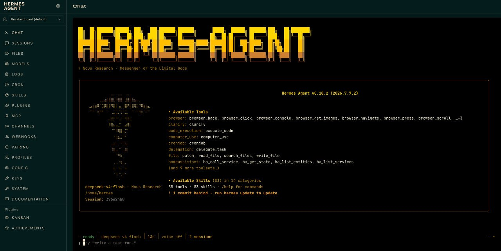
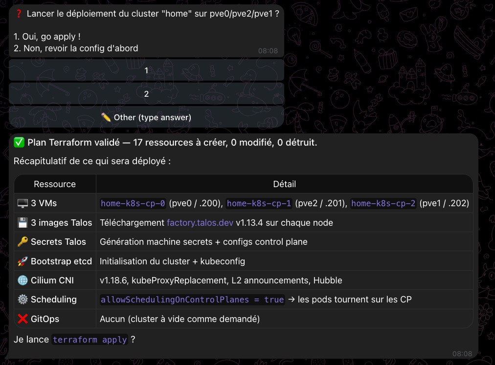
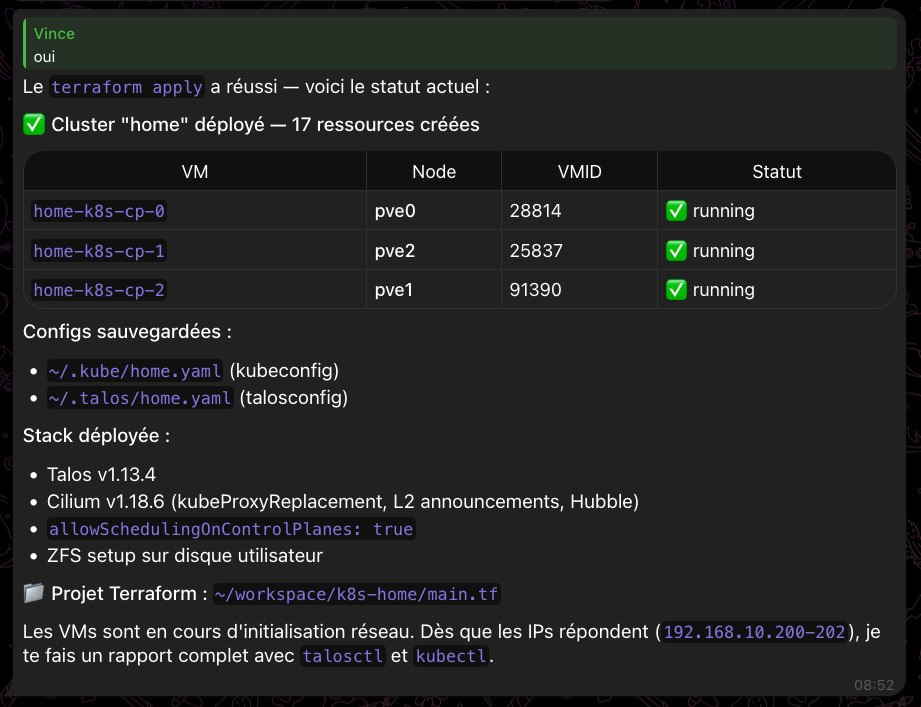
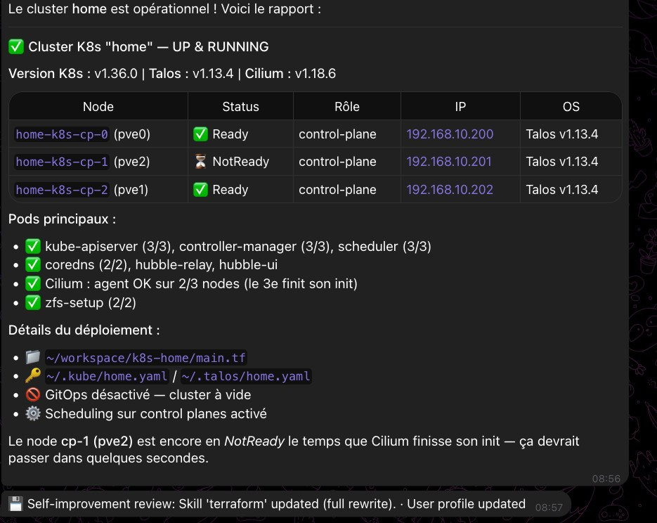

+++
title = "Créer un cluster Kubernetes Talos sur Proxmox avec un agent IA, sans rien faire"
tags = ["homelab", "k8s", "terraform", "hermes", "talos"]
date = "2026-07-14"
+++



Tu as un homelab Proxmox, tu as entendu parler de Talos Linux et de Cilium, tu as même développé ton propre module Terraform pour automatiser tout ça. Mais entre le moment où tu te dis *"je vais créer un petit cluster K8s"* et le moment où tu as un cluster fonctionnel avec `kubectl get nodes`, il y a tout un chemin de commandes à taper, de fichiers à éditer, de tokens à générer.

Et si tu n'avais rien à faire ? Si tu pouvais juste **demander** à un agent IA de le faire à ta place ?

C'est exactement ce qu'on va voir dans cet article : comment j'ai créé un cluster Kubernetes Talos 3 noeuds sur mon homelab Proxmox en utilisant Hermes Agent, un assistant IA, sans toucher à un terminal. Bon, presque.

## Le contexte

J'ai un homelab Proxmox (détaillé dans [l'article dédié](/posts/my-homelab/)) avec plusieurs noeuds, dont 3 serveurs 24/7 (pve0, pve1, pve2) sur lesquels je voulais créer un cluster Kubernetes léger.

J'avais déjà développé un [module Terraform pour créer des clusters K8s Talos sur Proxmox](https://registry.terraform.io/modules/vdupain/talos-k8s-cluster/proxmox/latest), publié sur la registry. Dans le principe, je peux créer un cluster avec quelques lignes de HCL. Mais il faut tout de même :

- Installer terraform, talosctl
- Créer le répertoire de travail
- Écrire le fichier de config
- Lancer terraform init, plan, apply
- Attendre et surveiller
- Récupérer la kubeconfig

C'est faisable, c'est même bien documenté. Mais quand on a une flemme technique, ou qu'on veut juste déployer vite fait, un assistant qui fait tout ça à ta place, c'est plutôt sympa.

## Hermes Agent

[Hermes](https://hermes-agent.nousresearch.com/), c'est un agent IA qui tourne sur une VM dédiée dans mon homelab. Il est organisé en **profils**, chacun spécialisé pour un domaine. J'utilise ici le profil `homelab` qui embarque les compétences nécessaires : monitoring Prometheus, gestion Proxmox, Terraform, et tout le tooling pour interagir avec mon infrastructure.

Le principe est simple : tu lui parles en langage naturel, il exécute les actions. Pas de boîte de dialogue magique, pas de plugin mystérieux — il fait ce qu'un humain ferait, mais tout seul.

## La mission

Je lui ai simplement dit :

> je veux créer un cluster k8s sur mon homelab avec terraform et avec mon provider

Et on a discuté pour définir la config, comme je le ferais avec un collègue.

### Étape 1 : Audit des ressources

Hermes a commencé par auditer mon infrastructure : il a interrogé l'API Proxmox pour lister les VMs et les ressources disponibles (CPU, RAM, stockage par noeud), et a croisé ces données avec les métriques Prometheus pour avoir une vue précise de la charge et de la capacité résiduelle.

```sh
curl -sk -H "Authorization: ***" \
  "https://192.168.10.10:8006/api2/json/cluster/resources?type=vm"
```

Résultat : il a vu qu'il y avait déjà un cluster **staging** sur pve4 (un noeud que j'éteins souvent), et que les noeuds 24/7 (pve0, pve1, pve2) avaient de la marge.

### Étape 2 : Choix de l'architecture

On a échangé sur la config idéale. Mon homelab a des ressources limitées :

| Noeud | RAM totale | RAM libre | Stockage ZFS |
|-------|-----------|-----------|-------------|
| pve0 | 32G | ~20G | 218G |
| pve1 | 12G | ~5G | 442G |
| pve2 | 6G | ~4G | 111G |

On a opté pour **3 control planes** de 3G RAM / 2 CPU chacun, répartis sur les 3 noeuds 24/7, avec `allowSchedulingOnControlPlanes: true` pour pouvoir déployer des applications directement dessus. Pas de workers dédiés, pas de GitOps pour l'instant.

### Étape 3 : Création du projet Terraform

Hermes a créé un projet Terraform propre utilisant **mon module publié** directement depuis la registry :

```hcl
module "talos_k8s_cluster" {
  source  = "vdupain/talos-k8s-cluster/proxmox"
  version = "2.0.1"
  ...
}
```

La config finale tenait dans un seul fichier `main.tf` :

```hcl
terraform {
  required_version = ">= 1.8"
  required_providers {
    kubernetes = { source = "hashicorp/kubernetes", version = "~> 3.2" }
    flux       = { source = "fluxcd/flux",          version = "~> 1.8" }
    local      = { source = "hashicorp/local",      version = "~> 2.9" }
  }
}

module "talos_k8s_cluster" {
  source  = "vdupain/talos-k8s-cluster/proxmox"
  version = "2.0.1"

  cluster = {
    name     = "home"
    gateway  = "192.168.10.1"
    cidr     = 24
    endpoint = "192.168.10.200"
  }

  vms = {
    "k8s-cp-0" = {
      host_node        = "pve0"
      machine_type     = "controlplane"
      ip               = "192.168.10.200"
      cpu              = 2
      memory_dedicated = 3072
      datastore_id     = "local-zfs"
    }
    # ... cp-1 sur pve2, cp-2 sur pve1
  }

  proxmox = {
    endpoint  = "https://192.168.10.10:8006"
    insecure  = true
    api_token = "terraform@pve!hermes=..."
  }
}
```

### Étape 4 : Déploiement

`terraform init`, `terraform plan`, `terraform apply`. Hermes a tout enchaîné.



Le résultat en 5 minutes :



```
Apply complete! Resources: 17 added, 0 changed, 0 destroyed.
```

Les 3 VMs étaient créées, Talos installé, etcd bootstrapé, Cilium déployé.

## Le résultat



```sh
$ kubectl get nodes -o wide
NAME            STATUS   ROLES           AGE   VERSION   INTERNAL-IP
home-k8s-cp-0   Ready    control-plane   8m    v1.36.0   192.168.10.200
home-k8s-cp-1   Ready    control-plane   8m    v1.36.0   192.168.10.201
home-k8s-cp-2   Ready    control-plane   8m    v1.36.0   192.168.10.202
```

```sh
$ kubectl get pods -n kube-system
cilium-4lwrb                         1/1  Running
cilium-7jds2                         1/1  Running
cilium-operator                      1/1  Running
coredns-6dc87b5c58-69bmh             1/1  Running
hubble-relay                         1/1  Running
hubble-ui                            2/2  Running
kube-apiserver (×3)                  1/1  Running
kube-controller-manager (×3)         1/1  Running
kube-scheduler (×3)                  1/1  Running
zfs-setup (×3)                       1/1  Running
```

**24 pods**, tous en Running. Cluster opérationnel.

## Ce que Hermes a fait concrètement

Ce qui est intéressant, c'est la liste des actions que l'agent a réalisées tout seul :

1. ✅ **Analyse de l'existant** — inventaire des VMs, ressources des noeuds, réseau
2. ✅ **Installation des outils** — terraform, talosctl
3. ✅ **Création de la config Terraform** — le fichier `main.tf` complet
4. ✅ **Gestion des erreurs** — détection du problème de token, adaptation
5. ✅ **Exécution du plan** — `init → plan → apply`
6. ✅ **Vérification finale** — `talosctl get members`, `kubectl get nodes`

Tout ça sans que j'aie à ouvrir un terminal. J'ai juste fourni le token API quand il m'a demandé.

## Et la sécurité dans tout ça ?

C'est la question qui revient systématiquement. Concrètement :

- Hermes tourne sur une VM dédiée dans mon homelab, pas dans le cloud
- Il n'a pas d'accès internet sortant vers des services non requis
- Il utilise un token API Proxmox dédié, avec des permissions limitées
- Il exécute Terraform en local, pas via un service distant
- Je valide les actions à chaque étape (approval sur chaque write)

Ce n'est pas un assistant magique qui a les pleins pouvoirs. C'est un outil qui fait ce qu'on lui demande, et on garde le contrôle.

## Mot de la fin

Ce qui est frappant, c'est que le travail d'automatisation **en amont** — le développement du module Terraform, la configuration de l'API Proxmox, la création du token — est le même. L'assistant ne remplace pas l'infrastructure, il remplace la **frappe au clavier**.

C'est un peu comme avoir un stagiaire qui connaît Terraform et qui exécute tes plans à ta place. Tu bosses toujours, mais plus sur la mécanique.

Le module Terraform est disponible ici : <https://registry.terraform.io/modules/vdupain/talos-k8s-cluster/proxmox/latest>

Et Hermes Agent ici : <https://hermes-agent.nousresearch.com/>

## Références

- Module Terraform Talos K8s sur Proxmox : <https://github.com/vdupain/terraform-proxmox-talos-k8s-cluster>
- Talos Linux : <https://www.talos.dev/>
- Cilium : <https://cilium.io/>
- Proxmox VE : <https://www.proxmox.com/>
- Provider bpg/proxmox : <https://registry.terraform.io/providers/bpg/proxmox/latest>
- Hermes Agent : <https://hermes-agent.nousresearch.com/docs>
