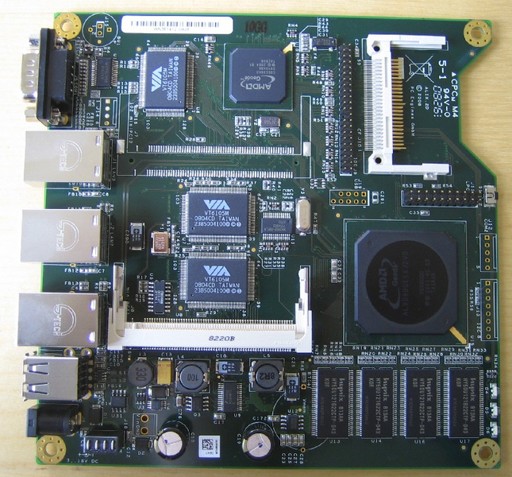

+++
title = "Installation d'OpenBSD 7.7 sur une carte PC Engines ALIX 2d3"
tags = ["homelab", "openbsd", "opnsense", "network"]
date = "2025-05-21"
draft = true
+++



Voici un article pour expliquer comment installer un système d'exploitation [OpenBSD](https://www.openbsd.org/index.html) sur une [carte PC Engines ALIX 2d3](https://www.pcengines.ch/alix2d3.htm).

J'ai cette carte ALIX depuis de nombreuses années, carte qui m'a servi pendant longtemps comme routeur et pare-feu avec m0n0wall et PFsense avant de la remplacer par une carte plus puissante PC Engines APU2.

Comme elle ne servait plus, je me suis dit que ce serait une bonne idée d'en faire quelque chose.

J'ai donc décidé d'y installer OpenBSD car j'ai déjà utilisé ce système par le passé et il est consomme peu de ressource pour ce type de carte.

Et puis ça change que de toujours utilisé des systèmes Linux!

## Configuration de TFTP et DHCP dans OPNsense

Afin d'éviter de sortir la carte Compact Flash de la carte PC Engines ALIX 2d3 pour l'installation à partir d'une image disque, on va plutôt procéder à une installation par le réseau avec PXE.

Pour cela, il y a un peu de configuration à prévoir pour faire fonctionner l'amorçage en PXE.

Voir cette article pour plus de précision: [comment démarrer un système d'exploitation depuis le réseau en PXE avec netboot.xyz](/posts/netboot-pxe)

Ici nous n'utiliserons pas [Netboot.xyz](https://netboot.xyz/) pour l'amorçage en PXE car en faisant quelques tests , j'ai rencontré 2 problèmes:

- le menu Netboot.xyz ne n'affiche pas correctement sur la carte PC Engines ALIX 2d3 (peut être lié au type de terminal) alors que cela fonctionne très bien sur les VMs dans Proxmox (par le port série)
- même en arrivant à passer par le menu et en chargeant OpenBSD, cela bloque sur le chargement du noyau OpenBSD: il doit s'agir d'un noyau pour architecture **amd64** et non **i386** d'où le blocage! En effet le CPU de la carte ALIX 2d3 est sur une architecture i386.

### Configuration TFTP

On télécharge et on dépose ces fichiers dans le répertoire de tftp (démon tftp installé sur OPNsense):

- le programme d'amorçage **pxeboot**
- le noyau OpenBSD **bsd.rd**: noyau ramdisk spécial qui génère un environnement live entièrement en mémoire. Il contient le script d’installation et quelques utilitaires nécessaires à une installation complète. Ces utilitaires peuvent également être utiles pour la reprise après un sinistre( recovery mode)

```sh
ssh root@opnsense
# choisir 8 pour accéder au shell
curl https://cdn.openbsd.org/pub/OpenBSD/7.7/i386/pxeboot -o /usr/local/tftp/pxeboot
curl https://cdn.openbsd.org/pub/OpenBSD/7.7/i386/bsd.rd -o /usr/local/tftp/bsd.rd
```

> Le processeur de la carte Alix 2D3 est AMD Geode LX800 à 500 MHz, c'est un processeur 32 bits, d'où **i386** et non pas **amd64** dans les urls utilisés.

Pour éviter de taper certaines commandes lors de la séquence de démarrage, on va créer un fichier de configuration (_boot.conf_) qui sera donc utilisé au démarrage pour passer certains paramètres de configuration.

Dans ce fichier de configuration, on indique donc:

- la vitesse du port série
- le tty sera le port série et non pas la carte graphique car il n'y en a pas sur la carte ALIX 2d3
- le nom du noyau à démarrer

```sh
mkdir /usr/local/tftp/etc
echo "stty com0 115200" > /usr/local/tftp/etc/boot.conf
echo "set tty com0" >> /usr/local/tftp/etc/boot.conf
echo "boot bsd.rd" >> /usr/local/tftp/etc/boot.conf
```

On vérifie qu'on a tous nos fichiers dans le répertoire de tftp:

```sh
root@OPNsense:/usr/local/tftp # ll
total 6748
-rw-r--r--  1 root wheel 4058537 Apr 13 19:11 bsd.rd
drwxr-xr-x  2 root wheel     512 May 21 14:44 etc/
-rw-r--r--  1 root wheel   97988 Apr 13 18:30 pxeboot
root@OPNsense:/usr/local/tftp # cat etc/boot.conf
stty com0 115200
set tty com0
boot bsd.rd
root@OPNsense:/usr/local/tftp #
```

C'est terminé pour la configuration tftp, on passe à celle du serveiur DHCP.

### Configuration DHCP

Pour notre serveur DHCP dans OPNsense:

- on se rend dans le menu de configuration du serveur DHCP: "**Services > ISC DHCPv4 > LAN**".
- on clique sur le bouton "**Advanced**" du menu "**Network booting**"
- on active en cochant "**Enable network booting**"
- enfin on renseigne les paramètres suivants:
  - **Set next-server IP**: 192.168.10.1, l'IP de notre serveur TFTP (ici hergébé sur OPNsense, où se trouve également le serveur DHCP)
  - **Set default bios filename**: pxeboot, le programme d'amorçage qui va permettre de charger le noyau OpenBSD (**bsd.rd**)

On a terminé avec la configuration de OPNsense, on peut passer au démarrage de la carte PC Engines ALIX 2d3 depuis le réseau en PXE.

## Démarrage en PXE

Tout d'abord, on se connecte sur le port série de la carte ALIX 2d3 et on vérifie que la vitesse du port série est bien définie sur **115200** baud (celle qu'on a indiqué dans le fichier _boot.conf_).

```sh
PC Engines ALIX.2 v0.99h
640 KB Base Memory
261120 KB Extended Memory

01F0 Master 044A TS4GCF170
Phys C/H/S 7785/16/63 Log C/H/S 973/128/63

BIOS setup:

(9) 9600 baud (2) 19200 baud (3) 38400 baud (5) 57600 baud *1* 115200 baud
(C) CHS mode *L* LBA mode (W) HDD wait (V) HDD slave *U* UDMA enable
(M) MFGPT workaround
(P) late PCI init
*R* Serial console enable
(E) PXE boot enable
(X) Xmodem upload
(Q) Quit
```

Une fois vérifé, on peut se connecter avec un terminal série (avec cu, screen, putty, etc...au choix).

Ici je me connecte depuis une VM OpenBSD et j'utilise cu, le port est cuaU1. On indique également la vitesse de la liaison série.

```sh
cu -l cuaU1 -s 115200
```

Voici la séquence de démarrage complète:

```sh
PC Engines ALIX.2 v0.99h
640 KB Base Memory
261120 KB Extended Memory

01F0 Master 044A TS4GCF170
Phys C/H/S 7785/16/63 Log C/H/S 973/128/63

Intel UNDI, PXE-2.0 (build 082)
Copyright (C) 1997,1998,1999  Intel Corporation
VIA Rhine III Management Adapter v2.43 (2005/12/15)

CLIENT MAC ADDR: 00 0D B9 1B AA 4C
CLIENT IP: 192.168.10.23  MASK: 255.255.255.0  DHCP IP: 192.168.10.1
GATEWAY IP: 192.168.10.1
probing: pc0 com0 com1 pci pxe![2.1] mem[640K 255M a20=on]
disk: hd0+
net: mac 00:0d:b9:1b:aa:4c, ip 192.168.10.23, server 192.168.10.1
>> OpenBSD/i386 PXEBOOT 3.65
switching console to com0
>> OpenBSD/i386 PXEBOOT 3.65
booting tftp:bsd.rd: 3299859+1471488+4358152+0+430080 [88+160+28]=0x920300
entry point at 0x201000

Copyright (c) 1982, 1986, 1989, 1991, 1993
        The Regents of the University of California.  All rights reserved.
Copyright (c) 1995-2025 OpenBSD. All rights reserved.  https://www.OpenBSD.org

OpenBSD 7.7 (RAMDISK_CD) #573: Sun Apr 13 11:08:58 MDT 2025
    deraadt@i386.openbsd.org:/usr/src/sys/arch/i386/compile/RAMDISK_CD
real mem  = 267976704 (255MB)
avail mem = 252772352 (241MB)
random: good seed from bootblocks
mainbus0 at root
bios0 at mainbus0: date 11/05/08, BIOS32 rev. 0 @ 0xfd088
pcibios0 at bios0: rev 2.1 @ 0xf0000/0x10000
pcibios0: pcibios_get_intr_routing - function not supported
pcibios0: PCI IRQ Routing information unavailable.
pcibios0: PCI bus #0 is the last bus
bios0: ROM list: 0xe0000/0xa800
cpu0 at mainbus0: (uniprocessor)
cpu0: Geode(TM) Integrated Processor by AMD PCS ("AuthenticAMD" 586-class) 499 MHz, 05-0a-02
cpu0: FPU,DE,PSE,TSC,MSR,CX8,SEP,PGE,CMOV,CFLUSH,MMX,MMXX,3DNOW2,3DNOW
pci0 at mainbus0 bus 0: configuration mode 1 (bios)
pchb0 at pci0 dev 1 function 0 "AMD Geode LX" rev 0x33
"AMD Geode LX Crypto" rev 0x00 at pci0 dev 1 function 2 not configured
vr0 at pci0 dev 9 function 0 "VIA VT6105M RhineIII" rev 0x96: irq 10, address 00:0d:b9:1b:aa:4c
ukphy0 at vr0 phy 1: Generic IEEE 802.3u media interface, rev. 3: OUI 0x004063, model 0x0034
vr1 at pci0 dev 10 function 0 "VIA VT6105M RhineIII" rev 0x96: irq 11, address 00:0d:b9:1b:aa:4d
ukphy1 at vr1 phy 1: Generic IEEE 802.3u media interface, rev. 3: OUI 0x004063, model 0x0034
vr2 at pci0 dev 11 function 0 "VIA VT6105M RhineIII" rev 0x96: irq 15, address 00:0d:b9:1b:aa:4e
ukphy2 at vr2 phy 1: Generic IEEE 802.3u media interface, rev. 3: OUI 0x004063, model 0x0034
pcib0 at pci0 dev 15 function 0 "AMD CS5536 ISA" rev 0x03
pciide0 at pci0 dev 15 function 2 "AMD CS5536 IDE" rev 0x01: DMA, channel 0 wired to compatibility, channel 1 wired to compatibility
wd0 at pciide0 channel 0 drive 0: <TS4GCF170>
wd0: 1-sector PIO, LBA48, 3831MB, 7847280 sectors
wd0(pciide0:0:0): using PIO mode 4, Ultra-DMA mode 4
pciide0: channel 1 ignored (disabled)
ohci0 at pci0 dev 15 function 4 "AMD CS5536 USB" rev 0x02: irq 12, version 1.0, legacy support
ehci0 at pci0 dev 15 function 5 "AMD CS5536 USB" rev 0x02: irq 12
usb0 at ehci0: USB revision 2.0
uhub0 at usb0 configuration 1 interface 0 "AMD EHCI root hub" rev 2.00/1.00 addr 1
isa0 at pcib0
isadma0 at isa0
com0 at isa0 port 0x3f8/8 irq 4: ns16550a, 16 byte fifo
com0: console
com1 at isa0 port 0x2f8/8 irq 3: ns16550a, 16 byte fifo
npx0 at isa0 port 0xf0/16: reported by CPUID; using exception 16
usb1 at ohci0: USB revision 1.0
uhub1 at usb1 configuration 1 interface 0 "AMD OHCI root hub" rev 1.00/1.00 addr 1
softraid0 at root
scsibus0 at softraid0: 256 targets
PXE boot MAC address 00:0d:b9:1b:aa:4c, interface vr0
root on rd0a swap on rd0b dump on rd0b
WARNING: CHECK AND RESET THE DATE!
erase ^?, werase ^W, kill ^U, intr ^C, status ^T

Welcome to the OpenBSD/i386 7.7 installation program.
Starting non-interactive mode in 5 seconds...
(I)nstall, (U)pgrade, (A)utoinstall or (S)hell?
```

C'est bon, on a bien le menu d'installation OpenBSD qui s'affiche, nous pouvons passer à la suite des opérations, c'est à dire l'installation de OpenBSD.

## Installation et configuration de OpenBSD

### Configuration générale

```sh
Welcome to the OpenBSD/i386 7.7 installation program.
Starting non-interactive mode in 5 seconds...
(I)nstall, (U)pgrade, (A)utoinstall or (S)hell? i
At any prompt except password prompts you can escape to a shell by
typing '!'. Default answers are shown in []'s and are selected by
pressing RETURN.  You can exit this program at any time by pressing
Control-C, but this can leave your system in an inconsistent state.

Terminal type? [vt220]
System hostname? (short form, e.g. 'foo') openbsd

Available network interfaces are: vr0 vr1 vr2 vlan0.
Network interface to configure? (name, lladdr, '?', or 'done') [vr0]
IPv4 address for vr0? (or 'autoconf' or 'none') [autoconf]
IPv6 address for vr0? (or 'autoconf' or 'none') [none]
Available network interfaces are: vr0 vr1 vr2 vlan0.
Network interface to configure? (name, lladdr, '?', or 'done') [done]
Using DNS domainname home
Using DNS nameservers at 192.168.10.4
```

- **System hostname**: on indique le nom de la machine, ici "openbsd"
- pour la configuration réseau
  - **Network interface**:  vr0, cela correspond à la 1ère interface réseau sur la carte ALIX 2d3 (qui en comporte 3: vr0/vr1/vr2)
  - **IPv4 address for vr0**: je laisse sur **autoconf** pour récupérer l'addresse IP par DHCP
  - **IPv6 address for vr0**: pour l'instant je n'active pas l'IPv6 et donc je laisse sur **none**
  - **Network interface to configure**: je ne configure pas les autres interfaces réseaux vr1 et vr2 et donc on laisse l'option par défaut sur **done**
  - la configuration DNS est récupérée automatiquement via le serveur DHCP, il n'y a donc rien à faire ici

```sh
Password for root account? (will not echo)
Password for root account? (again)
Start sshd(8) by default? [yes]
Change the default console to com0? [yes]
Available speeds are: 9600 19200 38400 57600 115200.
Which speed should com0 use? (or 'done') [115200]
Setup a user? (enter a lower-case loginname, or 'no') [no] vince
Full name for user vince? [vince]
Password for user vince? (will not echo)
Password for user vince? (again)
WARNING: root is targeted by password guessing attacks, pubkeys are safer.
Allow root ssh login? (yes, no, prohibit-password) [no] yes
What timezone are you in? ('?' for list) [Europe/Paris]
```

- On définit le mot de passe pour le compte superutilisateur root
- On active le démarrage du démon ssh pour permettre l'accès à distance
- On laisse le paramètre par défaut pour la console par le port série:
  - com0 sera donc la console par défaut pour y accéder par le port série
  - la vitesse est 115200 comme on a déjà vu un peu plus haut
- **Setup a user**: je crée un nouvel utilisateur pour éviter d'utiliser root autant que possible
- **Allow root ssh login**: j'autorise l'accès ssh avec login/password pour l'utilisateur root
  - idéalement il faudrait interdire l'accès direct en ssh avec le compte root
  - il faudrait mieux autoriser uniquement l'accès en ssh par clé et non par la saisie du login/mot de passe
- **What timezone are you in**: la timezone est correctement configurée avec la valeur par défaut proposée

### Configuration du disque d'installation

```sh
Available disks are: wd0.
Which disk is the root disk? ('?' for details) [wd0]
Encrypt the root disk with a (p)assphrase or (k)eydisk? [no]
Disk: wd0       geometry: 973/128/63 [7847280 Sectors]
Offset: 0       Signature: 0xAA55
            Starting         Ending         LBA Info:
 #: id      C   H   S -      C   H   S [       start:        size ]
-------------------------------------------------------------------------------
 0: 00      0   0   0 -      0   0   0 [           0:           0 ] Unused
 1: 00      0   0   0 -      0   0   0 [           0:           0 ] Unused
 2: 00      0   0   0 -      0   0   0 [           0:           0 ] Unused
*3: A6      0   1   2 -    973  15  63 [          64:     7847216 ] OpenBSD
Use (W)hole disk, use the (O)penBSD area or (E)dit the MBR? [OpenBSD]
The auto-allocated layout for wd0 is:
#                size           offset  fstype [fsize bsize   cpg]
  a:           869.8M               64  4.2BSD   2048 16384     1 # /
  b:           219.6M          1781344    swap
  c:          3831.7M                0  unused
  d:          2388.6M          2231008  4.2BSD   2048 16384     1 # /usr
  e:           353.8M          7122784  4.2BSD   2048 16384     1 # /home
Use (A)uto layout, (E)dit auto layout, or create (C)ustom layout? [a]
/dev/rwd0a: 869.8MB in 1781280 sectors of 512 bytes
5 cylinder groups of 202.50MB, 12960 blocks, 25920 inodes each
/dev/rwd0e: 353.8MB in 724480 sectors of 512 bytes
4 cylinder groups of 88.44MB, 5660 blocks, 11328 inodes each
/dev/rwd0d: 2388.6MB in 4891776 sectors of 512 bytes
12 cylinder groups of 202.50MB, 12960 blocks, 25920 inodes each
/dev/wd0a (30d58ffe8e4d09a2.a) on /mnt type ffs (rw, asynchronous, local)
/dev/wd0e (30d58ffe8e4d09a2.e) on /mnt/home type ffs (rw, asynchronous, local, nodev, nosuid)
/dev/wd0d (30d58ffe8e4d09a2.d) on /mnt/usr type ffs (rw, asynchronous, local, nodev)
```

On ne s'embête pas trop sur la partie disque, en effet on laisse la configuration par défaut proposée par l'installeur OpenBSD.

Dans mon cas, sur la carte Compact Flash j'avais déjà installé OpenBSD et donc le disque était déjà partionné. L'installeur l'a donc detécté.

Sinon pas de difficulté majeure: on utilise tout le disque via l'option **(W)hole disk** et on choisit l'option **(A)uto layout** pour le partionnement par défaut proposé par l'installeur.

### Installation des packages

```sh
Let's install the sets!
Location of sets? (disk http or 'done') [http]
HTTP proxy URL? (e.g. 'http://proxy:8080', or 'none') [none]
HTTP Server? (hostname, list#, 'done' or '?') [cdn.openbsd.org]
Server directory? [pub/OpenBSD/7.7/i386]

Select sets by entering a set name, a file name pattern or 'all'. De-select
sets by prepending a '-', e.g.: '-game*'. Selected sets are labelled '[X]'.
    [X] bsd           [X] comp77.tgz    [X] xbase77.tgz   [X] xserv77.tgz
    [X] bsd.rd        [X] man77.tgz     [X] xshare77.tgz
    [X] base77.tgz    [X] game77.tgz    [X] xfont77.tgz
Set name(s)? (or 'abort' or 'done') [done] -game*
    [X] bsd           [X] comp77.tgz    [X] xbase77.tgz   [X] xserv77.tgz
    [X] bsd.rd        [X] man77.tgz     [X] xshare77.tgz
    [X] base77.tgz    [ ] game77.tgz    [X] xfont77.tgz
Set name(s)? (or 'abort' or 'done') [done] -x*
    [X] bsd           [X] comp77.tgz    [ ] xbase77.tgz   [ ] xserv77.tgz
    [X] bsd.rd        [X] man77.tgz     [ ] xshare77.tgz
    [X] base77.tgz    [ ] game77.tgz    [ ] xfont77.tgz
Set name(s)? (or 'abort' or 'done') [done]
```

Maintenant nous pouvons installer les packages.

Nous laissons les 1ers paramètres avec les valeurs par défaut:

- nous téléchargeons les packages en http depuis les serveurs officiels OpenBSD: <https://cdn.openbsd.org/pub/OpenBSD/7.7/i386/>
- nous n'utilisons pas de proxy HTTP et donc nous laissons l'option sur **none**

Pour cette installation, nous supprimons le package _**game77.tgz**_ ainsi que tous les packages liés à X11 car nous n'en avons pas besoin.

On déselectionne donc ces packages comme indiqué par l'installeur en tapant: **-game\*** puis **-x\***.

```sh
Get/Verify SHA256.sig   100% |**************************|  2146       00:00
Signature Verified
Get/Verify bsd          100% |**************************| 15472 KB    00:17
Get/Verify bsd.rd       100% |**************************|  3963 KB    00:02
Get/Verify base77.tgz   100% |**************************|   260 MB    12:33
Get/Verify comp77.tgz   100% |**************************| 43762 KB    00:27
Get/Verify man77.tgz    100% |**************************|  8275 KB    00:06
Get/Verify BUILDINFO    100% |**************************|    54       00:00
Installing bsd          100% |**************************| 15472 KB    00:02
Installing bsd.rd       100% |**************************|  3963 KB    00:00
Installing base77.tgz   100% |**************************|   260 MB    02:37
Extracting etc.tgz      100% |**************************|   275 KB    00:00
Installing comp77.tgz   100% |**************************| 43762 KB    00:59
Installing man77.tgz    100% |**************************|  8275 KB    00:19
Installing BUILDINFO    100% |**************************|    54       00:00
Location of sets? (disk http or 'done') [done]
```

Les packages sont téléchargés puis décompréssés (pour ceux compréssés en tgz), parmis ces packages on retrouve:

- **bsd.rd**: le noyau OpenBSD ramdisk (voir l'explication en début d'article)
- **bsd**: le noyau OpenBSD
- les packages compréssés en tgz: packages de base, les fichiers dans etc, les fichiers man (manual pages), etc...

Enfin sur **Location of sets**, on laisse par défaut à **done** car nous avons presque terminé l'installation et il n'y a pas d'autres packages à installer.

```sh
Saving configuration files... done.
Making all device nodes... done.
fw_update: add amd,amdsev; update none
Relinking to create unique kernel... done.

CONGRATULATIONS! Your OpenBSD install has been successfully completed!

When you login to your new system the first time, please read your mail
using the 'mail' command.

Exit to (S)hell, (H)alt or (R)eboot? [reboot]
```

Voilà les dernières étapes de l'installation:

- les fichiers de configuration sont sauvegardés (par exemple la configuration réseau, le nom de machine qu'on a configuré précédemment)
- les périphériques (devices) sont crées (les fichiers qui se trouvent dans /dev)

Enfin on a le message nous indiquant que l'installation est terminée, nous pouvons maintenant redémarré le système.

Pour cela on appuie sur le touche "entrée" tout simplement.

```sh
syncing disks... done
rebooting...
```

Attention lors du redémarrage de s'assurer qu'on ne redémarre plus sur le réseau en PXE mais bien directement sur le disque (ici la carte Compact Flash).

### 1èr démarrage d'OpenBSD

```sh
PC Engines ALIX.2 v0.99h
640 KB Base Memory
261120 KB Extended Memory

01F0 Master 044A TS4GCF170
Phys C/H/S 7785/16/63 Log C/H/S 973/128/63
Using drive 0, partition 3.
Loading......
probing: pc0 com0 com1 pci mem[640K 255M a20=on]
disk: hd0+
>> OpenBSD/i386 BOOT 3.67
switching console to com0
>> OpenBSD/i386 BOOT 3.67
boot>
booting hd0a:/bsd: 10795539+2688004+208904+0+1146880 [800940+107+637088+698210]=0x1032b58
entry point at 0x201000

[ using 2136920 bytes of bsd ELF symbol table ]
Copyright (c) 1982, 1986, 1989, 1991, 1993
        The Regents of the University of California.  All rights reserved.
Copyright (c) 1995-2025 OpenBSD. All rights reserved.  https://www.OpenBSD.org

OpenBSD 7.7 (GENERIC) #579: Sun Apr 13 10:44:00 MDT 2025
    deraadt@i386.openbsd.org:/usr/src/sys/arch/i386/compile/GENERIC
real mem  = 267931648 (255MB)
avail mem = 245440512 (234MB)
random: good seed from bootblocks
mpath0 at root
scsibus0 at mpath0: 256 targets
mainbus0 at root
bios0 at mainbus0: date 11/05/08, BIOS32 rev. 0 @ 0xfd088
pcibios0 at bios0: rev 2.1 @ 0xf0000/0x10000
pcibios0: pcibios_get_intr_routing - function not supported
pcibios0: PCI IRQ Routing information unavailable.
pcibios0: PCI bus #0 is the last bus
bios0: ROM list: 0xe0000/0xa800
cpu0 at mainbus0: (uniprocessor)
cpu0: Geode(TM) Integrated Processor by AMD PCS ("AuthenticAMD" 586-class) 499 MHz, 05-0a-02
cpu0: FPU,DE,PSE,TSC,MSR,CX8,SEP,PGE,CMOV,CFLUSH,MMX,MMXX,3DNOW2,3DNOW
mtrr: K6-family MTRR support (2 registers)
pci0 at mainbus0 bus 0: configuration mode 1 (bios)
pchb0 at pci0 dev 1 function 0 "AMD Geode LX" rev 0x33
glxsb0 at pci0 dev 1 function 2 "AMD Geode LX Crypto" rev 0x00: RNG AES
vr0 at pci0 dev 9 function 0 "VIA VT6105M RhineIII" rev 0x96: irq 10, address 00:0d:b9:1b:aa:4c
ukphy0 at vr0 phy 1: Generic IEEE 802.3u media interface, rev. 3: OUI 0x004063, model 0x0034
vr1 at pci0 dev 10 function 0 "VIA VT6105M RhineIII" rev 0x96: irq 11, address 00:0d:b9:1b:aa:4d
ukphy1 at vr1 phy 1: Generic IEEE 802.3u media interface, rev. 3: OUI 0x004063, model 0x0034
vr2 at pci0 dev 11 function 0 "VIA VT6105M RhineIII" rev 0x96: irq 15, address 00:0d:b9:1b:aa:4e
ukphy2 at vr2 phy 1: Generic IEEE 802.3u media interface, rev. 3: OUI 0x004063, model 0x0034
glxpcib0 at pci0 dev 15 function 0 "AMD CS5536 ISA" rev 0x03: rev 3, 32-bit 3579545Hz timer, watchdog, gpio, i2c
gpio0 at glxpcib0: 32 pins
iic0 at glxpcib0
maxtmp0 at iic0 addr 0x4c: lm86
pciide0 at pci0 dev 15 function 2 "AMD CS5536 IDE" rev 0x01: DMA, channel 0 wired to compatibility, channel 1 wired to compatibility
wd0 at pciide0 channel 0 drive 0: <TS4GCF170>
wd0: 1-sector PIO, LBA48, 3831MB, 7847280 sectors
wd0(pciide0:0:0): using PIO mode 4, Ultra-DMA mode 4
pciide0: channel 1 ignored (disabled)
ohci0 at pci0 dev 15 function 4 "AMD CS5536 USB" rev 0x02: irq 12, version 1.0, legacy support
ehci0 at pci0 dev 15 function 5 "AMD CS5536 USB" rev 0x02: irq 12
usb0 at ehci0: USB revision 2.0
uhub0 at usb0 configuration 1 interface 0 "AMD EHCI root hub" rev 2.00/1.00 addr 1
isa0 at glxpcib0
isadma0 at isa0
com0 at isa0 port 0x3f8/8 irq 4: ns16550a, 16 byte fifo
com0: console
com1 at isa0 port 0x2f8/8 irq 3: ns16550a, 16 byte fifo
pcppi0 at isa0 port 0x61
spkr0 at pcppi0
npx0 at isa0 port 0xf0/16: reported by CPUID; using exception 16
usb1 at ohci0: USB revision 1.0
uhub1 at usb1 configuration 1 interface 0 "AMD OHCI root hub" rev 1.00/1.00 addr 1
nvram: invalid checksum
vscsi0 at root
scsibus1 at vscsi0: 256 targets
softraid0 at root
scsibus2 at softraid0: 256 targets
root on wd0a (30d58ffe8e4d09a2.a) swap on wd0b dump on wd0b
clock: unknown CMOS layout
Automatic boot in progress: starting file system checks.
/dev/wd0a (30d58ffe8e4d09a2.a): file system is clean; not checking
/dev/wd0e (30d58ffe8e4d09a2.e): file system is clean; not checking
/dev/wd0d (30d58ffe8e4d09a2.d): file system is clean; not checking
pf enabled
starting network
reordering: ld.so libc libcrypto sshd sshd-session sshd-auth ssh-agent.
openssl: generating isakmpd RSA keys... done.
openssl: generating iked ECDSA keys... done.
ssh-keygen: generating new host keys: RSA ECDSA ED25519
sshd: (ED25519) SHA256:7B9gP5rAEIKe5mlGU/v16WIL8dvuPPA2iV4IsqvGnhg
starting early daemons: syslogd pflogd ntpd.
starting RPC daemons:.
savecore: no core dump
checking quotas: done.
clearing /tmp
kern.securelevel: 0 -> 1
creating runtime link editor directory cache.
preserving editor files.
starting network daemons: sshd smtpd sndiod.
running rc.firsttime
fw_update: add none; update none; keep amd,amdsev
Checking for available binary patches...
Run syspatch(8) to install:
001_nfs         002_zic         003_zoneinfo
starting local daemons: cron.
Wed May 21 16:58:48 CEST 2025

OpenBSD/i386 (openbsd.home) (tty00)

login:
```

Comme on peut le voir dans la séquence de démarrage, on est bien sur le disque et non sur le réseau:

```sh
Phys C/H/S 7785/16/63 Log C/H/S 973/128/63
Using drive 0, partition 3.
Loading......
probing: pc0 com0 com1 pci mem[640K 255M a20=on]
disk: hd0+
>> OpenBSD/i386 BOOT 3.67
switching console to com0
>> OpenBSD/i386 BOOT 3.67
boot>
booting hd0a:/bsd: 10795539+2688004+208904+0+1146880 [800940+107+637088+698210]=0x1032b58
entry point at 0x201000
```

On se connecte avec l'utilisateur que nous avons configuré lors de l'installation:

```sh
OpenBSD/i386 (openbsd.home) (tty00)

login: vince
Password:
OpenBSD 7.7 (GENERIC) #579: Sun Apr 13 10:44:00 MDT 2025

Welcome to OpenBSD: The proactively secure Unix-like operating system.

Please use the sendbug(1) utility to report bugs in the system.
Before reporting a bug, please try to reproduce it with the latest
version of the code.  With bug reports, please try to ensure that
enough information to reproduce the problem is enclosed, and if a
known fix for it exists, include that as well.

You have new mail.
openbsd$
```

C'est tout bon: on a un système d'exploitation OpenBSD fonctionnel sur notre carte PC Engines ALIX 2d3!

## On fait le tour du propriètaire

Maintenant que tout est fonctionnel, on tape quelques commandes pour avoir un peu d'information sur le système:

```sh
openbsd$ uname -a
OpenBSD openbsd.home 7.7 GENERIC#579 i386
openbsd$
```

On est bien sur notre OpenBSD en version 7.7 sur architecture i386.

```sh
openbsd$ dmesg
OpenBSD 7.7 (GENERIC) #579: Sun Apr 13 10:44:00 MDT 2025
    deraadt@i386.openbsd.org:/usr/src/sys/arch/i386/compile/GENERIC
real mem  = 267931648 (255MB)
avail mem = 245440512 (234MB)
random: good seed from bootblocks
mpath0 at root
scsibus0 at mpath0: 256 targets
mainbus0 at root
bios0 at mainbus0: date 11/05/08, BIOS32 rev. 0 @ 0xfd088
pcibios0 at bios0: rev 2.1 @ 0xf0000/0x10000
pcibios0: pcibios_get_intr_routing - function not supported
pcibios0: PCI IRQ Routing information unavailable.
pcibios0: PCI bus #0 is the last bus
bios0: ROM list: 0xe0000/0xa800
cpu0 at mainbus0: (uniprocessor)
cpu0: Geode(TM) Integrated Processor by AMD PCS ("AuthenticAMD" 586-class) 499 MHz, 05-0a-02
cpu0: FPU,DE,PSE,TSC,MSR,CX8,SEP,PGE,CMOV,CFLUSH,MMX,MMXX,3DNOW2,3DNOW
mtrr: K6-family MTRR support (2 registers)
pci0 at mainbus0 bus 0: configuration mode 1 (bios)
pchb0 at pci0 dev 1 function 0 "AMD Geode LX" rev 0x33
glxsb0 at pci0 dev 1 function 2 "AMD Geode LX Crypto" rev 0x00: RNG AES
vr0 at pci0 dev 9 function 0 "VIA VT6105M RhineIII" rev 0x96: irq 10, address 00:0d:b9:1b:aa:4c
ukphy0 at vr0 phy 1: Generic IEEE 802.3u media interface, rev. 3: OUI 0x004063, model 0x0034
vr1 at pci0 dev 10 function 0 "VIA VT6105M RhineIII" rev 0x96: irq 11, address 00:0d:b9:1b:aa:4d
ukphy1 at vr1 phy 1: Generic IEEE 802.3u media interface, rev. 3: OUI 0x004063, model 0x0034
vr2 at pci0 dev 11 function 0 "VIA VT6105M RhineIII" rev 0x96: irq 15, address 00:0d:b9:1b:aa:4e
ukphy2 at vr2 phy 1: Generic IEEE 802.3u media interface, rev. 3: OUI 0x004063, model 0x0034
glxpcib0 at pci0 dev 15 function 0 "AMD CS5536 ISA" rev 0x03: rev 3, 32-bit 3579545Hz timer, watchdog, gpio, i2c
gpio0 at glxpcib0: 32 pins
iic0 at glxpcib0
maxtmp0 at iic0 addr 0x4c: lm86
pciide0 at pci0 dev 15 function 2 "AMD CS5536 IDE" rev 0x01: DMA, channel 0 wired to compatibility, channel 1 wired to compatibility
wd0 at pciide0 channel 0 drive 0: <TS4GCF170>
wd0: 1-sector PIO, LBA48, 3831MB, 7847280 sectors
wd0(pciide0:0:0): using PIO mode 4, Ultra-DMA mode 4
pciide0: channel 1 ignored (disabled)
ohci0 at pci0 dev 15 function 4 "AMD CS5536 USB" rev 0x02: irq 12, version 1.0, legacy support
ehci0 at pci0 dev 15 function 5 "AMD CS5536 USB" rev 0x02: irq 12
usb0 at ehci0: USB revision 2.0
uhub0 at usb0 configuration 1 interface 0 "AMD EHCI root hub" rev 2.00/1.00 addr 1
isa0 at glxpcib0
isadma0 at isa0
com0 at isa0 port 0x3f8/8 irq 4: ns16550a, 16 byte fifo
com0: console
com1 at isa0 port 0x2f8/8 irq 3: ns16550a, 16 byte fifo
pcppi0 at isa0 port 0x61
spkr0 at pcppi0
npx0 at isa0 port 0xf0/16: reported by CPUID; using exception 16
usb1 at ohci0: USB revision 1.0
uhub1 at usb1 configuration 1 interface 0 "AMD OHCI root hub" rev 1.00/1.00 addr 1
nvram: invalid checksum
vscsi0 at root
scsibus1 at vscsi0: 256 targets
softraid0 at root
scsibus2 at softraid0: 256 targets
root on wd0a (30d58ffe8e4d09a2.a) swap on wd0b dump on wd0b
clock: unknown CMOS layout
openbsd$
```

Un coup de **dmesg** pour voir les messages du noyau suite au démarrage.

```sh
openbsd$ vmstat
 procs    memory       page                    disk traps          cpu
 r   s   avm     fre  flt  re  pi  po  fr  sr wd0  int   sys   cs us sy id
 1  46   18M     78M  323   0   9   2   0  79  63  284   381  136 12  5 83
openbsd$
```

```sh
openbsd$ top
load averages:  0.04,  0.05,  0.11                        openbsd.home 17:17:39
28 processes: 27 idle, 1 on processor                        up 0 days 00:21:19
CPU: 12.0% user,  0.0% nice,  4.6% sys,  0.0% spin,  0.3% intr, 83.2% idle
Memory: Real: 6724K/158M act/tot Free: 77M Cache: 47M Swap: 14M/220M

  PID USERNAME PRI NICE  SIZE   RES STATE     WAIT      TIME    CPU COMMAND
55472 _ntp       2  -20 1120K  968K sleep     kqread    0:00  0.00% ntpd
47664 _ntp       2    0 1060K  972K sleep     kqread    0:00  0.00% ntpd
30099 vince     18    0 1316K  940K sleep     sigsusp   0:00  0.00% ksh
60016 _syslogd   2    0 1352K  908K sleep     kqread    0:00  0.00% syslogd
87572 _smtpd     2    0 2340K    4K idle      kqread    0:00  0.00% smtpd
89608 _dhcp      2    0 1080K  512K idle      kqread    0:00  0.00% dhcpleased
84944 _dhcp      2    0 1096K  396K idle      kqread    0:00  0.00% dhcpleased
23853 root       2  -20 1236K  932K sleep     kqread    0:00  0.00% ntpd
76816 _smtpq     2    0 1728K    4K idle      kqread    0:00  0.00% smtpd
65349 root       2    0 1100K  712K idle      kqread    0:00  0.00% cron
42937 root       2    0  964K  424K idle      sbwait    0:00  0.00% syslogd
44079 root       2    0 1752K    4K idle      kqread    0:00  0.00% smtpd
82333 _smtpd     2    0 1596K    4K idle      kqread    0:00  0.00% smtpd
    1 root      10    0  856K  212K idle      wait      0:00  0.00% init
27240 _smtpd     2    0 1816K    4K idle      kqread    0:00  0.00% smtpd
18391 _smtpd     2    0 1504K    4K idle      kqread    0:00  0.00% smtpd
70749 _pflogd    4    0  972K  204K sleep     bpf       0:00  0.00% pflogd
63275 _smtpd     2    0 1492K    4K idle      kqread    0:00  0.00% smtpd
```

## Conclusion et la suite!

Installer OpenBSD sur du matériel ancien n'est pas bien difficile.

Je verrais par la suite ce que je pourrais faire de cette carte PC Engines ALIX 2d3 avec OpenBSD installé dessus!

Je lui trouverais bien une utilisation plutôt qu'elle reste au fond du tiroir. D'autant plus que cette carte consomme peu au niveau électrique:

>About 3 to 4W at Linux idle, peak about 6W without miniPCI cards and USB devices


## Pour aller plus loin

- [Comment démarrer un système d'exploitation depuis le réseau en PXE avec netboot.xyz](/posts/netboot-pxe)
- [OpenBSD](https://www.openbsd.org/index.html)
- [OpenBSD pxeboot manual page](https://man.openbsd.org/pxeboot.8)
- [OpenBSD FAQ - Installation Guide](https://www.openbsd.org/faq/faq4.html)
- [Carte PC Engines ALIX 2d3](https://www.pcengines.ch/alix2d3.htm)