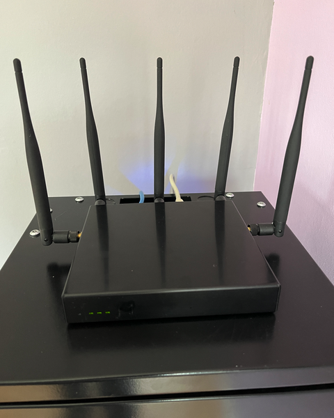
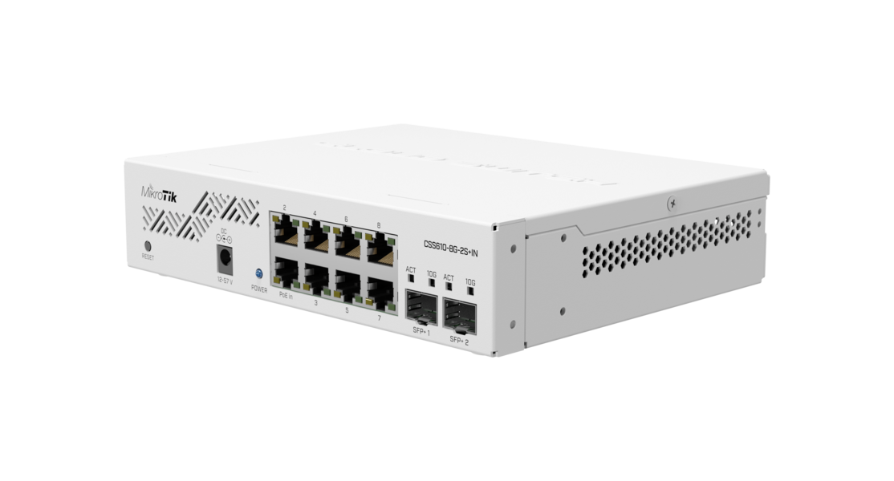

+++
title = "Mon homelab"
tags = ["homelab"]
date = "2025-05-17"
+++

## Box Internet

- Forfait Orange
- 1 Gbit/s en débit descendant et 700 Mbit/s en débit montant

## Routeur OPNsense PC Engines APU2

- Routeur OPNsense avec [carte PC Engines APU2E4](https://www.pcengines.ch/apu2e4.htm)
- OS: [OPNsense](https://opnsense.org/)

## AP et Répéteur Wifi PC Engines APU2

Point d'accès et répéteur Wifi avec OpenWrt.

- [carte PC Engines APU2E0](https://www.pcengines.ch/apu2e0.htm)
- [wle200nx 802.11 a/b/g/n miniPCI express radio](https://www.pcengines.ch/wle200nx.htm)
- [wle600vx 802.11ac miniPCI express wireless modules](https://www.pcengines.ch/wle600vx.htm)
- OS: [OpenWrt](https://openwrt.org/)

## Spécifications des cartes PC Engines APU2

- CPU: AMD Embedded G series GX-412TC, 1 GHz quad Jaguar core with 64 bit and AES-NI support, 32K data + 32K instruction cache per core, shared 2MB L2 cache.
- DRAM: 2 or 4 GB DDR3-1333 DRAM
- Storage: Boot from m-SATA SSD, SD card (internal sdhci controller), or external USB. 1 SATA + power connector.
- 12V DC, about 6 to 12W depending on CPU load. Jack = 2.5 mm, center positive
- Connectivity: 2 or 3 Gigabit Ethernet channels (Intel i211AT on apu2b2, i210AT on apu2b4)
- I/O: DB9 serial port, 2 USB 3.0 external + + 2 USB 2.0 internal, three front panel LEDs, pushbutton
- Expansion: 2 miniPCI express (one with SIM socket), LPC bus, GPIO header, I2C bus, COM2 (3.3V RXD / TXD)
- Board size: 6 x 6" (152.4 x 152.4 mm) - same as apu1d, alix2d13 and wrap1e.
- Firmware: coreboot
- Cooling: Conductive cooling from the CPU to the enclosure using a 3 mm alu heat spreader (included).

## Commutateur réseau administrable MikroTik CSS610-8G-2S+

- 8 ports Ethernet 10/100/1000
- 2 ports SFP+
- OS: SwitchOS Lite

## PC Dual Xeon

- Carte mère: [HUANANZHI X99-F8D PLUS](http://www.huananzhi.com/en/more.php?lm=10&id=311)
- CPU: 56 x Intel(R) Xeon(R) CPU E5-2680 v4 @ 2.40GHz (2 Sockets)
- RAM: 128 Go DDR4 ECC 2400
- Disque: SSD NVME 1To et SSD 240 Go
- OS: [Proxmox](https://www.proxmox.com/en/)

## Station de travail Dell 5820

- CPU: 12 x Intel(R) Xeon(R) W-2133 CPU @ 3.60GHz (1 Socket)
- RAM: 48 Go DDR4 ECC 2666
- Disque: SSD NVME 500 Go
- OS: [Proxmox](https://www.proxmox.com/en/)

## 3 Dell Optiplex micro

- Dell Optiplex 3060
  - CPU: 4 x Intel(R) Core(TM) i5-6600T CPU @ 2.70GHz
  - RAM: 32 Go DDR4 2133
  - Disque: SSD NVME 250 Go
  - OS: [Proxmox](https://www.proxmox.com/en/)
  
- Dell Optiplex 7040
  - CPU: 6 x Intel(R) Core(TM) i5-8400T CPU @ 1.70GHz
  - RAM: 12 Go DDR4 2666
  - Disque: SSD 500 Go
  - OS: [Proxmox](https://www.proxmox.com/en/)

- Dell Optiplex 9020
  - CPU: 4 x Intel(R) Core(TM) i5-4590T CPU @ 2.00GHz
  - RAM: 6 Go DDR3 1600
  - Disque: SSD 128 Go
  - OS: [Proxmox](https://www.proxmox.com/en/)

## BeagleBone Black

- CPU: ARM Cortex A8
- RAM: 512 MB
- Disque: Onboard Flash 4GB, 8bit Embedded MMC
- OS: Debian

## Carte PC Engines Alix 2D3

- CPU: 500 MHz AMD Geode LX800
- RAM: 256 MB DDR DRAM
- Disque: Compact Flash socket, 44 pin IDE header
- OS: [OpenBSD](https://www.openbsd.org/)

