+++
title = "Comment démarrer un système d'exploitation depuis le réseau en PXE avec netboot.xyz"
tags = ["homelab", "network"]
date = "2025-05-16"
+++

## Netboot PXE, c'est quoi?

L'amorçage avec PXE (Pre-boot eXecution Environment) permet à un ordinateur, une station de travail, une appliance de démarrer depuis le réseau en récupérant une image d'un système d'exploitation qui se trouve sur un serveur distant.

Cet amorçage s'effectue généralement en 3 étapes:

1. recherche depuis une interface réseau d'une IP depuis un serveur DHCP ou BOOTP, ainsi que le fichier à amorcer (ici les fichiers d'amorçage proviennent de [Netboot.xyz](https://netboot.xyz/))
2. téléchargement du fichier à amorcer depuis un serveur TFTP
3. exécution du fichier à amorcer

La taille du fichier à amorcer ne permet pas de démarrer directement un noyau Linux (alors qu'on peut avec des certains noyaux BSD), mais il faut que le logiciel à amorcer le télécharge et l'exécute lui-même.

C'est exactement le rôle de [Netboot.xyz](https://netboot.xyz/): amorcer puis télécharger le système d'exploitation à démarrer et installer.

On peut aussi réaliser des séquences de démarrage un peu plus compliquée comme par exemple avec NetBSD: utilisation de PXELINUX pour charger le netboot loader de NetBSD qui se chargera ensuite de démarrer le noyau NetBSD.

Dans cet article, on va rester simple, c'est à dire une amorçage uniquement avec PXE/DHCP/TFTP (on n'aura pas besoin de serveur NFS comme c'est parfois le cas).

## Configuration de OPNsense

Avant toute chose, il faut un serveur DHCP et un serveur TFTP.

Chez moi j'utilise OPNsense depuis bien longtemps (avant ça pfSense et encore avant m0n0wall), on va donc voir comment le configurer pour pourvoir amorcer un système depuis le réseau.

En effet OPNsense me sert déjà pour mon routage, gérer mes machines en DHCP, le DNS avec unbound DNS ou encore le VPN.

### Installation et configuration du serveur TFTP (trivial FTP)

Il n'y a pas de serveur TFTP installé par défaut dans OPNSense, nous devons donc l'installer et cela passe par l'installation d'un plugin.

- aller dans le menu "**System > Firmware > Plugin**"
- recherche le plugin qui se nomme **os-tftp**
- cliquer sur le bouton "**+**" pour installer ce plugin

Le plugin **os-tftp** est installé!

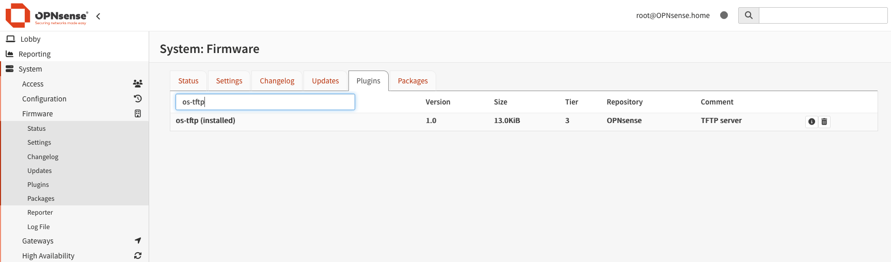

Une fois que le plugin **os-tftp** est installé, il faut encore réaliser quelques opérations via le shell.

On se connecte donc à OPNSense pour créer le répertoire nécessaire pour TFTP.

```sh
ssh root@opnsense
# choisir 8 pour accéder au shell
mkdir /usr/local/tftp
cd /usr/local/tftp
```

Ensuite nous devons télécharger les fichiers netboot dans le répertoire crée précédemment.

```sh
curl -O  https://boot.netboot.xyz/ipxe/netboot.xyz.kpxe
curl -O  https://boot.netboot.xyz/ipxe/netboot.xyz.efi
curl -O  https://boot.netboot.xyz/ipxe/netboot.xyz-arm64.efi
```

On vérifie qu'on a bien les fichiers nécessaires pour la suite.

```sh
root@OPNsense:/usr/local/tftp # ll
total 6748
-rw-r--r--  1 root wheel 1109504 Apr 25 06:33 netboot.xyz-arm64.efi
-rw-r--r--  1 root wheel 1116160 Apr 25 06:33 netboot.xyz.efi
-rw-r--r--  1 root wheel  382860 Apr 25 06:33 netboot.xyz.kpxe
```

J'ai téléchargé le fichier netboot.xyz-arm64.efi pour les architectures ARM mais je ne l'utiliserai pas.

Il nous reste à démarrer le serveur TFTP.
- on active le service TFTP en cliquant sur "**Enable**"
- on indique l'IP depuis laquelle le daemon TFTP écoutera
- on clique sur le bouton "**Save**"
- le service devrait démarrer

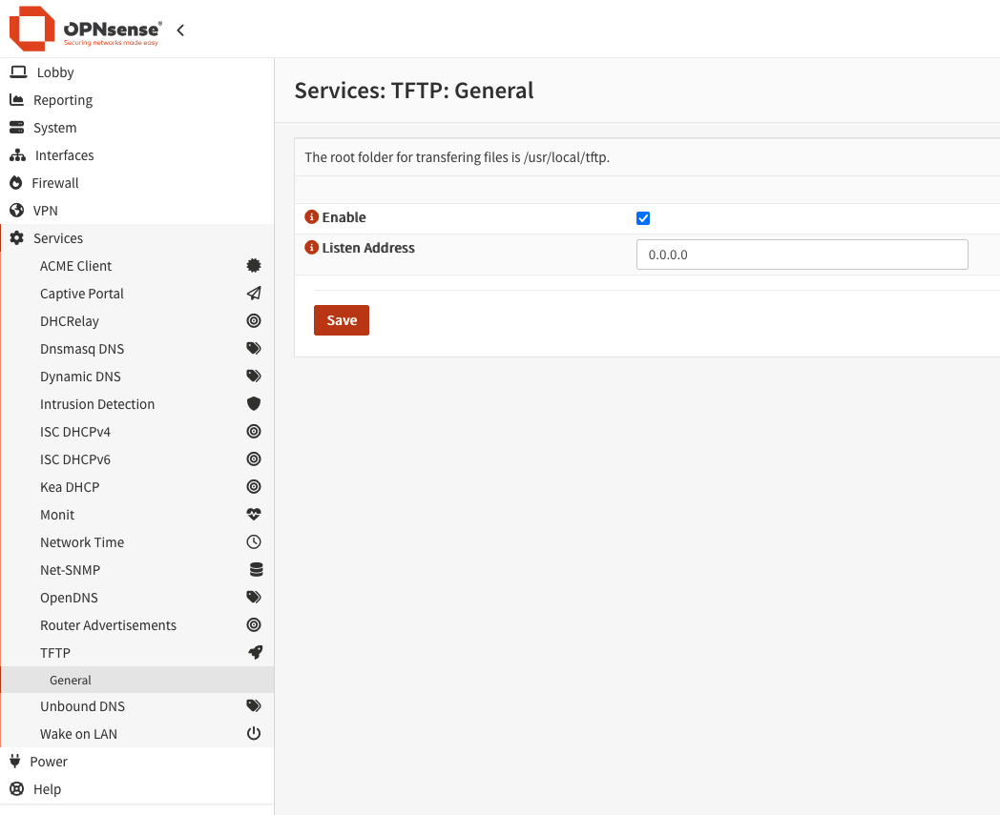

On vérifie que le service est bien démarré en allant dans le menu "**System > Diagnostics > Services**".

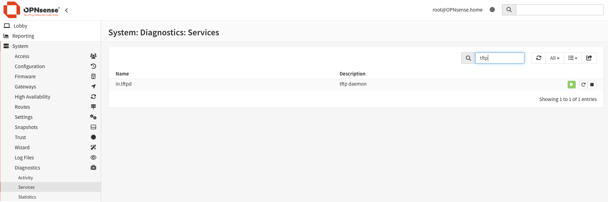

On peut également vérifier depuis un client tftp sur une autre machine étant donné que le daemon tftp écoute sur 0.0.0.0:

```sh
vince @ mac-mini.home ➜  ~ tftp opnsense       
tftp> status
Remote host: opnsense.home
RFC2347 Options support: enabled
Non-RFC defined options support: enabled
Mode: octet
Verbose: off
Debug: none
Artificial packetloss: 0 in 100 packets
Segment size: 512 bytes
Network timeout: 5 seconds
Maximum network timeout: 25 seconds
Maximum timeouts: 5 
tftp> quit
vince @ mac-mini.home ➜  ~
```

Tout est ok, nous allons maintenant configurer notre serveur DHCP.

### Configuration du serveur DHCP

La configuration du serveur DHCP dans OPNsense n'est pas très compliquée.

Par contre ici on part du principe qu'on a déjà un serveur DHCP opérationnel.

- aller dans le menu "**Services > ISC DHCPv4**"
- sélectionner l'interface, ici c'est "**LAN**" qui correspond à mon réseau interne (ça pourrait être OPT1, VLAN1, etc...)
- dans les différents paramètres, rechercher "**Network booting**"
  - cliquer sur le bouton "**Advanced**"
  - activer le en cochant "**Enable network booting**"


- on renseigne les champs comme indiqués dans la capture d'écran en dessous
  - on retrouve l'IP du prochain serveur, en fait le serveur TFTP depuis lequel le fichier d'amorçage sera téléchargé
  - les différents fichiers d'amorçage
- on clique sur le bouton "**Save**" pour sauvegarder notre configuration DHCP

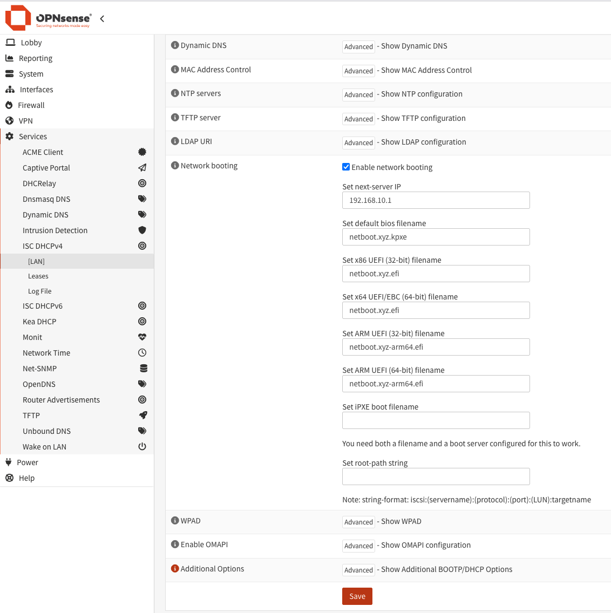

Enfin on peut redémarrer le serveur DHCP pour prendre en compte les modifications.

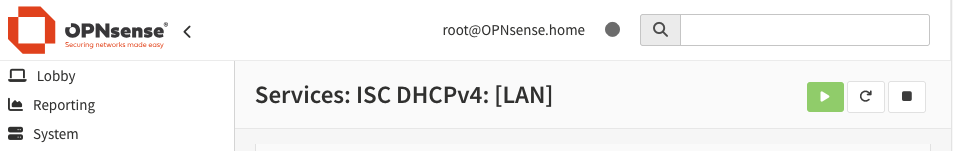

Et voilà on a terminé avec OPNsense.


## Démarrer en PXE avec une carte Alix 2D3

Pour tester tout ça, j'ai une carte PC Engines Alix 2D3 qui trainait dans le placard depuis un bout de temps et il fallait bien lui trouver une utilisation.

La voici: démarrer dessus avec un amorçage PXE!

### Configuration du BIOS

D'abord il faut configurer la carte au niveau du BIOS pour qu'elle démarrage en priorité en PXE.

Pour entrer dans le BIOS, il faut appuyer sur la touche "S" pendant le test de la mémoire. Comme indiqué dans la documentation:

> E toggles PXE boot enable. Defaults to disable as the PXE module has a 60 second time-out.

Je n'avais pas vu et je n'ai pas essayé mais il semble qu'on puisse appuye sur la touche "N" pour démarrer en PXE sans modifier la configuration du BIOS.

> PXE boot can be activated either through the E option in setup (always), or by pressing N during
> memory test (one time). PC Engines cannot provide technical support for the PXE module, too
> many possible failure points (Intel / Via PXE module, DHCP server, TFTP server, boot image etc).
> To avoid premature link failure on cold start, please also enable HDD delay in BIOS setup.

```sh
PC Engines ALIX.2 v0.99h
640 KB Base Memory
261120 KB Extended Memory

01F0 Master 044A TS4GCF170                               
Phys C/H/S 7785/16/63 Log C/H/S 973/128/63

BIOS setup:

(9) 9600 baud (2) 19200 baud (3) 38400 baud (5) 57600 baud *1* 115200 baud
(C) CHS mode *L* LBA mode (W) HDD wait (V) HDD slave *U* UDMA enable
(M) MFGPT workaround
(P) late PCI init
*R* Serial console enable 
*E* PXE boot enable 
(X) Xmodem upload 
(Q) Quit
```

On touche sur la touche "E" pour activer le démarrage sur PXE et "Q" pour quitter et sauvegarder la configuration du BIOS.

### Démarrage en PXE

Une fois le BIOS configuré, la magie opère: la carte Alix 2D3 démarre sur le fichier d'amorace de [Netboot.xyz](https://netboot.xyz/).

Je me connecte à la carte sur un port série car il n'y a pas de sortie vidéo.

```sh
obsd# cu -l cuaU1 -s 115200
Connected to /dev/cuaU1 (speed 115200)

boot> reboot
Rebooting...
exit
PC Engines ALIX.2 v0.99h
640 KB Base Memory
261120 KB Extended Memory

01F0 Master 044A TS4GCF170                               
Phys C/H/S 7785/16/63 Log C/H/S 973/128/63

Intel UNDI, PXE-2.0 (build 082)
Copyright (C) 1997,1998,1999  Intel Corporation
VIA Rhine III Management Adapter v2.43 (2005/12/15)

CLIENT MAC ADDR: 00 0D B9 1B AA 4C  
CLIENT IP: 192.168.10.23  MASK: 255.255.255.0  DHCP IP: 192.168.10.1           
GATEWAY IP: 192.168.10.1 
PXE->EB: !PXE at 9E2E:0070, entry point at 9E2E:0106                           
         UNDI code segment 9E2E:1966, data segment 94BD:9710 (594-640kB)
         UNDI device is PCI 00:09.0, IRQ 10, type DIX+802.3
         594kB free base memory after PXE unload
iPXE initialising devices...


iPXE 1.21.1+ (g4cca1) -- Open Source Network Boot Firmware -- https://ipxe.org
Features: DNS HTTP HTTPS iSCSI NFS TFTP SRP VLAN AoE ELF MBOOT PXE bzImage COMBOOT Menu PXEXT
netboot.xyz - v2.x
                                      
Configuring (net0 00:0d:b9:1b:aa:4c)...... ok
tftp://192.168.10.1/local-vars.ipxe... Not found (https://ipxe.org/2d12613b)
Local vars file not found... attempting TFTP boot...
tftp://192.168.10.1/HOSTNAME-openbsd.ipxe... Not found (https://ipxe.org/2d12613b)
Custom boot by Hostname not found trying MAC...
tftp://192.168.10.1/MAC-000db91baa4c.ipxe... Not found (https://ipxe.org/2d12613b)
Custom boot by MAC not found booting default...
tftp://192.168.10.1/menu.ipxe... Not found (https://ipxe.org/2d12613b)
Local TFTP failed... attempting remote HTTPS
Attempting https boot over IPv4...
https://boot.netboot.xyz/menu.ipxe... ok
boot.cfg... ok
Attempting to retrieve latest upstream version number...
https://boot.netboot.xyz/version.ipxe... ok

netboot.xyz v2.x - next-server: 192.168.10.1 
```

On voit quelques informations intéressantes pendant la séquence de démarrage:
- connexion réseau avec le serveur DHCP
- tentatives de téléchargement des fichiers d'amorçage
- netboot.xyz v2.x - next-server: 192.168.10.1

Ça fonctionne: on démarre bien depuis le réseau en téléchargeant un fichier d'amorçage.

## Démarrage d'une VM en PXE dans Proxmox

Maintenant on va faire la même chose mais avec une VM dans notre hyperviseur préféré Proxmox.

Je ne rentre pas dans le détail de la création de la VM car ce n'est pas l'objectif de cet article.

Il faut juste s'assurer dans la configuration que le démarrage de la VM se fait bien sur l'interface réseau en 1er et non pas sur le disque ni le CD-ROM.


### Configuration de la VM

Pour cela, c'est très simple:

- sélectionner la VM sur laquelle démarrer sur le réseau avec PXE
- dans le menu "**Options**" de la VM, sélectionner "**Boot Order**" et cliquer en haut sur le bouton "**Edit**"

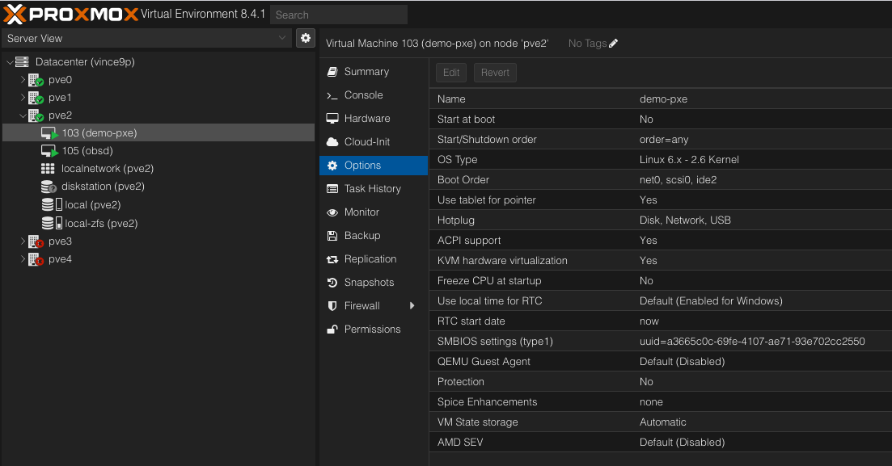

Il suffit de modifier l'ordre et de choisir "**net0**" à mettre en haut de la liste pour démarrer sur le périphérique réseau.

Le nom de l'interface réseau peut éventuellement changer suivant la configuration de la VM.


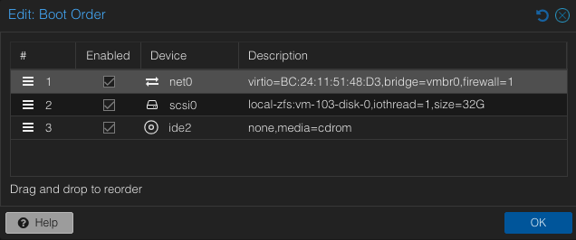

On configure pour accéder à la VM par le port série avec un terminal

- ajouter une interface série
- modifier l'affichage (Display) et sélectionner l'interface "**Serial terminal 0**"

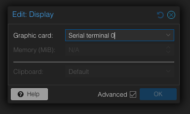

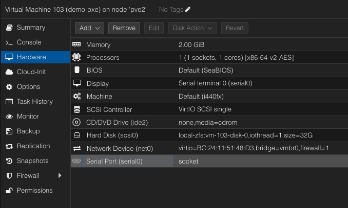

La VM est correctement configurée, il reste à la démarrer.

### Démarrage de la VM en PXE

Et maintenant il n'y a plus qu'à démarrer notre VM et accéder à la console par le terminal.

Pour cela il suffit de sélectionner "**xterm.js**" depuis le menu "**Console**" situé en haut à droite.

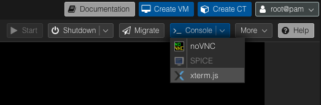

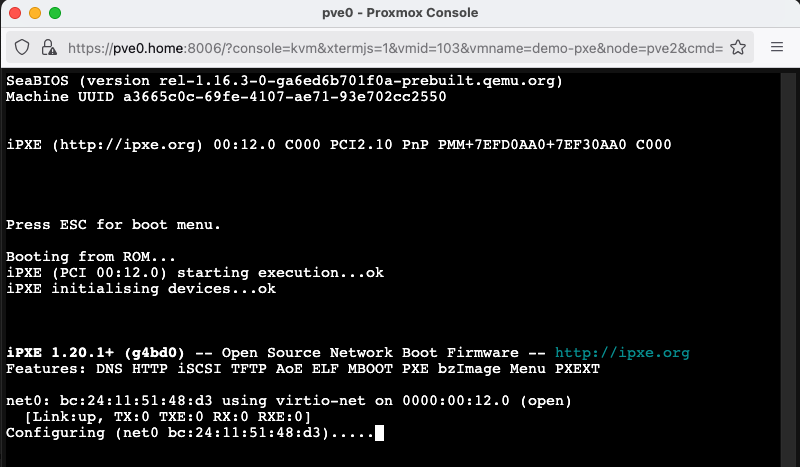


Ci dessous on retrouve la séquence complète de démarrage de la VM.

```sh
SeaBIOS (version rel-1.16.3-0-ga6ed6b701f0a-prebuilt.qemu.org)
Machine UUID a3665c0c-69fe-4107-ae71-93e702cc2550


iPXE (http://ipxe.org) 00:12.0 C000 PCI2.10 PnP PMM+7EFD0AA0+7EF30AA0 C000
                                                                               


Press ESC for boot menu.

Booting from ROM...
iPXE (PCI 00:12.0) starting execution...ok
iPXE initialising devices...ok


iPXE 1.20.1+ (g4bd0) -- Open Source Network Boot Firmware -- http://ipxe.org
Features: DNS HTTP iSCSI TFTP AoE ELF MBOOT PXE bzImage Menu PXEXT

net0: bc:24:11:51:48:d3 using virtio-net on 0000:00:12.0 (open)
  [Link:up, TX:0 TXE:0 RX:0 RXE:0]
Configuring (net0 bc:24:11:51:48:d3)...... ok
net0: 192.168.10.186/255.255.255.0 gw 192.168.10.1
Next server: 192.168.10.1
Filename: netboot.xyz.kpxe
tftp://192.168.10.1/netboot.xyz.kpxe... ok
netboot.xyz.kpxe : 382860 bytes [PXE-NBP]
PXE->EB: !PXE at 9C6C:0710, entry point at 9C6C:0160
         UNDI code segment 9C6C:0802, data segment 9CF0:2CE0 (625-639kB)
         UNDI device is PCI 00:12.0, IRQ 10, type DIX+802.3
         625kB free base memory after PXE unload
iPXE initialising devices...


iPXE 1.21.1+ (g4cca1) -- Open Source Network Boot Firmware -- https://ipxe.org
Features: DNS HTTP HTTPS iSCSI NFS TFTP SRP VLAN AoE ELF MBOOT PXE bzImage COMBO
OT Menu PXEXT
netboot.xyz - v2.x
                                      
Configuring (net0 bc:24:11:51:48:d3).................. ok
tftp://192.168.10.1/local-vars.ipxe... Not found (https://ipxe.org/2d12613b)
Local vars file not found... attempting TFTP boot...
Custom boot by Hostname not found trying MAC...
tftp://192.168.10.1/MAC-bc24115148d3.ipxe... Not found (https://ipxe.org/2d12613
b)
Custom boot by MAC not found booting default...
tftp://192.168.10.1/menu.ipxe... Not found (https://ipxe.org/2d12613b)
Local TFTP failed... attempting remote HTTPS
Attempting https boot over IPv6...
https://boot.netboot.xyz/menu.ipxe....
```

```sh
                  netboot.xyz v2.x - next-server: 192.168.10.1
      
   Default:                                                                    
      Boot from local hdd                                               (268)  
   Distributions:                                                              
      Linux Network Installs (64-bit)                                          
      Live CDs                                                                 
      BSD Installs                                                             
      Unix Network Installs                                                    
      FreeDOS                                                                  
      Windows                                                                  
   Tools:                                                                      
      Utilities (64-bit)                                                       
      Architecture: x86_64                                                     
      iPXE shell                                                               
      Network card info                                                        
      PCI Device List                                                          
      About netboot.xyz                                                        
   Signature Checks:                                                           
      netboot.xyz [ enabled: true ] 
```


Comme sur la carte Alix, on peut voir en détail la séquence de démarrage.

On récupère une adresse IP depuis le serveur DHCP et ensuite il nous donne l'IP pour se connecter au serveur TFTP.

```sh
net0: 192.168.10.186/255.255.255.0 gw 192.168.10.1
Next server: 192.168.10.1
```

Ensuite depuis ce serveur TFTP, on télécharge le fichier d'amorçage **netboot.xyz.kpxe**.

```sh
Filename: netboot.xyz.kpxe
tftp://192.168.10.1/netboot.xyz.kpxe... ok
netboot.xyz.kpxe : 382860 bytes [PXE-NBP]
```

En fin de séquence de démarrage, on tombe sur le menu spécifique à [Netboot.xyz](https://netboot.xyz/) qui nous permet de choisir le système d'exploitation à démarrer.

## Netboot.xyz

Je ne rentre pas dans les détails de [Netboot.xyz](https://netboot.xyz/) car la documentation officielle est déjà très complète.

Voici quelques captures d'écran de [Netboot.xyz](https://netboot.xyz/) lorsque l'on démarre dessus en PXE.

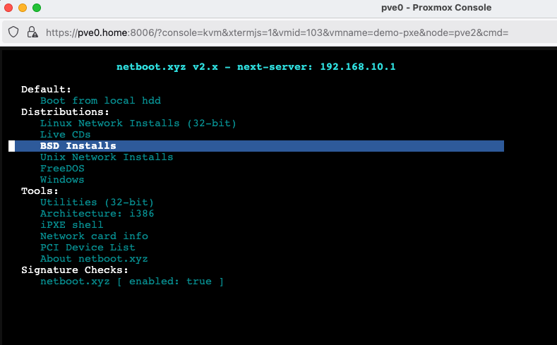

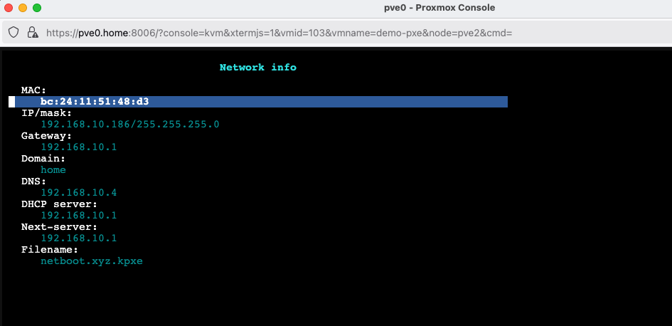

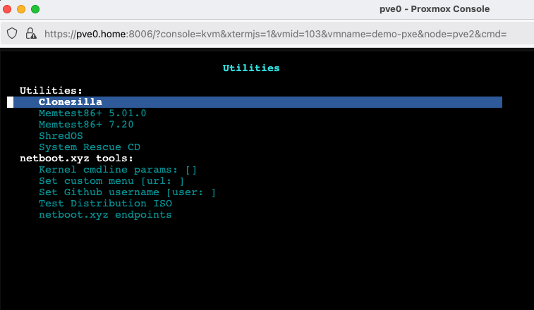

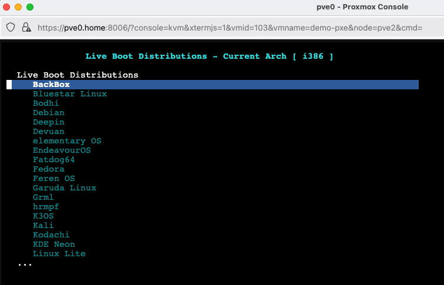

## Conclusion

Et voilà on est capable de démarrer à peu prêt n'importe quelle machine depuis le réseau en PXE pour peu:
- qu'elle dispose d'une interface et connexion au réseau
- que son BIOS permette de démarrer en PXE
- qu'on est sous la main un serveur DHCP et TFTP

J'ai voulu également tester ça avec une carte BeagleBone Black dotée d'un ARM Cortex A8, malheursement son BIOS ne permet pas de démarrer en PXE.

A moi l'installation de Linux, OpenBSD, FreeBSD depuis le réseau sur mes machines physiques ou virtuelles!

## Pour aller plus loin

* <https://netboot.xyz/>
* <https://opnsense.org/>
