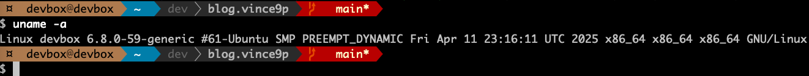
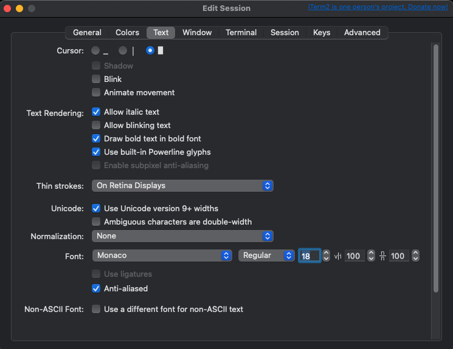

+++
title = "Bye bye Oh My Zsh, retour à bash et powerline.bash "
tags = ["shell"]
date = "2025-05-28"
+++

## Pourquoi supprimer Oh My Zsh?

- je suis très loin d'utiliser toutes fonctionnalités de zsh/oh-my-zsh
- je trouve que c'est un peu l'usine à gaz
- je suis partisant du minimaliste et d'utiliser autant que possible les outils/fonctionnalités déjà installés sur les sytèmes d'exploitation

## Installation et configuration

On supprime donc **Oh My Zsh**, pour cela on exécute la commande suivante en ligne de commande depuis un shell **oh-my-zsh**:

```sh
uninstall_oh_my_zsh
```

```sh
devbox@devbox ➜  ~ uninstall_oh_my_zsh

Switching your shell back to '/bin/bash':
Password:
Are you sure you want to remove Oh My Zsh? [y/N] y
Removing ~/.oh-my-zsh
Found ~/.zshrc -- Renaming to /home/devbox/.zshrc.omz-uninstalled-2025-05-28_04-31-11
Looking for original zsh config...
No original zsh config found
Thanks for trying out Oh My Zsh. It's been uninstalled.
Don't forget to restart your terminal!
devbox@devbox ➜  ~
```

Et là on revient à un autre shell, on choisira **bash**.

Comme indiqué on n'oublie pas de redémarrer son terminal.

```sh
devbox@devbox:~$ echo $SHELL
/bin/bash
```

Ensuite on va installer [powerline.bash](https://gitlab.com/bersace/powerline.bash) pour enrichir quand même de quelques fonctionnaliés suplémentaires.

Pour installer [powerline.bash](https://gitlab.com/bersace/powerline.bash):

```sh
curl -Lo ~/.config/powerline.bash https://gitlab.com/bersace/powerline-bash/raw/master/powerline.bash
. ~/.config/powerline.bash
PROMPT_COMMAND='__update_ps1 $?
```

Ensuite il faut ajouter la configuration suivante dans votre fichier _.bashrc_ pour activer **powerline.bash**:

```sh
. ${HOME}/.config/powerline.bash
PROMPT_COMMAND='__update_ps1 $?'
```

Recharger le shell bash:

- soit avec ```exec $SHELL```
- soit en sourceant le fichier _.bashrc_: ```. .bashrc```

Et voila!



> N'oublier pas d'utiliser une police avec les symboles Powerline ou d'activer le support des glyphs Powerline

Par exemple dans ITerm2 sur macOS:

- aller dans le menu "**Session > Edit session**"
- séléctionner l'onglet "**Text**"
- activer l'option "**Use built-in Powerline glyphs**"



Pour en savoir plus aller voir directement sur <https://gitlab.com/bersace/powerline.bash>, c'est très bien expliqué et en français.

## Références

- [powerline.bash](https://gitlab.com/bersace/powerline.bash)
- [powerline-shell](https://github.com/b-ryan/powerline-shell)
- [Uninstalling Oh My Zsh](https://github.com/ohmyzsh/ohmyzsh?tab=readme-ov-file#uninstalling-oh-my-zsh)
