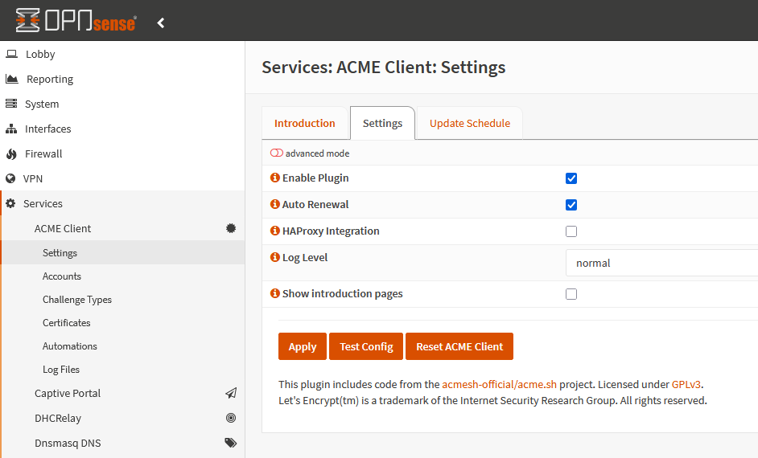

+++
title = "Renouvellement automatique des certificats avec Let’s Encrypt et ACME"
tags = ["homelab", "k8s", "proxmox", "opnsense"]
date = "2025-03-12"
+++


Comment ne plus s'enquiquiner avec le renouvellement de nos certificats? Let's Encrypt bien sûr!
Il faut reconnaître qu'on se noie bien souvent dans un verre d'eau avec la gestion de nos certificats et de leurs renouvellements!

Cet article partira sur un exemple avec un nom de domaine OVH avec un challenge en DNS-01 mais le même principe s'applique avec d'autres fournisseurs de nom de domaine (en challenge DNS-01,HTTP-01, autres types).

Pour plus de détail concernant les types de challenges, voir la documentation Let's Encrypt: <https://letsencrypt.org/fr/docs/challenge-types/>

### Pour les Ingress dans Kubernetes

Comment faire pour activer du https avec des certificats valides et renouvellés automatiquement sur nos Ingress Kubernetes?
Pour cela on a besoin de cert-manager ainsi que le webhook OVH.

#### Installation de Cert-Manager

Je parts du principe que je suis déjà en full Gitops avec Flux sur un cluster Kubernetes et donc je ne passerai par des commandes "helm install" en ligne de commande mais directement par l'édition de fichiers Kubernetes à pousser dans notre source de vérité Git!

Rien de particulier ici, on installe le HelmRelease de cert-manager.

```yaml
# cert-manager.yaml
---
apiVersion: v1
kind: Namespace
metadata:
  name: cert-manager
---
apiVersion: source.toolkit.fluxcd.io/v1
kind: HelmRepository
metadata:
  name: cert-manager
  namespace: cert-manager
spec:
  interval: 24h
  url: https://charts.jetstack.io
---
apiVersion: helm.toolkit.fluxcd.io/v2
kind: HelmRelease
metadata:
  name: cert-manager
  namespace: cert-manager
spec:
  interval: 30m
  chart:
    spec:
      chart: cert-manager
      version: 1.16.1
      sourceRef:
        kind: HelmRepository
        name: cert-manager
        namespace: cert-manager
      interval: 12h
  values:
    installCRDs: true
```

#### Installation du Webhook OVH pour Cert-Manager

On installe ensuite le [webhook OVH](https://artifacthub.io/packages/helm/cert-manager-webhook-ovh/cert-manager-webhook-ovh) nécessaire à Cert-Manager pour avoir l'implémentation OVH pour le challenge en DNS-01.

Il faudra modifier les variables suivantes dans le HelmRelease:

- groupName
- email: pour s'enregistrer auprès de Let's Encrypt

Ici non plus rien de particulier à dire, si ce n'est que j'ai uniquement configuré Let's Encrypt avec l'url de production (il y a un staging Let's Encrypt pour tester la génération des certificats, je l'ai supprimé du HelmRelease pour plus de lisibilité).

```yaml
# cert-manager-webhook-ovh.yaml
---
apiVersion: source.toolkit.fluxcd.io/v1
kind: HelmRepository
metadata:
  name: cert-manager-webhook-ovh
  namespace: cert-manager
spec:
  interval: 24h
  url: https://aureq.github.io/cert-manager-webhook-ovh/
---
apiVersion: helm.toolkit.fluxcd.io/v2
kind: HelmRelease
metadata:
  name: cert-manager-webhook-ovh
  namespace: cert-manager
spec:
  interval: 30m
  chart:
    spec:
      chart: cert-manager-webhook-ovh
      version: 0.7.0
      sourceRef:
        kind: HelmRepository
        name: cert-manager-webhook-ovh
        namespace: cert-manager
      interval: 12h

  values:
    configVersion: 0.0.1
    groupName: ${groupName}
    issuers:
      - name: le-prod
        create: true
        kind: ClusterIssuer
        namespace: default
        cnameStrategy: None
        acmeServerUrl: https://acme-v02.api.letsencrypt.org/directory
        email: ${email}
        ovhEndpointName: ovh-eu
        ovhAuthenticationRef:
          applicationKeyRef:
            name: ovh-credentials
            key: applicationKey
          applicationSecretRef:
            name: ovh-credentials
            key: applicationSecret
          consumerKeyRef:
            name: ovh-credentials
            key: consumerKey
```

#### Configuration du webhook OVH

Vous noterez au dessus qu'on référence un objet ovhAuthentificationRef.

En effet pour utiliser le webhook OVH il convient de créer un API Key dans l'interface d'OVH et de configurer ce webhook avec l'Application Key, Application Secret et le Consumer Key qui seront donc configurés dans ce webhook.

Sur l'interface OVH qui se trouve ici <https://api.ovh.com/createToken/index.cgi>

1. Renseigner un nom d'application et une description
2. Définir une durée de validité
3. Ajouter les droits sur **GET/PUT/POST/DELETE** sur **/domain/zone/**


Une fois qu'on a notre Application Key, Application Secret et Consumer Key, on met tout ça dans un secret Kubernetes. Ici on utilisera un SealedSecret (secret scellé).
C'est donc ce sealed secret qu'on utilise pour ovhAuthentificationRef de notre configuration du webhook OVH.

```yaml
---
apiVersion: bitnami.com/v1alpha1
kind: SealedSecret
metadata:
  creationTimestamp: null
  name: ovh-credentials
  namespace: cert-manager
spec:
  encryptedData:
    applicationKey: ...
    applicationSecret: ...
    consumerKey: ...
  template:
    metadata:
      creationTimestamp: null
      name: ovh-credentials
      namespace: cert-manager
    type: Opaque
```

Une fois qu'on déploie tous nos fichiers Kubernetes en gitops, on vérifie que tout est opérationnel sur notre cluster Kubernetes.
Les pods cert-manager, cert-manager-ca-injector, cert-manager-webhook et cert-manager-webhook-ovh doivent être up and running.


Il ne reste plus qu'à configurer nos Ingress Kubernetes. Je ne rentrerai pas dans le détail de la configuration de core-dns, external-dns, de l'Ingress Controller qui pourraient faire l'objet d'un article à part entière.

Tout est déjà correctement configuré sur mon cluster (dans mon cas pour l'Ingress j'utilise Traefik, ce serait identique avec nginx ou haproxy).

### Configuration des Ingress

Rien de plus simple, suivant le déploiement (Kind Ingress ou HelmRelease avec values ingress), la configuration peut changer mais en gros, il y a juste ajouter une annotation au niveau de l'Ingress pour indiquer que l'émetteur du certificat sera Let's Encrypt: cert-manager.io/cluster-issuer: le-prod.

Et bien entendu on ajoute aussi une entrée tls pour cet Ingress avec le nom du secret et le nom du host.

A noter que le nom le-prod est celui indiqué dans notre fichier HelmRelease cert-manager-webhook-ovh.yaml où on a déclaré l'émetteur.

```yaml
 ingress:
        enabled: true
        annotations:
          cert-manager.io/cluster-issuer: le-prod
        hosts:
          - ${prometheusIngressHost}
        path: /
        tls:
          - secretName: prometheus-tls
            hosts:
            - ${prometheusIngressHost}
```

Voila les Ingress qui sont déployés sur mon cluster:


Et maintenant on va aller voir du côté des certificats ce que ça donne.

Lors de l'installation du controller Cert-Manager, des CRD (Custom Resource Definition, en gros de nouveaux objets Kubernetes) ont été installés dans notre cluster et notamment les objets Certificaterequests et Certificate.

Ici on vérifie les demandes de certificats qui ont été émises par le controller Cert-Manager, certificats nécessaires pour notre Ingress pour le tls.


On voit que tout est ok et "approved". Maintenant on peut regarder voir si nos certificats émis par Let's Encrypt sont bien présents dans notre cluster.


Tous nos certificats ont bien été générés par Let's Encrypt et sont bien déployés dans notre cluster.

### Vérification de l'utilisation des certificats avec le HTTPS


Comme j'use et abuse de curl, bien entendu je préfére vérifier avec curl plutôt qu'avec mon navigateur.
On peut voir que le certificat a bien été généré et émis par Let's Encrypt avec une validité de 3 mois.

```sh
curl -v https://podinfo.homelab.vincentdupain.com/
*   Trying 192.168.10.211:443...
* Connected to podinfo.homelab.vincentdupain.com (192.168.10.211) port 443 (#0)
* ALPN, offering h2
* ALPN, offering http/1.1
*  CAfile: /etc/ssl/certs/ca-certificates.crt
*  CApath: /etc/ssl/certs
* TLSv1.0 (OUT), TLS header, Certificate Status (22):
* TLSv1.3 (OUT), TLS handshake, Client hello (1):
* TLSv1.2 (IN), TLS header, Certificate Status (22):
* TLSv1.3 (IN), TLS handshake, Server hello (2):
* TLSv1.2 (IN), TLS header, Finished (20):
* TLSv1.2 (IN), TLS header, Supplemental data (23):
* TLSv1.3 (IN), TLS handshake, Encrypted Extensions (8):
* TLSv1.2 (IN), TLS header, Supplemental data (23):
* TLSv1.3 (IN), TLS handshake, Certificate (11):
* TLSv1.2 (IN), TLS header, Supplemental data (23):
* TLSv1.3 (IN), TLS handshake, CERT verify (15):
* TLSv1.2 (IN), TLS header, Supplemental data (23):
* TLSv1.3 (IN), TLS handshake, Finished (20):
* TLSv1.2 (OUT), TLS header, Finished (20):
* TLSv1.3 (OUT), TLS change cipher, Change cipher spec (1):
* TLSv1.2 (OUT), TLS header, Supplemental data (23):
* TLSv1.3 (OUT), TLS handshake, Finished (20):
* SSL connection using TLSv1.3 / TLS_AES_128_GCM_SHA256
* ALPN, server accepted to use h2
* Server certificate:
*  subject: CN=podinfo.homelab.vincentdupain.com
*  start date: Mar  8 05:58:57 2025 GMT
*  expire date: Jun  6 05:58:56 2025 GMT
*  subjectAltName: host "podinfo.homelab.vincentdupain.com" matched cert's "podinfo.homelab.vincentdupain.com"
*  issuer: C=US; O=Let's Encrypt; CN=R10
*  SSL certificate verify ok.
* Using HTTP2, server supports multiplexing
* Connection state changed (HTTP/2 confirmed)
* Copying HTTP/2 data in stream buffer to connection buffer after upgrade: len=0
* TLSv1.2 (OUT), TLS header, Supplemental data (23):
* TLSv1.2 (OUT), TLS header, Supplemental data (23):
* TLSv1.2 (OUT), TLS header, Supplemental data (23):
* Using Stream ID: 1 (easy handle 0x55c3389549f0)
* TLSv1.2 (OUT), TLS header, Supplemental data (23):
> GET / HTTP/2 
```

All good, je suis en https avec des certificats générés et renouvellés quelque soit le sous-domaine.

### Super mais hors Kubernetes, je faits comment pour mes certificats?

ACME (Automatic Certificate Management Environment) bien sûr, généralement 2 possibilités:

1. soit l'intégration native ACME est déjà prévue
2. soit elle ne l'est pas et alors on utilisera le script acme.

#### Intégration ACME native: exemple avec Proxmox

Dans Proxmox l'intégration ACME est déjà prévue et il est possible de choisir différents providers (dans notre cas, on est sur OVH en challenge DNS-01 et le provider est présent).

Il faut tout d'abord configurer le compte Let's Encrypt ainsi que le plugin OVH pour le challenge dans la configuration générale de Proxmox (dans Datacenter).


On ajoute le compte Let's Encrypt et on ajoute le plugin.


On choisit donc le plugin OVH et pour **OVH_AK**, **OVH_AS** et **OVH_CK** on reprend les valeurs qu'on a généré tout à l'heure depuis l'interface d'OVH (cf. Application Key, Application Secret et Consumer Key).


Une fois cette configuration réalisée alors sur chaque noeud de notre cluster Proxmox, il suffira de configurer ACME et de déclencher la génération des certificats.


On édite d'abord le compte à utiliser qu'on a défini au dessus dans la configuration générale.

Puis on ajoute un domaine en cliquant sur le bouton "**Add**".


Une fois fait, je n'ai plus qu'à cliquer sur le bouton "**Order Certificates Now**" pour demander à Let's Encrypt de me générer des certificats et de les installer sur le noeud proxmox.


Lors de la génération des certificats, on peut voir dans les logs qu'un record TXT est ajouté au nom DNS par Let's Encrypt.


Côté OVH et DNS, on peut voir ce record TXT (record de la forme _acme-challenge.YOUR_DOMAIN):

```text
_acme-challenge.pve4     60 IN TXT
```

Et hop un certificat valide pour mon noeud pve de mon cluster.


#### Intégration ACME native: exemple avec OPNsense

Je ne vais pas trop rentré dans le détail car le principe est toujours le même:

1. configuration du compte utilisé pour Let's Encrypt
2. configuration du plugin/provider OVH avec la clé API, secret, etc...
3. ajout/création du domaine pour le certificat à générer
4. enfin génération et installation du certificat généré par Let's Encrypt

Dans OPNsense, il faut aller dans les sous-menus de "**Services / ACME Client**".

Dans les settings, on active le renouvellement automatique pour ne pas s'embêter à le faire soit même.



On configure ensuite le compte à utiliser pour Let's Encrypt avec notre email.


Ensuite on configure le type de challenge à utiliser. Ici on est toujours sur OVH en challenge DNS-01.

Comme pour la configuration de cert-manager et de Proxmox, on a besoin de l'application key, application secret et consumer key qu'on avait crée
depuis l'interface OVH.


Une fois tout ça configuré, il suffit d'ajouter un certificat pour notre domaine.

On voit d'ailleurs ici que le renouvellement a été réalisée la veille de l'écriture de cet article.


A noter que dans mon router/firewall OPNsense j'utilise **Unbound DNS** pour overrider des hosts/domaines et ainsi avoir du https en interne sur des services non exposés sur internet.


#### Pas d'intégration native: utilisation du script ACME

Dans ce cas j'utilise le script ACME directement pour générer et renouveller les certificats.

Je ne vais pas m'étendre sur l'utilisation d'ACME car tout est très bien documenté ici: <https://github.com/acmesh-official/acme.sh>

Pour simplifier à l'extrême, je montre rapidement 2 scripts pour

comprendre le fonctionnement:

- un pour générer les certificats
- et un autre pour le renouvellement des certificats

Dans le script de génération, on reconnaît des choses qu'on a déjà vu plusieurs fois (AK, AS, CK, type de challenge dns_ovh).

```sh
root@caddy:~# cat cert.sh
#!/bin/sh
export OVH_AK="..."
export OVH_AS="..."
export OVH_CK=".."
$HOME/.acme.sh/acme.sh --issue -d devbox.vincentdupain.com --dns dns_ovh --server letsencrypt
```

Dans le script de renouvellement, idem rien de difficile, il voit le paramètre renew pour renouveller le certificat.

Ensuite le script installe les certificats (installcert) à l'endroit désiré (ici Caddy le reverse proxy) et ce script recharge (reloadcmd) la configuration de Caddy qui utilise ces certificats.

```sh
root@caddy:~# cat renew_cert.sh
#!/bin/sh
/root/.acme.sh/acme.sh --renew -d devbox.vincentdupain.com --force
/root/.acme.sh/acme.sh --installcert -d devbox.vincentdupain.com \
  --cert-file /etc/caddy/devbox.vincentdupain.com.cer \
  --key-file /etc/caddy/devbox.vincentdupain.com.key \
  --reloadcmd  "systemctl restart caddy"
```

Dans cet exemple, les certificats sont générés pour un reverse proxy Caddy. Dans la configuration Caddy, je référence les chemins vers le certificat et la clé pour activer le TLS.

```sh
root@caddy:~# cat /etc/caddy/Caddyfile
devbox.vincentdupain.com  {
  reverse_proxy devbox:9999
  tls /etc/caddy/devbox.vincentdupain.com.cer /etc/caddy/devbox.vincentdupain.com.key
}
```

J'ai vraiment survolé et simplifié mais bon quand on a compris le principe alors on peut le répliquer et généraliser comme on veut (apache, nginx, etc...).

### Conclusion

Pourquoi s'embêter à gérer nos certificats TLS quand on peut automatiser tout ça.
D'autant plus que nos outils le permettent facilement et que finalement ce n'est pas si compliqué que cela.

Si je ne dis pas de bétise, Let's Encrypt et ACME fonctionnent avec les certificats SAN et wildcard.

Dernier point, on a vu rapidement ACME pour le renouvellement
automatique, ce dernier n'est pas propre à Let's Encrypt, en effet il peut
être utilisé avec d'autres fournisseurs de certificats TLS (ZeroSSL, etc...).

## Références

- les types de challenges: <https://letsencrypt.org/fr/docs/challenge-types/>
- cert-manager: <https://artifacthub.io/packages/helm/cert-manager/cert-manager>
- cert-manager webhook OVH: <https://artifacthub.io/packages/helm/cert-manager-webhook-ovh/cert-manager-webhook-ovh>
- acme: <https://github.com/acmesh-official/acme.sh>
- How to use OVH domain API: <https://github.com/acmesh-official/acme.sh/wiki/How-to-use-OVH-domain-api>
