+++
title = "Terraformation de clusters Kubernetes Talos sur Proxmox en GitOps"
tags = ["homelab", "k8s"]
date = "2025-03-02"
+++

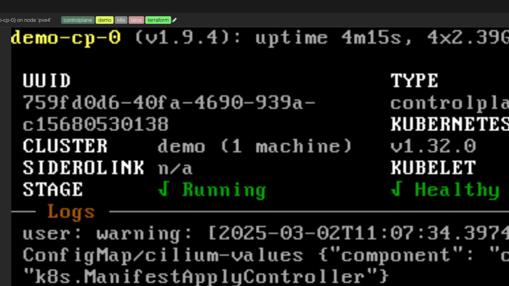

Après avoir développé un provider terraform pour créer des clusters K8s Talos sur l'hyperviseur Proxmox, je me suis dit que ce serait sympa de pouvoir créer ces clusters K8s directement en GitOps dans K8s avec FluxCD plutôt que d'éditer des fichiers Terraform et de gérer son infrastructure et ces clusters Kubernetes à coup de plan/apply/destroy en ligne de commande.

## Terraform Controller à la rescousse

Finalement c'est assez simple, la gestion de notre IaC Terraform ne sera plus réalisée à la main mais directement avec le controller Terraform à partir de la déclaration de l'IaC qu'on poussera dans Git.

Tout d'abord, on a besoin de déployer le controller Terraform dans notre cluster k8s existant.

Je ne vais pas rentrer dans les explications du fonctionnement de ce controller car tout est très bien documenté ici: <https://flux-iac.github.io/tofu-controller/>

En gros ce que fait ce controller Terraform:

- CRD pour définir un objet de type Terraform
- gère les runners terraform (validate/plan/apply/destroy)
- gère la réconcilation et du drift des ressources terraform

Pour déployer ce controller, voir le manifest [tf-controller.yaml](<https://github.com/vdupain/gitops-k8s/blob/main/infrastructure/tf/tf-controller.yaml>) ci-dessous. Dans mon cas, ce controller est dans mon GitOps sur lequel est branché mon cluster "staging" avec FluxCD

```yaml
# tf-controller.yaml 
---
apiVersion: source.toolkit.fluxcd.io/v1
kind: HelmRepository
metadata:
  name: tf-controller
  namespace: flux-system
spec:
  interval: 24h
  type: oci
  url: oci://ghcr.io/flux-iac/charts
---
apiVersion: helm.toolkit.fluxcd.io/v2
kind: HelmRelease
metadata:
  name: tf-controller
  namespace: flux-system
spec:
  interval: 30m
  chart:
    spec:
      chart: tf-controller
      sourceRef:
        kind: HelmRepository
        name: tf-controller
      version: '0.16.0-rc.4'
      interval: 12h
  releaseName: tf-controller
  targetNamespace: flux-system
  install:
    crds: Create
  upgrade:
    crds: CreateReplace
  values:
    replicaCount: 1
    concurrency: 24
    resources:
      limits:
        cpu: 1000m
        memory: 2Gi
      requests:
        cpu: 400m
        memory: 64Mi
    caCertValidityDuration: 24h
    certRotationCheckFrequency: 30m
    image:
      tag: v0.16.0-rc.4
    runner:
      image:
        tag: v0.16.0-rc.4
```

Une fois déployé dans notre cluster, on a notre controller terraform qui tourne dans notre cluster et de nouveaux CRD ont été installés, notamment le nouvel objet **Terraform**.

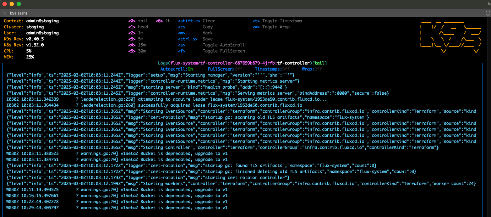

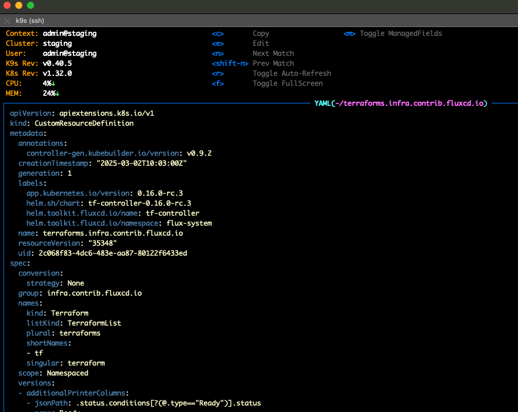

## Prérequis

 Avant d'utiliser le nouvel objet Terraform pour créer notre cluster K8s de démo avec mon provider terraform-proxmox-talos-k8s-cluster, il faut déclarer et déployer dans le cluster existant les credentials pour accéder à l'hyperviseur Proxmox ainsi qu'un objet GitRepository pour indiquer où se trouve les sources git de ce provider terraform-proxmox-talos-k8s-cluster.

Pour les credentials Proxmox, ils seront stockés dans ce secret k8s (dans la vraie vie ce sera un SealedSecret). Il faut déclarer:

- le user SSH
- un API token Proxmox

car le provider [Terraform bpg pour Proxmox](<https://registry.terraform.io/providers/bpg/proxmox/latest/docs>) que j'utilise dans mon provider nécessite à la fois des accès par API mais aussi des accès SSH sur les noeuds Proxmox directement (pour la création des custom disks par exemple, l'API Proxmox ne permettant pas de tous faire en terme de création de ressources.

Voir ici: <https://registry.terraform.io/providers/bpg/proxmox/latest/docs/resources/virtual_environment_vm>)

```yaml
# proxmox-credentials.secret.yaml
---
apiVersion: v1
kind: Secret
metadata:
  name: proxmox-pve-credentials
  namespace: flux-system
stringData:
  ssh_username: terraform
  ssh_password: terraform
  api_token: terraform@pve!provider=<api-token>
```

Maintenant on va déployer notre objet GitRepository dans notre cluster k8s, c'est lui qui indique où se trouve notre provider terraform-proxmox-talos-k8s-cluster.

Cette objet GitRepository sera utilisé par l'objet Terraform pour savoir où se trouve la source de l'IaC ainsi que les modules Terraform dont nous aurons besoin pour créer notre cluster K8s Talos sur Proxmox.

```yaml
---
apiVersion: source.toolkit.fluxcd.io/v1
kind: GitRepository
metadata:
  name: terraform-proxmox-talos-k8s-cluster
  namespace: flux-system
spec:
  interval: 30s
  url: https://github.com/vdupain/terraform-proxmox-talos-k8s-cluster
  ref:
    branch: demo-tf
```

## Terraformation de notre cluster k8s

Maintenant qu'on a les prérequis, on va pouvoir déclarer et créer un nouveau cluster K8s avec un seul noeud pour le moment (on s'en fiche, c'est une démo, pas besoin d'un cluster 3 control planes et 3 workers).

Idem je ne rentre pas dans les explications de la déclaration d'un objet Terraform car tout est bien documenté ici: <https://flux-iac.github.io/tofu-controller/use-tf-controller/>

Disons que ce qui est important de savoir pour l'instant sont les points suivant:

- **sourceRef**: on référence notre objet GitRepository qu'on a déclaré et déployé ci-dessus
- **runnerPodTemplate**: c'est là où on va passer les variables d'environnement au runner Terraform pour permettre la connexion à l'hyperviseur Proxmox
- **writeOutputsToSecret**: les outputs de Terraform seront être stockés dans des secrets k8s. Cela nous permettra entre autre de récupérer la configuration k8s du nouveau cluster qu'on va créer
- **vars**: c'est la déclaration de toutes les variables qu'on va avoir besoin pour créer nos ressources Terraform. Notamment on y trouve la déclaration de notre cluster single node

```yaml
# demo.yaml
---
apiVersion: infra.contrib.fluxcd.io/v1alpha2
kind: Terraform
metadata:
  name: demo-cluster
  namespace: flux-system
spec:
  interval: 1m
  approvePlan: "auto"
  destroyResourcesOnDeletion: true
  sourceRef:
    kind: GitRepository
    name: terraform-proxmox-talos-k8s-cluster
    namespace: flux-system
  writeOutputsToSecret:
    name: demo-cluster-output
    outputs:
    - kube_config
    - talos_config
  runnerPodTemplate:
    spec:
      env:
        - name: PROXMOX_VE_SSH_USERNAME
          valueFrom:
            secretKeyRef:
              name: proxmox-pve-credentials
              key: ssh_username
        - name: PROXMOX_VE_SSH_PASSWORD
          valueFrom:
            secretKeyRef:
              name: proxmox-pve-credentials
              key: ssh_password
        - name: PROXMOX_VE_API_TOKEN
          valueFrom:
            secretKeyRef:
              name: proxmox-pve-credentials
              key: api_token
  vars:
  - name: proxmox
    value:
      endpoint: "https://pve4.home:8006"
      insecure: true
  - name: cluster
    value:
      name: "demo"
      network_dhcp : true
  - name: vms
    value:
      cp-0:
        host_node:      "pve4"
        machine_type:   "controlplane"
        cpu:            4
        ram_dedicated:  4096
        os_disk_size:   10
        data_disk_size: 10
        datastore_id:   "local-zfs" 
```

Et donc on pousse dans Git et on déploie de nouvel objet Terraform sur notre cluster actuel (FluxCD ici mais ce serait pareil avec ArgoCD).

Une fois qu'on déploie sur le cluster K8s, un runner Terraform va se lancer pour créer l'IaC (objet Terraform ci-dessus).

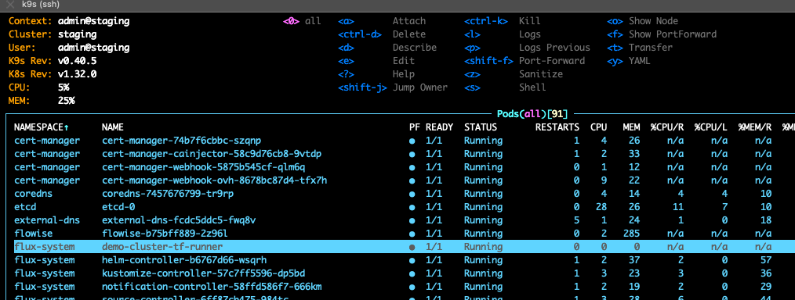

Si on regarde les logs du pod du runner Terraform on peut alors voir les commandes terraform qui sont exécutés.

On reconnaît ici les logs standards de Terraform quand on lance les commandes terraform validate/plan/apply/destroy.

En fait le pod runner Terraform embarque juste le tooling nécessaire pour faire du Terraform (comme on le ferait sur un poste de dév ou bien depuis un runner gitlab dans un pipeline CI par exemple).

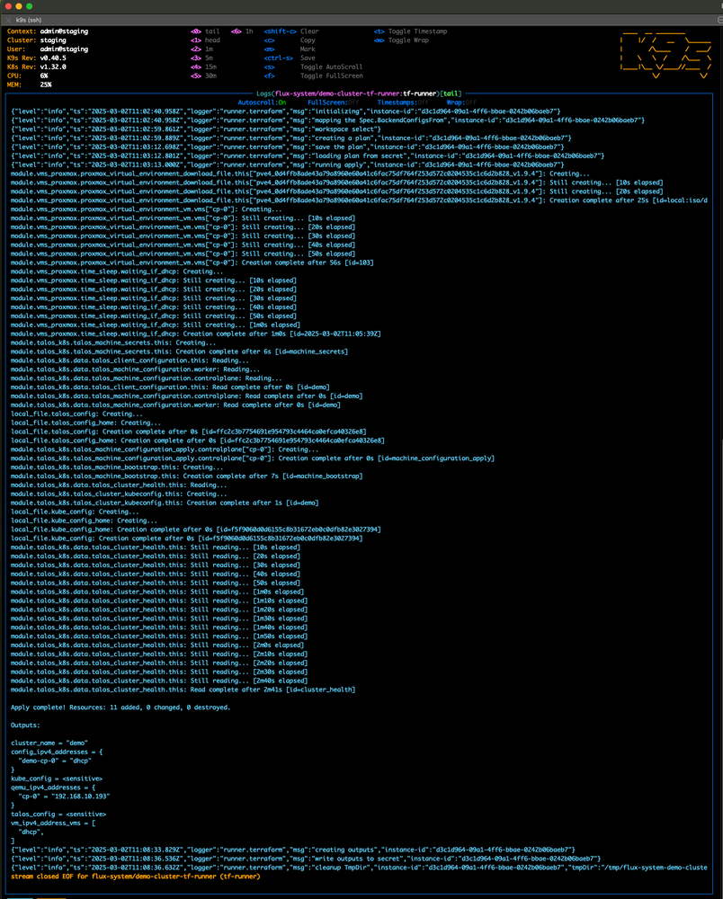

Dans les logs, on remarquera 2 outputs en particulier:

- kube_config: fichier de configuration de Kubernetes
- talos_config: fichier de configuration de Talos

Ces 2 outputs sont propres à l’implémentation de mon provider terraform-proxmox-talos-k8s-cluster car on a besoin de ces 2 fichiers pour interagir avec les clusters K8s Talos.

On verra ensuite comment utiliser le fichier de configuration Kubernetes.

Côté hyperviseur Proxmox, notre VM a popé (demo-cp-0) avec l'image Talos pour instancier notre cluster de démo single node.

Le cluster K8s sur lequel est deployé le controller Terraform est le cluster staging de mon homelab dont les vms sont préfixées staging-cp et staging-worker.

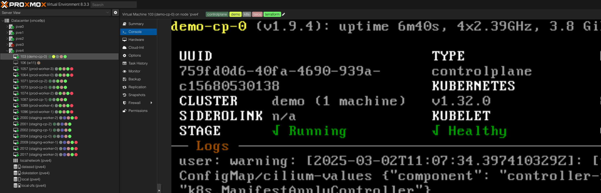

Maintenant qu'on a notre VM Talos instanciée en IaC par notre runner Terraform exécuté dans un pod de notre cluster k8s, il est tant de voir comment on accède à ce nouveau cluster single node!

## Accès au nouveau cluster K8s

 Pour accéder à notre nouveau cluster de démo single node, nous avons besoin du fichier de configuration Kubernetes.

Le controller Terraform nous l'a stocké dans un secret k8s car c'est ce que nous lui avons demandé lorsque nous avons déclaré notre objet Terraform ci-dessus (writeOutputsToSecret).

Pour cela, rien de plus simple, on extrait cette configuration kubernetes depuis ce secret et on le stocke dans un fichier, ici on le mettra dans /tmp/demo-cluster.yaml (on aurait pu le mettre dans $HOME/.kube, utiliser kubie ctx, etc...là encore je vais au plus simple).

```sh
kubectl -n flux-system get secrets demo-cluster-output -o jsonpath='{.data.kube_config}' | base64 --decode > /tmp/demo-cluster.yaml
```

A noter que le nom kube_config est celui qu'on a vu dans les outputs des logs du controller Terraform qu'on a vu précédemment.

Maintenant qu'on a notre fichier de configuration K8s, on peut se connecter à notre nouveau cluster single node:

```sh
kubectl --kubeconfig /tmp/demo-cluster.yaml get nodes
```

Et voilà, on a notre cluster avec 1 noeud et on voit bien nos pods qui tournent dedans (cilium, kube-apiserver, etc...).

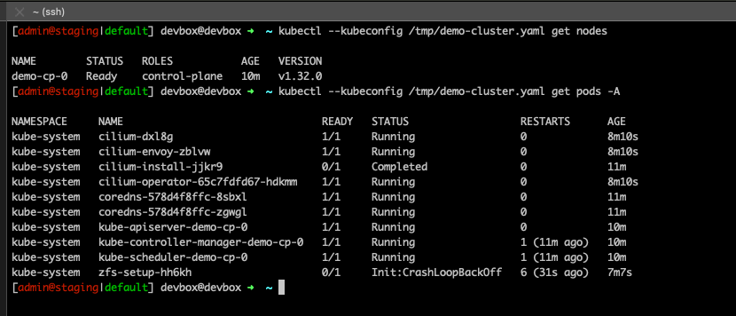

## Comment ajouter un noeud à notre cluster en Gitops?

 Rien de plus simple: on édite notre fichier Terraform demo.yaml et on déclare un nouveau noeud. Ici on a ajouté le noeud cp-1.

On pousse tout ça dans Git et FluxCD lira ce fichier manifest demo.yaml et fera la reconciliation (ici on parle de la reconciliation K8s et non Terraform, la réconciliation Terraform vient dans un 2nd temps avec le controller Terraform).

```yaml
 - name: vms
    value:
      cp-0:
        host_node:      "pve4"
        machine_type:   "controlplane"
        cpu:            4
        ram_dedicated:  4096
        os_disk_size:   10
        data_disk_size: 10
        datastore_id:   "local-zfs"
      cp-1:
        host_node:      "pve4"
        machine_type:   "controlplane"
        cpu:            4
        ram_dedicated:  4096
        os_disk_size:   10
        data_disk_size: 10
        datastore_id:   "local-zfs"
```

 Une fois cette ressource Terraform redéployée dans notre cluster (le cluster staging avec le controller Terraform, pas celui de démo qu'on vient juste de créer!), le controller Terraform va détecter le changement sur la ressource Terraform (demo.yaml) et va tenter de réconcilier cette ressource Terraform.

**Attention: ici on parle de la réconciliation Terraform (pour amener l'infrastruction dans l'état désiré, c'est à dire ajouter un 2ème noeud à notre cluster de démo en instant une 2ème VM).**

Si on a du mal à appréhender les concepts, on peut vite se prendre les pieds dans le tapis entre les différents clusters, les différentes réconciliations (k8s et Terraform) et le côté Inception de cette démo.

Et c'est parti la VM pour le 2ème noeud cp-1 (demo-cp-1) pope sur l'hyperviseur Proxmox et on peut aussi le voir dans les logs du runner Terraform (en gros une commande terraform apply est exécutée dans ce runner Terraform).

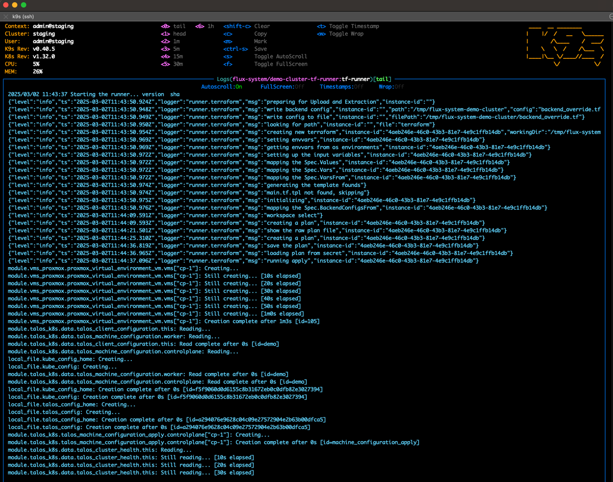

Désormais mon cluster K8s Talos de démo a bien 2 noeuds et ce cluster k8s est **healthy**

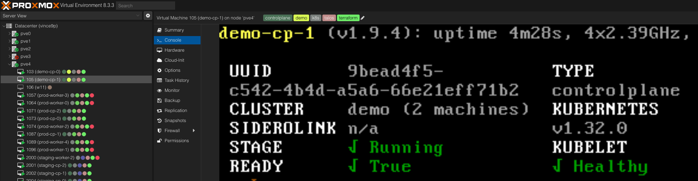

Un coup de kubectl pour confirmer que tout est ok sur les 2 noeuds.

On voit bien notre 2 noeuds du cluster de démo ainsi que les pods en cours de création.

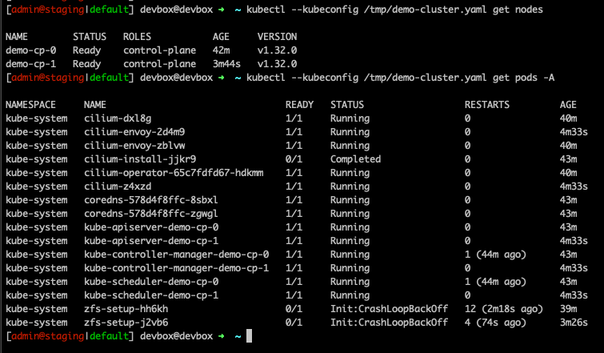

## Le state Terraform dans Kubernetes

Le plan d'infrastructure et le state Terraform sont stockés dans des objets Secret dans Kubernetes.

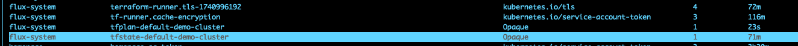

Ici aussi je ne rentre pas dans les explications du state Terraform et comment le gérer dans différents backends. Ici on fait au plus rapide pour la démo et donc le state terraform est stocké dans un "Kubernetes backend" qui est le backend par défaut si on ne configure rien.

Dans un vrai projet, on aura bien entendu la possibilité d'utiliser un autre backend, comme un backend S3 par exemple pour stocker et versionner notre state Terraform.

Voir la documentation du controller Terraform sur la partie backend: <https://flux-iac.github.io/tofu-controller/use-tf-controller/with-a-custom-backend/>

## Mot de la fin et conclusion

 Cet article est un survol très rapide pour expliquer comment gérer des ressource Terraform avec le controller Terraform dans Kubernetes, avec ici un cluster K8s Talos sur Proxmox comme exemple d'infrastructure à déployer.

J'ai pris volontairement des raccourcis pour les explications et le déploiement (à noter par exemple que le controller Terraform ne fonctionnait pas en mettant un required_version >= 1.8 dans les fichiers versions.tf, j'ai donc patché à l'arrache pour la démo, voir le fix: <https://github.com/vdupain/terraform-proxmox-talos-k8s-cluster/commit/3a76dd7709cfa519f52256805fc54996bb1769c7>).

En tout cas, cette démo permet de voir toute la puissance de Kubernetes, de l'IaC Terraform et du principe du GitOps comme source de vérité, pour gérer nos clusters k8s et nos infrastructures.

Un des principes fondamentaux qui est important de comprendre dans Kubernetes et l'IaC Terraform, c'est celui de la réconciliation avec l'approche déclarative.

C'est finalement très puissant une fois qu'on a compris le concept et son implémentation dans les différents outils (on peut aussi faire de la réconciliation sur une base de données, c'est ce que les développeurs font avec liquibase par exemple et des scripts d’altération de schémas).

On cherche tout simplement à aller d'un état initial vers un état final. Avec état final = état initial + changeset avec changeset = ajout/suppression/modification de ressources qui composent un état (objets K8s, ressources Terraform, etc).

## Pour aller plus loin

- Terraform Controller: <https://flux-iac.github.io/tofu-controller/>
- Provider Terraform bpg Proxmox: <https://registry.terraform.io/providers/bpg/proxmox/latest>
- IaC Kubernetes Talos sur Proxmox: <https://github.com/vdupain/terraform-proxmox-talos-k8s-cluster/>
- démo: <https://github.com/vdupain/gitops-k8s/tree/main/apps/base/terraform>
- Module sur la registry Terraform: <https://registry.terraform.io/modules/vdupain/talos-k8s-cluster/proxmox/latest>
- Proxmox: <https://www.proxmox.com/en/>
