+++
title = "Migration VLAN de mon réseau : segmentation par usage avec VXLAN"
description = "Segmentation VLAN complète de mon réseau : isolation par usage (DMZ, IOT, GUEST, HOMELAB), transport des VLANs sur le WiFi via VXLAN, sur OPNsense, OpenWrt et MikroTik."
tags = ["homelab", "reseau", "vlan", "vxlan", "opnsense", "openwrt", "mikrotik"]
date = "2026-08-12"
+++

## 1. Contexte et objectif

Le réseau domestique était un **LAN plat unique** (192.168.10.0/24) où tous les équipements partageaient le même domaine de diffusion :

- appliances (routeur/firewall OPNsense, AP, répéteur WiFi, switch)
- hyperviseurs Proxmox
- services homelab
- clusters Kubernetes
- NAS Synology
- IoT
- appareils personnels (téléphones, tablettes, consoles de jeux)

**Objectif :** introduire une **segmentation VLAN par usage** pour isoler les zones de confiance et préparer une approche **zero trust**.

### 1.0 Matériel utilisé

| Élément | Détail |
|---------|--------|
| Routeur/firewall | OPNsense 26.7.1_1 (FreeBSD, PC Engines APU4 — AMD GX-412TC) |
| Machine de test | ALIX 2d3 (PC Engines) + OpenBSD 7.7 |
| AP WiFi | PC Engines APU2 — OpenWrt 24.10.1 (x86/64, AMD GX-412TC) |
| Répéteur | ASUS RT-AX59U — OpenWrt 25.12.5 (mediatek/filogic, ARMv8) |
| Switch | MikroTik CSS610-8G-2S+ (SwOS) |
| Hyperviseurs | Proxmox VE (pve0-4) |
| NAS | Synology DiskStation |
| DNS/DHCP | Unbound + KEA (OPNsense) |

### 1.1 Topologie physique initiale

```
┌───────────┐
│  Livebox  │
│  .1.1 WAN │
└─────┬─────┘
      │ igb0
┌─────┴───────────────────────────────────────────────────────────────┐
│  OPNsense (.1) — FreeBSD                                            │
│                                                                     │
│  igb0 ── WAN                                                        │
│                                                                     │
│  bridge0 = LAN (.10.1)  [igb1 + igb2 + igb3]                        │
│     │               │               │                               │
│  igb1 (libre)    igb2 (AP)      igb3 (pve1)                         │
│     │               │               │                               │
└─────┴───────────────┼───────────────┼───────────────────────────────┘
                      │               │
                      │               └───── pve1 (.11)
                      │                     (Proxmox)
                      │
┌─────────────────────┴───────────────────────────────────────────────┐
│  AP OpenWrt (.2)                                                    │
│  br-lan (bridge plat, pas de VLAN)                                  │
│  eth0 ── libre                                                      │
│  eth1 ← igb2                                                        │
│  SSIDs: Vince-AC (5 GHz), Vince-N (2.4 GHz)                         │
└──────┬──────────────────────────────────────────────────────────────┘
       │ [WiFi, Relay Bridge (relayd)]
       │ phy0-ap0 ~~~~~~~~~~  wwan (STA)
┌──────┴──────────────────────────────────────────────────────────────┐
│  Répéteur (.254) — relayd                                           │
│  br-lan [lan1+lan2+lan3+wwan]                                       │
│  wwan (STA) ← [WiFi relayd]                                         │
│  (relaye le LAN sans VLAN, trame complète)                          │
└──────┬──────────────────────────────────────────────────────────────┘
       │ lan1 (filaire)
┌──────┴──────────────────────────────────────────────────────────────┐
│  Switch CSS610 (.5) — SwOS                                          │
│  (LAN transparent, PVID 1 — pas de VLAN configuré)                  │
└──┬──────┬──────┬──────┬──────┬──────┬───────────────────────────────┘
   │      │      │      │      │      │
pve0(.10) pve2(.12) pve3(.13) pve4(.14) diskstation(.3)
(Proxmox) (Proxmox) (Proxmox) (Proxmox) (NAS synology)
```

### 1.2 Mapping des ports

**OPNsense (.1) :**

| Port | Connexion | Rôle |
|------|-----------|------|
| igb0 | WAN (Livebox) | Internet |
| igb1 | Libre (initialement) → port de test VLAN (ALIX) | Sorti du bridge pour les tests |
| igb2 | AP OpenWrt | Port de production VLAN |
| igb3 | pve1 (direct) | Chemin filaire alternatif |

**AP OpenWrt (.2) :**

| Élément | Connexion | Rôle |
|---------|-----------|------|
| eth0 | Libre | Port physique disponible |
| eth1 | igb2 (OPNsense) | Uplink filaire |
| br-lan | eth0 + eth1 | Bridge principal |
| phy0-ap0 | [WiFi 5 GHz] | Radio 5 GHz |
| phy1-ap0 | [WiFi 2.4 GHz] | Radio 2.4 GHz |
| Vince-AC | 5 GHz | SSID principal |
| Vince-N | 2.4 GHz | SSID secondaire |

**Répéteur (.254) :**

| Élément | Connexion | Rôle |
|---------|-----------|------|
| lan1 | Switch MikroTik (port 1) | Port switch |
| lan2 | ALIX vr1 | Port test |
| lan3 | Libre | Port disponible |
| br-lan | lan1 + lan2 + lan3 + wwan | Bridge principal, 192.168.10.254 |
| wwan (STA) | [WiFi] → AP | Lien uplink WiFi |

**Switch MikroTik CSS610 (.5) :**

| Port | Connexion | Rôle |
|:----:|-----------|------|
| 1 | Répéteur (lan1) | Uplink |
| 2 | pve2 | Hyperviseur |
| 3 | pve0 | Hyperviseur |
| 4 | pve3 | Hyperviseur |
| 5 | pve4 | Hyperviseur |
| 6 | NAS (Synology) | Stockage |
| 7 | ALIX (vr0) | Test VLAN |
| 8 | ALIX (vr1) | Test VLAN |

### 1.3 Machine de test (ALIX 2d3 — PC Engines, OpenBSD 7.7)

> **🎯 Rôle de la machine de test :** cette ALIX sert à **valider pas à pas** le déploiement des VLANs sur chaque équipement. Elle est déplacée et rebranchée sur les différents points du réseau (OPNsense, répéteur, switch…) afin de tester la connectivité **avec ou sans VLAN** à chaque étape du rollout progressif.

| Interface | MAC | Usage |
|-----------|-----|-------|
| vr0 | 00:0d:b9:1b:aa:4c | **Sans VLAN** (192.168.10.23) — tests LAN natif |
| vr1 | 00:0d:b9:1b:aa:4d | **Avec VLAN** — support des interfaces vlan |
| vr2 | 00:0d:b9:1b:aa:4e | Libre |

**Config réseau (OpenBSD 7.7, fichiers `/etc/hostname.*`) :**

| Fichier | Contenu | Usage |
|---------|---------|-------|
| `/etc/hostname.vr0` | `inet autoconf` | Sans VLAN — DHCP sur le LAN natif |
| `/etc/hostname.vr1` | `inet autoconf` | Support physique des VLANs |
| `/etc/hostname.vlanXX` | `vlan XX vlandev vr1` + `dhcp` | VLAN XX (les tags précis seront définis en section 4.2) |

**Méthode de test :** selon l'équipement à valider, on branche `vr0` (sans VLAN, accès LAN natif) ou `vr1` (avec VLAN, via les interfaces `vlanXX`) et on vérifie l'obtention d'une IP DHCP + la connectivité vers le gateway du VLAN concerné.

### 1.4. Modèle OSI — la pierre angulaire

Le **modèle OSI** (Open Systems Interconnection) découpe la communication réseau en **7 couches**. C'est la **pierre angulaire** pour comprendre ce projet : il permet de situer précisément les trames Ethernet, les trames WiFi et le VXLAN, et de saisir pourquoi le VXLAN est la solution retenue.

| Couche | Nom | Exemples | Rôle |
|:------:|-----|----------|------|
| 7 | Application | HTTP, DNS, SSH | Services applicatifs |
| 6 | Présentation | TLS, SSL | Chiffrement / format |
| 5 | Session | TLS | Gestion des sessions |
| 4 | Transport | TCP, UDP | Fiabilisation, ports |
| 3 | Réseau | IP, ICMP | Routage (L3) |
| 2 | Liaison | **Ethernet, WiFi (802.11), 802.1Q** | Trames (L2) |
| 1 | Physique | Câble, radio | Support physique |

**Où se situent les éléments clés de ce projet :**

| Élément | Couche |
|---------|:------:|
| **Trame Ethernet** (+ tag 802.1Q) | **L2** |
| **Trame WiFi (802.11)** | **L2** (structure différente de l'Ethernet) |
| IP (routage) | **L3** |
| UDP (transport VXLAN) | **L4** |
| **VXLAN** (encapsule une trame L2 dans UDP/L3) | **Overlay L2 sur L3** |

**Le point clé :** le **VXLAN** encapsule une **trame Ethernet L2 complète** (avec son tag 802.1Q) dans un **paquet UDP (L4) transporté par IP (L3)**. C'est un **overlay L2 sur L3** : il fait voyager la trame L2 à travers un réseau L3, ce qui permet de transporter les VLANs sur le WiFi (qui ne gère pas le 802.1Q en natif — voir section 6.1).

## 2. Mode opératoire — rollout progressif

> **🎯 Approche :** valider chaque maillon de la chaîne réseau un par un, sans jamais toucher plusieurs équipements en même temps, afin de pouvoir revenir en arrière à tout moment.
>
> 1. **Backup** de l'équipement concerné avant toute modification
> 2. **Configurer** un seul maillon (ex: OPNsense → VLANs)
> 3. **Valider** avec la machine de test ALIX (déplacée sur ce maillon) : obtention IP DHCP + ping vers la gateway, **avec et sans VLAN**
> 4. **Rollback** si échec (restauration de la config)
> 5. **Passer au maillon suivant** (AP → répéteur → switch) une fois le précédent validé
>
> Cette démarche s'applique à la configuration réseau **sur chaque équipement** (OPNsense, AP, répéteur, switch) et permet de **déployer sans risque de coupure globale**.

---

## 3. Audit réseau (lecture seule)

### 3.1. Contexte et outils utilisés

Avant toute modification, un audit complet a été réalisé :
> **🛡️ Contexte de l'audit :** cet audit a été réalisé par un **agent IA** (agent **Hermes** de **Nous Research**) sur mandat de Vincent. Les connexions aux APIs **OPNsense** et **Proxmox** ont été faites via des **tokens API en lecture seule** (aucune modification possible), et l'exploration a été complétée par des requêtes **ARP/ping** et de la **navigation web** en lecture seule. Aucun équipement n'a été modifié pendant cette phase.
| Outil | Données collectées |
|-------|--------------------|
| API OPNsense (read-only) | Version (26.7.1_1), règles firewall, gateways, WireGuard, Unbound, compteurs |
| API Proxmox | Nœuds (pve0-4), VMs/LXC, interfaces réseau |
| ARP / ping / OUI lookup | Cartographie des hôtes, identification constructeurs |
| Navigation web | Identification AP (LuCI), répéteur (LuCI), Synology (DSM) |

### 3.2. Commandes d'audit utilisées

```bash
# API OPNsense (token read-only)
hermes@host:~$ curl -sk -u "$KEY:$SECRET" "https://192.168.10.1/api/core/firmware/info"
hermes@host:~$ curl -sk -u "$KEY:$SECRET" "https://192.168.10.1/api/firewall/filter/searchRule"
hermes@host:~$ curl -sk -u "$KEY:$SECRET" "https://192.168.10.1/api/unbound/settings/get"

# API Proxmox (token hermes)
hermes@host:~$ curl -sk -H "Authorization: PVEAPIToken=hermes@pve!hermes=$SECRET" \
  "https://192.168.10.10:8006/api2/json/nodes"
hermes@host:~$ curl -sk -H "Authorization: PVEAPIToken=hermes@pve!hermes=$SECRET" \
  "https://192.168.10.10:8006/api2/json/cluster/resources?type=vm"

# ARP local
hermes@host:~$ ip neigh show

# Identification OUI (maclookup.app)
# 00:0d:b9 = PC Engines (APU, ALIX)
# 58:9c:fc = FreeBSD Foundation (OPNsense)
# 00:0d:b9 = MikroTik (historique)
```

**Exemples de résultats obtenus :**

```bash
# Exemple 1 — Version du firmware OPNsense
$ curl -sk -u "$KEY:$SECRET" "https://192.168.10.1/api/core/firmware/info" | jq '.product_version'
"26.7.1_1"

# Exemple 2 — Nombre de règles firewall actives
$ curl -sk -u "$KEY:$SECRET" "https://192.168.10.1/api/firewall/filter/searchRule" | jq '.rows | length'
57

# Exemple 2b — Détail d'une règle firewall présente dès le départ (confiance implicite du LAN)
$ curl -sk -u "$KEY:$SECRET" "https://192.168.10.1/api/firewall/filter/searchRule" | jq '.rows[] | select(.description=="Default allow LAN to any rule") | {action, source_net, destination_net, protocol, description, log, enabled}'
{
  "action": "pass",
  "source_net": "lan",
  "destination_net": "any",
  "protocol": "any",
  "description": "Default allow LAN to any rule",
  "log": 0,
  "enabled": 1
}

# Exemple 3 — Cartographie des hôtes (ARP + identification OUI)
$ ip neigh show
192.168.10.2   dev br-lan lladdr 00:0d:b9:...  REACHABLE   # AP — PC Engines
192.168.10.3   dev br-lan lladdr 00:11:32:...  REACHABLE   # NAS — Synology
192.168.10.10  dev br-lan lladdr XX:XX:XX:...  REACHABLE   # pve0 — Proxmox
192.168.10.254 dev br-lan lladdr XX:XX:XX:...  REACHABLE   # Répéteur — ASUS
```

### 3.3. Synthèse de l'audit

#### Découvertes importantes

1. **Topologie en chaîne** (pas une étoile) : OPNsense → AP → répéteur WiFi → switch → pve0/2/3/4. Le segment AP→répéteur passe par le **WiFi**, ce qui a des implications fortes pour le VLAN (voir section 6).
2. **pve1 est connecté en direct** sur l'interface **igb3** d'OPNsense (filaire, pas via le switch ni le WiFi) — un chemin de test propre pour les VLANs sans dépendre du WiFi.
3. **Un seul sous-réseau 192.168.10.0/24 (LAN plat)** héberge tous les équipements sans aucune segmentation : OPNsense, 5 hyperviseurs Proxmox, clusters K8s, NAS, IoT, appareils personnels — tous dans le même domaine de diffusion.
4. **Aucune règle firewall entre les équipements du LAN** : les flux internes sont totalement libres (confiance implicite), seul le trafic WAN est filtré. Un appareil IoT compromis peut joindre directement un hyperviseur ou le NAS.
5. **Services exposés sur Internet sans isolation** : Caddy (.22) est exposé en WAN (443) dans le **même** segment que les machines internes — un compromis de Caddy donnerait accès à tout le LAN.

| Donnée | Résultat |
|--------|----------|
| Version OPNsense | **26.7.1_1** |
| Règles firewall | **57** actives |
| Équipements identifiés | OPNsense (.1), AP (.2), NAS (.3), switch (.5), pve0-4 (.10-.14), haos (.20), Caddy (.22), répéteur (.254), etc. |
| Constructeurs (OUI) | PC Engines (APU/ALIX), FreeBSD Foundation (OPNsense), Synology, MikroTik, ASUS |

> **🗺️ Contexte :** avant segmentation, **tout est à plat dans un même réseau** 192.168.10.0/24 — les équipements fixes, les VMs/CTs, les clusters K8s, le NAS, l'IoT et les appareils personnels cohabitent sans aucune séparation. Le **range DHCP initial** alloué par OPNsense/KEA était **192.168.10.100 → 192.168.10.199** (les IPs < .100 sont des adresses statiques/machines).

| IP | Équipement | Rôle |
|----|-----------|------|
| .1 | OPNsense | Routeur/firewall (FreeBSD) |
| .2 | AP OpenWrt | Point d'accès WiFi (PC Engines) |
| .3 | Synology DiskStation | NAS |
| **.5** | **Switch MikroTik CSS610** | Switch (SwOS) |
| .10 | pve0 | Hyperviseur Proxmox |
| .11 | pve1 | Hyperviseur Proxmox (direct sur igb3) |
| **.12** | **pve2** | Hyperviseur Proxmox |
| .13 | pve3 | Hyperviseur Proxmox |
| **.14** | **pve4** | Hyperviseur Proxmox |
| .20 | haos | Home Assistant |
| .22 | Caddy | Reverse proxy (exposé WAN 443) |
| .142 | devbox | VM Ubuntu |
| .184/.131 | laptop / iPhone | Appareils personnels |
| .187 | hermesagent | Agent d'infra |
| .189/.191/.192 | prometheus/exporter/grafana | Monitoring |
| .203 | ai-cluster | Nœud K8s Talos (RTX 3060) |
| .230-.235 | LB Cilium | Load balancers K8s |
| .254 | Répéteur OpenWrt | Répéteur WiFi |

---

## 4. Réflexion sur la segmentation

### 4.1. Question de départ

> « Comment utiliser 192.168.20.0/24 pour mes clusters K8s ? »

Rapidement élargie en : **segmentation complète par usage**, pas seulement un VLAN K8s.

**Le point de départ était lié à la complexité d'adressage K8s** : avec **2-3 clusters Kubernetes** (home, ai-cluster), et **Cilium** en CNI avec ses **Load Balancers (LBs)**, l'adressage devient rapidement compliqué à gérer sans convention ni segmentation :

- **IPs des nodes** : control plane (CP) + workers de chaque cluster
- **IPs des services** : plages de services Kubernetes
- **IPs des LBs Cilium** : plage dédiée pour les load balancers (ex: `*.ai` → LB .230-.235)

Sans **convention d'adressage** ni **segmentation**, ces plages se mélangent et deviennent impossibles à distinguer/mémoriser — d'où l'idée initiale de **réserver un sous-réseau dédié aux clusters**, avant d'élargir à une segmentation complète par usage.

### 4.2. Plan VLAN retenu

> **🏷️ Remarque :** les VLANs **DMZ**, **IOT** et **GUEST** sont des catégories **assez standard** dans les segmentations réseau par VLAN — on les retrouve dans de nombreuses configurations (entreprises, homelabs, documentation Cisco/Unifi/MikroTik…). Leur rôle est bien établi :
>
> - **DMZ** : isoler les services exposés à Internet (réduit la surface d'attaque)
> - **IOT** : contenir les appareils peu fiables (objets connectés) dans un segment contrôlé
> - **GUEST** : offrir un accès Internet aux invités, sans accès au réseau interne
>
> Le plan ci-dessous s'inscrit donc dans des **bonnes pratiques reconnues**, appliquées à l'échelle d'un homelab.

| Tag | Nom | Plage | Usage |
|:---:|-----|-------|-------|
| 10 | **USER** | 192.168.10.0/24 | Appareils réels + gestion (OPNsense, pve, switch, AP, NAS) |
| 20 | **DMZ** | 192.168.20.0/24 | Services exposés Internet (Caddy) |
| 30 | **IOT** | 192.168.30.0/24 | Appareils IoT (haos, équipements non fiables) |
| 40 | **GUEST** | 192.168.40.0/24 | Invités / appareils non fiables |
| 50 | **HOMELAB** | 192.168.50.0/24 | Services internes + clusters K8s |

### 4.3. Décisions clés

| Décision | Raison |
|----------|--------|
| K8s dans HOMELAB (pas de VLAN dédié) | **Un seul sous-réseau 192.168.50.0/24 dans HOMELAB est largement suffisant.** C'est un **homelab** : on n'y aura jamais un cluster K8s avec des centaines de nœuds. Le /24 offre 250 adresses utilisables, plus qu'assez pour les nodes + services + LBs Cilium. Réduire la complexité, K8s derrière le même firewall, NetworkPolicies Cilium gèrent déjà l'interne. |
| NAS dans USER avec accès HOMELAB→USER | Appareil de confiance, les services doivent y accéder |
| Zero trust en phase 2 | **La mise en place des VLANs est déjà assez complexe** — il faut y aller par étapes. Le durcissement des règles firewall (zero trust) sera fait **en phase 2**, une fois tous les flux réseau validés et stables. |

### 4.4. Matrice de flux cible (zero trust)

Matrice présentée au **format règle firewall** (Source → Destination → Ports → Action), proche de la configuration OPNsense :

| # | Source | Destination | Protocole / Ports | Action |
|:-:|--------|-------------|:------------------:|:------:|
| 1 | USER (10) | Internet | * | ✅ **Pass** |
| 2 | USER (10) | DMZ (20) | TCP 443 | 🟡 Pass (accès services) |
| 3 | HOMELAB (50) | Internet | * | ✅ **Pass** |
| 4 | HOMELAB (50) | USER (10) | TCP 8006, 22, 443 | 🟡 Pass (gestion) |
| 5 | DMZ (20) | Internet | * | ✅ **Pass** |
| 6 | DMZ (20) | HOMELAB (50) | TCP (services backends) | 🟡 Pass (Caddy → backends) |
| 7 | IOT (30) | Internet | UDP 53, TCP 443 | 🟡 Pass (mises à jour) |
| 8 | **IOT (30)** | **USER/HOMELAB/DMZ** | * | 🚫 **Block** |
| 9 | GUEST (40) | Internet | * | ✅ **Pass** |
| 10 | **GUEST (40)** | **LAN (tout sauf Internet)** | * | 🚫 **Block** |

**⚠️ Note :** les ports/protocoles sont des **valeurs cibles indicatives** (basées sur les services connus : Caddy 443, Proxmox 8006…). Le détail exact des flux sera affiné en **phase 2** (durcissement zero trust).

---

## 5. Mise en place des VLANs sur OPNsense

### 5.0. Préparation

- Backup OPNsense : **System → Configuration → Backups → Download configuration** (fichier XML)
- Identifier les ports physiques et leurs usages
- Préparer la machine de test (ALIX/OpenBSD)

### 5.1. Le point technique fondamental

Sur **OPNsense/FreeBSD**, un bridge logiciel (`if_bridge`) **n'est pas VLAN-aware** comme un switch matériel. On ne peut pas faire passer un trunk 802.1Q dans un bridge brut. La méthode correcte :

> **Créer des interfaces VLAN enfants sur chaque port physique, puis un bridge dédié par VLAN.**

### 5.2. Architecture cible (bridge-par-VLAN)

```
                         OPNsense
                          │
       ┌──────────────────┼───────────────────────┐
       │                  │                       │
     igb1 (test)        igb2 (AP)              igb3 (pve1)
       │                  │                       │
  ┌────┴─────┐       ┌────┴─────┐            (bridge0 natif)
  │ brut     │       │ brut     │
  │ vlan0.1.X│       │ vlan0.2.X│
  └────┬─────┘       └────┬─────┘
       │                  │
       ▼                  ▼
┌─────────────────────────────────────┐
│  bridge0  = igb2(brut) + igb3(brut) │ ← VLAN 10 USER (natif, non taggé)
│  bridge1  = vlan0.1.20 + vlan0.2.20 │ ← VLAN 20 DMZ  → SVI 192.168.20.1
│  bridge2  = vlan0.1.30 + vlan0.2.30 │ ← VLAN 30 IOT  → SVI 192.168.30.1
│  bridge3  = vlan0.1.40 + vlan0.2.40 │ ← VLAN 40 GUEST→ SVI 192.168.40.1
│  bridge4  = vlan0.1.50 + vlan0.2.50 │ ← VLAN 50 HOMELAB → SVI .50.1
└─────────────────────────────────────┘
```

### 5.3. Convention de nommage FreeBSD

| Élément | Format | Exemple |
|---------|--------|---------|
| Interface VLAN | `vlan0.<parent>.<tag>` | `vlan0.1.20` = tag 20 sur igb1 |
| Bridge | `bridge<N>` (auto) | `bridge1` (numéro = ordre de création, pas le VLAN) |
| Assignation OPNsense | `opt<N>` | opt8 = DMZ |

**Piège rencontré** : impossible de nommer librement (`vlan20` refusé, `bridge20` refusé). Le nom système est imposé par FreeBSD, la **Description** sert de nom logique.

### 5.4. Création des VLANs et des bridges

**Objectif :** disposer d'un port isolé pour tester les VLANs sans risque.

**Avant :**

```
bridge0 = igb1 + igb2 + igb3
```

**Action :** retirer igb1 de bridge0 (Interfaces → Bridges → bridge0 → Edit).

**Après :**

```
bridge0 = igb2 + igb3   (VLAN 10 natif, inchangé)
igb1 = port libre → port de test VLAN
```

**Vérification :** l'AP (igb2) et pve1 (igb3) continuent de fonctionner — aucun impact réel (igb1 était vide).

#### Créer les VLANs sur le port de test + brancher l'ALIX

**Interfaces → Other Types → VLAN → Add** (×4) :

| # | Tag | Parent | Description | Device généré |
|:-:|:---:|:------:|-------------|:-------------:|
| 1 | 20 | igb1 | DMZ | vlan0.1.20 |
| 2 | 30 | igb1 | IOT | vlan0.1.30 |
| 3 | 40 | igb1 | GUEST | vlan0.1.40 |
| 4 | 50 | igb1 | HOMELAB | vlan0.1.50 |

**Save + Apply** après chaque création.

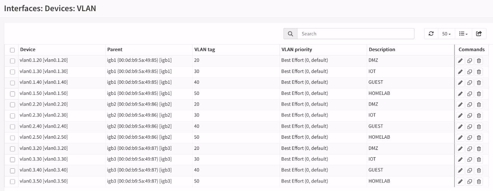

**Interfaces → Assignments → Add** (×4) : activer **sans IP** (membres de bridge).

| Assignation | Device |
|:-----------:|:-------:|
| opt3 | vlan0.1.20 |
| opt5 | vlan0.1.30 |
| opt6 | vlan0.1.40 |
| opt7 | vlan0.1.50 |

**Schéma à cette étape (test filaire sur igb1) :**

```
                          OPNsense
                           │
     ┌─────────────────────┼──────────────────────┐
     │                     │                      │
   igb1 (test)           igb2 (AP)              igb3 (pve1)
     │                     │                      │
   vlan0.1.20-50          (brut)                 (brut)
     │                     │                      │
     │               AP OpenWrt .2               pve1 .11
     │                     │
     │               [WiFi] Répéteur .254
     │                     │
     │               Switch MikroTik
     │                     │
     │               pve0/2/3/4
     │
  ┌──┴──────────┐
  │ ALIX (OpenBSD) │
  │ vr1 → igb1     │  ← interface de test VLAN
  │ vr0 → AP eth0  │  ← LAN témoin 192.168.10.23
  └───────────────┘
```

#### Créer les bridges VLAN

**Interfaces → Other Types → Bridge → Add** (×4) :

| Bridge | Membres | IP (SVI) |
|:------:|:-------:|----------|
| bridge1 | vlan0.1.20 | 192.168.20.1/24 |
| bridge2 | vlan0.1.30 | 192.168.30.1/24 |
| bridge3 | vlan0.1.40 | 192.168.40.1/24 |
| bridge4 | vlan0.1.50 | 192.168.50.1/24 |

**Configurer chaque bridge** (Interfaces → [bridge]) :

| Paramètre | Valeur |
|-----------|--------|
| Enable | ☑️ |
| IPv4 Configuration Type | Static IPv4 |
| IPv4 address | (voir tableau) |
| Block private networks | ❌ décocher |
| Block bogon networks | ❌ décocher |
| Description | DMZ / IOT / GUEST / HOMELAB |

**Vérification** (Diagnostics → Ping depuis OPNsense) : les 4 IPs gateway répondent.

### 5.5. Étendre les VLANs à igb2 (AP)

**Objectif :** faire transiter les VLANs sur le port réel vers l'AP.

**Interfaces → Other Types → VLAN → Add** (×4) :

| Tag | Parent | Description | Device |
|:---:|:------:|-------------|:------:|
| 20 | igb2 | DMZ (AP) | vlan0.2.20 |
| 30 | igb2 | IOT (AP) | vlan0.2.30 |
| 40 | igb2 | GUEST (AP) | vlan0.2.40 |
| 50 | igb2 | HOMELAB (AP) | vlan0.2.50 |

**Assigner** (sans IP) puis **ajouter aux bridges existants** :

| Bridge | Membres après ajout |
|:------:|:-------------------:|
| bridge1 (DMZ) | vlan0.1.20 + vlan0.2.20 |
| bridge2 (IOT) | vlan0.1.30 + vlan0.2.30 |
| bridge3 (GUEST) | vlan0.1.40 + vlan0.2.40 |
| bridge4 (HOMELAB) | vlan0.1.50 + vlan0.2.50 |

**Schéma à cette étape :**

```
                          OPNsense
                           │
     ┌─────────────────────┼──────────────────────┐
     │                     │                      │
   igb1 (test)           igb2 (AP)              igb3 (pve1)
     │                     │                      │
   vlan0.1.20-50      vlan0.2.20-50             (brut)
     │                     │                      │
     │  bridge1-4          │  bridge1-4           │
     └────────┬────────────┘                      │
              │                                   │
         AP OpenWrt .2                     pve1 .11
         (vlan_filtering)                    (bridge0)
              │
         [WiFi] Répéteur .254
              │
         Switch MikroTik
              │
         pve0/2/3/4
```

**Vérification de la structure (SSH OPNsense) :**

```bash
# Vérifier les membres et IP de chaque bridge (sur OPNsense)
for b in bridge0 bridge1 bridge2 bridge3 bridge4; do
  echo "=== $b ==="
  ifconfig $b 2>/dev/null | grep -E "member|inet "
done
```

**Résultat attendu :**

```
bridge0 = igb2, igb3                    (10.1)
bridge1 = vlan0.1.20 + vlan0.2.20       (20.1)
bridge2 = vlan0.1.30 + vlan0.2.30       (30.1)
bridge3 = vlan0.1.40 + vlan0.2.40       (40.1)
bridge4 = vlan0.1.50 + vlan0.2.50       (50.1)
```

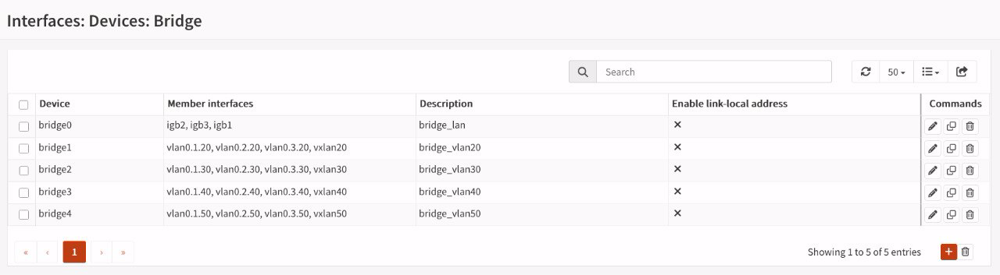

### 5.6. Configurer KEA DHCP (subnets par VLAN)

**Services → Kea DHCP → Subnets → Add Subnet** (×4) :

| Subnet | Pool | Gateway | DNS |
|:------:|:----:|:-------:|:---:|
| 192.168.20.0/24 | .100 - .199 | 192.168.20.1 | 192.168.10.1 |
| 192.168.30.0/24 | .100 - .199 | 192.168.30.1 | 192.168.10.1 |
| 192.168.40.0/24 | .100 - .199 | 192.168.40.1 | 192.168.10.1 |
| 192.168.50.0/24 | .100 - .199 | 192.168.50.1 | 192.168.10.1 |

Chaque subnet : **Add** → Pool (range) → Options (Router = gateway, DNS = 192.168.10.1).

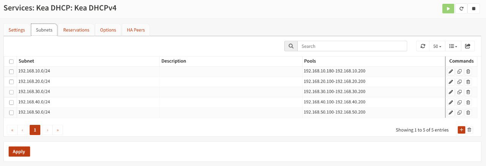

### 5.7. Règles firewall par VLAN

**Firewall → Rules → [chaque VLAN]** → Add :

| Interface | Source | Destination | Proto | Description |
|:---------:|:------:|:-----------:|:-----:|-------------|
| opt8 (DMZ) | opt8 | 192.168.20.1 | ICMP | Test ping gateway |
| opt9 (IOT) | opt9 | 192.168.30.1 | ICMP | Test ping gateway |
| opt10 (GUEST) | opt10 | 192.168.40.1 | ICMP | Test ping gateway |
| opt11 (HOMELAB) | opt11 | 192.168.50.1 | ICMP | Test ping gateway |

⚠️ **NE PAS utiliser `(self)`** comme destination — voir le piège des règles ICMP dans les **Annexes (Pièges rencontrés)**. La destination doit être **l'IP de la gateway du VLAN uniquement**.

### 5.8. Mapping final (après implémentation)

| Assignation | Device | Rôle | IP |
|:-----------:|--------|------|:--:|
| wan | igb0 | WAN | DHCP |
| lan | bridge0 | LAN 10/24 | 192.168.10.1 |
| opt1 | igb2 | Physique brute (AP) | — |
| opt2 | igb3 | Physique brute (pve1) | — |
| opt3 | vlan0.1.20 | VLAN 20 igb1 | — |
| opt5 | vlan0.1.30 | VLAN 30 igb1 | — |
| opt6 | vlan0.1.40 | VLAN 40 igb1 | — |
| opt7 | vlan0.1.50 | VLAN 50 igb1 | — |
| opt12 | vlan0.2.20 | VLAN 20 igb2 | — |
| opt13 | vlan0.2.30 | VLAN 30 igb2 | — |
| opt14 | vlan0.2.40 | VLAN 40 igb2 | — |
| opt15 | vlan0.2.50 | VLAN 50 igb2 | — |
| opt8 | bridge1 | DMZ | 192.168.20.1 |
| opt9 | bridge2 | IOT | 192.168.30.1 |
| opt10 | bridge3 | GUEST | 192.168.40.1 |
| opt11 | bridge4 | HOMELAB | 192.168.50.1 |
| opt4 | HomeWireGuard | VPN | — |

---

### 5.9. Validation sur OPNsense (ALIX) — connectivité

> **ℹ️ La configuration des interfaces VLAN sur l'ALIX** (vr0 sans VLAN, vr1 avec vlan20-50) est détaillée en **section 1.3 (machine de test)**. On ne la répète pas ici.

⚠️ **Piège OpenBSD** : le parent doit être monté d'abord :

```bash
root@alix:~# ifconfig vr1 up    # SANS ça, les paquets ne sortent pas (100% perte, tcpdump vide)
```

#### Script de test d'isolation (ALIX)

```bash
#!/bin/sh
# test-vlans.sh — Test d'isolation inter-VLAN (OpenBSD)
# Usage: sh test-vlans.sh
# Les IPs sources sont récupérées dynamiquement depuis ifconfig (DHCP)

echo "=== TEST ISOLATION VLAN (gateway = doit répondre, autres = bloqués) ==="
echo ""

# Récupérer l'IP source d'une interface
get_ip() {
    ifconfig "$1" 2>/dev/null | awk '/inet /{print $2; exit}'
}

# Tester un flux : ping depuis l'IP source vers une destination
# $1 = source IP, $2 = destination, $3 = label
test_ping() {
    if ping -S "$1" -c2 -w2 "$2" >/dev/null 2>&1; then
        echo "  vers $2 ($3) : ⚠️ RÉPOND (attendu: BLOQUÉ)"
    else
        echo "  vers $2 ($3) : ✅ bloqué"
    fi
}

# Tester la gateway d'un VLAN : doit répondre
test_gateway() {
    if ping -S "$1" -c2 -w2 "$2" >/dev/null 2>&1; then
        echo "  gateway $2     : ✅ RÉPOND"
    else
        echo "  gateway $2     : ❌ PERDU (attendu: répond)"
    fi
}

# --- VLAN 20 (DMZ) ---
IP20=$(get_ip vlan20)
[ -n "$IP20" ] && echo "--- VLAN 20 (DMZ) source $IP20 ---" || echo "--- VLAN 20 (DMZ) ❌ pas d'IP ---"
if [ -n "$IP20" ]; then
    test_gateway "$IP20" 192.168.20.1 "DMZ gateway"
    test_ping "$IP20" 192.168.30.1 "IOT"
    test_ping "$IP20" 192.168.10.1 "LAN"
fi
echo ""

# --- VLAN 30 (IOT) ---
IP30=$(get_ip vlan30)
[ -n "$IP30" ] && echo "--- VLAN 30 (IOT) source $IP30 ---" || echo "--- VLAN 30 (IOT) ❌ pas d'IP ---"
if [ -n "$IP30" ]; then
    test_gateway "$IP30" 192.168.30.1 "IOT gateway"
    test_ping "$IP30" 192.168.10.1 "LAN"
    test_ping "$IP30" 192.168.20.1 "DMZ"
fi
echo ""

# --- VLAN 40 (GUEST) ---
IP40=$(get_ip vlan40)
[ -n "$IP40" ] && echo "--- VLAN 40 (GUEST) source $IP40 ---" || echo "--- VLAN 40 (GUEST) ❌ pas d'IP ---"
if [ -n "$IP40" ]; then
    test_gateway "$IP40" 192.168.40.1 "GUEST gateway"
    test_ping "$IP40" 192.168.10.1 "LAN"
fi
echo ""

# --- VLAN 50 (HOMELAB) ---
IP50=$(get_ip vlan50)
[ -n "$IP50" ] && echo "--- VLAN 50 (HOMELAB) source $IP50 ---" || echo "--- VLAN 50 (HOMELAB) ❌ pas d'IP ---"
if [ -n "$IP50" ]; then
    test_gateway "$IP50" 192.168.50.1 "HOMELAB gateway"
    test_ping "$IP50" 192.168.10.1 "LAN"
fi
echo ""

echo "=== RÉSULTAT ==="
echo "  ✅ = conforme au comportement attendu"
echo "  ⚠️ = anomalie (un flux qui devrait être bloqué passe)"
echo "  ❌ = la gateway du VLAN ne répond pas (problème VLAN)"
```

**Résultat attendu :** toutes les gateways répondent, tous les accès LAN/bloqués sont refusés. Les IPs sources sont lues dynamiquement via `ifconfig vlanXX` (robuste aux changements DHCP).

**Sortie réelle du script exécuté :**

```bash
$ sh ./test-vlans.sh
=== TEST ISOLATION VLAN (gateway = doit répondre, autres = bloqués) ===

--- VLAN 20 (DMZ) source 192.168.20.101 ---
  gateway 192.168.20.1     : ✅ RÉPOND
  vers 192.168.30.1 (IOT) : ✅ bloqué
  vers 192.168.10.1 (LAN) : ✅ bloqué

--- VLAN 30 (IOT) source 192.168.30.102 ---
  gateway 192.168.30.1     : ✅ RÉPOND
  vers 192.168.10.1 (LAN) : ✅ bloqué
  vers 192.168.20.1 (DMZ) : ✅ bloqué

--- VLAN 40 (GUEST) source 192.168.40.100 ---
  gateway 192.168.40.1     : ✅ RÉPOND
  vers 192.168.10.1 (LAN) : ✅ bloqué

--- VLAN 50 (HOMELAB) source 192.168.50.100 ---
  gateway 192.168.50.1     : ✅ RÉPOND
  vers 192.168.10.1 (LAN) : ✅ bloqué

=== RÉSULTAT ===
  ✅ = conforme au comportement attendu
  ⚠️ = anomalie (un flux qui devrait être bloqué passe)
  ❌ = la gateway du VLAN ne répond pas (problème VLAN)
```

#### Test DHCP (KEA)

Les interfaces VLAN de l'ALIX (vlan20-50 sur vr1) sont déjà configurées en **DHCP** — voir la config de la machine de test en **section 1.3**.

**Vérification côté OPNsense** : **Services → Kea DHCP → Leases** → chaque VLAN doit avoir une lease **assigned** pour l'ALIX.

**Exemple de leases (une IP ALIX par interface VLAN) :**

| Subnet | IP | MAC | Hostname | État |
|:------:|:--:|-----|----------|:----:|
| DMZ (20) | 192.168.20.101 | 00:0d:b9:1b:aa:4d | alix | assigned |
| IOT (30) | 192.168.30.102 | 00:0d:b9:1b:aa:4d | alix | assigned |
| GUEST (40) | 192.168.40.100 | 00:0d:b9:1b:aa:4d | alix | assigned |
| HOMELAB (50) | 192.168.50.100 | 00:0d:b9:1b:aa:4d | alix | assigned |

*(L'ALIX utilise la même MAC `00:0d:b9:1b:aa:4d` (vr1) sur les 4 VLANs, avec une IP distincte par subnet.)*

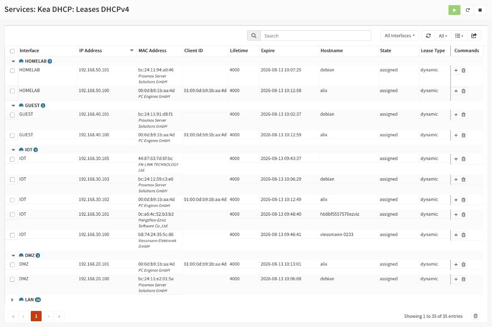

**Vérification côté ALIX** : `ifconfig vlanXX | grep inet` doit montrer une IP dans la plage du subnet correspondant.

---

### 5.10. Résultats finaux et persistance

| Test | Résultat |
|------|:--------:|
| Connectivité 4 VLANs | ✅ 0% perte |
| Isolation inter-VLAN | ✅ 100% bloqué |
| Isolation LAN | ✅ bloqué depuis tous les VLANs |
| DHCP KEA | ✅ 4/4 leases |
| Réseau existant | ✅ intact |

**Test de persistance (reboot OPNsense) :** après un redémarrage d'OPNsense, les **bridges sont recréés avec leurs membres** (vlan0.X.20-50 + vxlanX), les **interfaces VLAN sont présentes** et le réseau reste intact ✅.

## 6. Le WiFi : AP et répéteur

### 6.1. Pourquoi le 802.1Q n'est pas standard sur le WiFi

Le **tag 802.1Q** est une étiquette de **trame Ethernet filaire** (IEEE 802.3 + champ 802.1Q). Sur un lien **WiFi (802.11)**, la trame a une structure différente :

| Élément | Filaire Ethernet | WiFi (802.11) |
|---------|:----------------:|:--------------:|
| Trame | Trame Ethernet + champ 802.1Q | Trame 802.11 (structure différente) |
| Priorisation QoS | 802.1p (dans le tag VLAN) | WMM / 802.11e (QoS Control, pas de tag) |
| Segmentation VLAN | Tag 802.1Q standard | SSIDs multiples = segmentation native |

**La trame 802.11 n'a pas de champ 802.1Q.** Le standard WiFi segmente via **SSIDs multiples** (chaque SSID mappé à un réseau/VLAN), pas via des tags dans la trame.

**Méthodes réelles pour "VLAN sur WiFi" :**

| Méthode | Standard ? | Comment |
|---------|:----------:|---------|
| SSIDs multiples | ✅ IEEE 802.11 | Chaque SSID → un VLAN (méthode native) |
| WDS (4 adresses) | ✅ | Préserve la trame Ethernet complète — tag dépend du driver |
| 802.1X / WPA3-Enterprise | ✅ | Le RADIUS assigne un VLAN par utilisateur (dynamic VLAN) |
| 802.11s mesh | ✅ | Maillage, pas de tags |
| Tag 802.1Q dans la trame 802.11 | ❌ **PAS standardisé** | Non défini par l'IEEE |

**Conséquence pour ce projet :** le 802.1Q "brut" sur WiFi n'est pas standard — d'où le recours aux **SSIDs dédiés** (méthode native) et à l'**encapsulation VXLAN** (section 7) pour transporter les VLANs.

### 6.2. Le problème : le WiFi ne transporte pas les VLANs

Le segment **AP OpenWrt → Répéteur** passe par le **WiFi**. Un tag 802.1Q est une étiquette de trame Ethernet filaire : sur un lien 802.11, elle peut être perdue selon le mode du répéteur.

| Mode répéteur | Tags VLAN traversent ? |
|---------------|:----------------------:|
| Routage/NAT (client standard) | ❌ Non — décapsulation IP, tag détruit |
| **Relay Bridge (relayd)** | ❌ Non — relayd fait du routage de trames, tag détruit |
| Pont WDS (4-adresses) | ✅ Oui |

### 6.3. Vérification sur le terrain

- **Répéteur (.254)** : interface `repeater_bridge` en protocole **Relay Bridge** ✅ → les VLANs passeront
- **AP (.2)** : `brctl show` → `br-lan` contient `eth1 + phy0-ap0 + phy1-ap0` = **pont transparent** ✅

```bash
# Vérification AP (SSH root)
root@openwrt:~# brctl show
bridge name  bridge id          STP enabled  interfaces
br-lan       7fff.000db95ae901   no           eth1
                                              phy0-ap0
                                              phy1-ap0
```

Les VLANs traversent le WiFi via relayd mais : réécriture MAC (relayd), débit partagé entre VLANs sur la radio, multicast parfois capricieux. Acceptable pour un homelab, à connaître.

### 6.4. Découverte : relayd ne transporte pas les VLANs

**L'audit initial supposait que le répéteur (.254) était en "Relay Bridge" (relayd).** La réalité vérifiée sur le terrain :

```
config wifi-iface 'wifinet2'
 option device 'radio1'
 option mode 'sta'          ← CLIENT WiFi, PAS relayd !
 option network 'wwan'      ← interface séparée
```

```bash
br-lan = lan1, lan2, lan3, phy0-ap0    ← wwan ABSENT du bridge
```

**Conséquence : le répéteur fait du routage/NAT entre le WiFi et le LAN filaire** — les tags VLAN 20-50 sont **détruits** au décapsulage WiFi. Seul le VLAN 10 natif (non taggé) traverse.

**Impact : le switch MikroTik (derrière le répéteur) ne peut pas transporter les VLANs via le WiFi.** Symptôme observé : les trames 802.1Q partent de l'ALIX mais n'arrivent jamais sur igb2 d'OPNsense (tcpdump : 10 852 paquets reçus, 0 tag 802.1Q).

**Options pour résoudre :**

1. **Câble filaire switch → AP/OPNsense** (fiable, recommandé)
2. **Convertir le répéteur en WDS (4-adresses)** — voir section 6.5
3. Accepter : le switch reste sur le VLAN 10, VLANs seulement sur les chemins filaires directs

### 6.5. Conversion répéteur relayd → WDS

**Objectif :** tenter de faire traverser les tags 802.1Q sur le lien WiFi répéteur ↔ AP. Le mode STA (2-adresses) détruit les tags ; le **WDS (4-adresses)** transporte la trame Ethernet complète, ce qui est le **seul espoir** de préserver le tag. **Mais le 802.1Q n'étant pas standard sur le WiFi (section 6.1), le résultat n'était pas garanti** — c'est ce qu'on a dû vérifier sur le terrain.

#### Prérequis (côté AP)

Le SSID cible doit accepter les clients WDS (`wds='1'`) :

```bash
# AP (/etc/config/wireless) — SSID Vince-AC (5 GHz)
root@ap:~# uci show wireless.default_radio0.wds
# → wireless.default_radio0.wds='1'   ← obligatoire
```

#### Config cible (côté répéteur)

```bash
# /etc/config/wireless — le client WDS (au lieu de relayd)
config wifi-iface 'wifinet3'
    option device 'radio1'      # 5 GHz
    option mode 'sta'
    option ssid 'Vince-AC'
    option encryption 'psk2'
    option key '...'
    option wds '1'              # ← WDS activé
    option network 'lan'        # ← DANS le bridge (PAS wwan séparé)
```

**Point clé :** le client WDS doit être ponté dans **br-lan** (`option network 'lan'`), pas dans une interface wwan séparée avec IP — sinon c'est du routage et les tags sont détruits.

```bash
# /etc/config/network — br-lan inchangé (les ports LAN + le lien WDS)
config device
    option name 'br-lan'
    option type 'bridge'
    list ports 'lan1'
    list ports 'lan2'
    list ports 'lan3'
    # le lien WDS (phy1-sta0) est ajouté automatiquement via network 'lan'
```

#### Vérification de la conversion

```bash
# 1. Le lien WDS est établi et ponté ?
$ iwinfo
phy1-sta0 ESSID: "Vince-AC"
         Access Point: 0a:bf:b8:1d:b7:9f
         Mode: Client  Channel: 36 (5.180 GHz)  HT Mode: VHT80
         Center Channel 1: 42 2: unknown
         Tx-Power: 20 dBm  Link Quality: 39/70
         Signal: -71 dBm  Noise: -92 dBm
         Bit Rate: 526.5 MBit/s
         Encryption: none
         Type: nl80211  HW Mode(s): 802.11ax/ac/n
         Hardware: embedded [MediaTek MT7986]
         TX power offset: none
         Channel offset: none
         Supports VAPs: yes  PHY name: phy1

# 2. Le lien WDS est dans le bridge ?
$ brctl show
bridge name bridge id  STP enabled interfaces
br-lan  7fff.08bfb80db79e yes  lan2
       phy1-sta0
       lan3
       lan1
```

#### 🚨 DÉCOUVERTE : WDS ne suffit PAS sur ath10k

**Les tags 802.1Q ne traversent toujours pas le lien WiFi même en WDS.** Diagnostic croisé tcpdump :

| Point d'écoute | Trafic VLAN 20 taggé | Conclusion |
|----------------|:--------------------:|:----------:|
| ALIX (vlan20) | ✅ émis (length 46) | L'émission est correcte |
| Répéteur (phy1-sta0) | ✅ émis vers le WiFi | Le répéteur émet les tags |
| **AP (phy0-ap0 / phy1-ap0)** | ❌ **0 paquet 802.1Q** | **Les tags sont strippés par le driver ath10k à la réception** |

**Preuve que le WDS transporte bien les trames :** les ARP du réseau 10 (pve derrière le switch) arrivent bien sur phy0-ap0 — le lien WDS fonctionne pour le trafic non taggé. Seuls les tags VLAN sont perdus.

**Cause : limitation du driver ath10k (QCA9880)** — le tag 802.1Q est une couche Ethernet filaire, le driver le retire à la réception de la trame 802.11, même en 4-adresses. **Aucune config OpenWrt ne préserve les tags sur ce matériel.**

**Confirmation externe :** le driver ath10k a une limitation **documentée** — il droppe ou échoue à transmettre les trames 802.1Q taggées selon le firmware Qualcomm officiel et la version du driver, notamment en mode bridge/WDS. Les workarounds recommandés consistent à stripper les tags au niveau hôte (sous-interfaces Ethernet → WLAN untagged). **Notre solution VXLAN est un contournement encore plus robuste** : elle encapsule la trame VLAN dans UDP 4789, ce qui évite totalement que ath10k traite les tags 802.1Q bruts.

**Vérification driver (dmesg AP) :** `phy0-ap0` (5 GHz, où le répéteur est connecté via WDS) est piloté par **`ath10k_pci`** (`qca988x hw2.0`). C'est bien ce driver qui strippe les tags sur le chemin répéteur → AP. La radio 2.4 GHz (`phy1-ap0`) utilise `ath9k` — non concernée par le WDS.

#### Conclusion

| Solution | Transporte les VLANs ? | Statut |
|----------|:----------------------:|:------:|
| STA (2-adresses) | ❌ Non | Abandonné |
| relayd (Relay Bridge) | ❌ Non (jamais été actif) | Abandonné |
| **WDS (4-adresses)** | ❌ Non sur ath10k | **Découvert** |
| **VXLAN par-dessus WDS** | ✅ Oui (encapsulation UDP) | **En cours de validation** (section 7) |

**Leçon :** sur le WiFi, la segmentation VLAN se fait par **SSIDs dédiés** (Vince-IOT → VLAN 30, Vince-Guest → VLAN 40 — validés), pas par tags sur un lien. Pour transporter des VLANs à travers un lien WiFi, il faut **encapsuler** (VXLAN).

---

### 6.6. Configurer l'AP OpenWrt (vlan_filtering)

**Objectif :** rendre l'AP VLAN-aware pour transporter les tags 20-50.

**Config /etc/config/network (AP) :**

```
config device
    option name 'br-lan'
    option type 'bridge'
    option vlan_filtering '1'
    list ports 'eth0'
    list ports 'eth1'

config bridge-vlan
    option device 'br-lan'
    option vlan '10'
    list ports 'eth0:u*'
    list ports 'eth1:u*'

config bridge-vlan
    option device 'br-lan'
    option vlan '20'
    list ports 'eth0:t'
    list ports 'eth1:t'

config bridge-vlan
    option device 'br-lan'
    option vlan '30'
    list ports 'eth0:t'
    list ports 'eth1:t'

config bridge-vlan
    option device 'br-lan'
    option vlan '40'
    list ports 'eth0:t'
    list ports 'eth1:t'

config bridge-vlan
    option device 'br-lan'
    option vlan '50'
    list ports 'eth0:t'
    list ports 'eth1:t'

config interface 'lan'
    option device 'br-lan.10'      # ← IP sur la sous-interface VLAN 10 !
    option proto 'static'
    list ipaddr '192.168.10.2/24'
    option gateway '192.168.10.1'
```

**Légende :** `u` = untagged, `t` = tagged, `*` = PVID.

**Schéma AP après config :**

```
                 AP OpenWrt .2
                 ┌──────────────┐
    ALIX vr0 ────│ eth0         │
                 │  ┌────────┐  │
                 │  │ br-lan │  │
                 │  │ vlan   │  │
                 │  │ filter │  │
                 │  └───┬────┘  │
                 │      │       │
    OPNsense ────│ eth1 │       │
    (igb2)       └──────┼───────┘
                        │
            VLANs 10(natif)/20/30/40/50
```

**⚠️ Piège critique :** avec `vlan_filtering=1`, l'IP de management doit être sur **`br-lan.10`** (sous-interface VLAN 10), PAS sur br-lan brut — sinon perte de connectivité et rollback automatique LuCI.

**Appliquer :**

```bash
root@ap:~# /etc/init.d/network reload
```

**Vérifier :**

```bash
# vlan_filtering est-il actif sur le bridge ?
$ cat /sys/class/net/br-lan/bridge/vlan_filtering
1

# L'IP de gestion est-elle bien sur br-lan.10 (et non br-lan brut) ?
$ ip addr show br-lan.10 | grep inet
    inet 192.168.10.2/24 brd 192.168.10.255 scope global br-lan.10
    inet6 fe80::20d:b9ff:fe5a:e900/64 scope link

# La gateway OPNsense répond-elle ?
$ ping -c2 192.168.10.1
PING 192.168.10.1 (192.168.10.1): 56 data bytes
64 bytes from 192.168.10.1: seq=0 ttl=64 time=0.821 ms
64 bytes from 192.168.10.1: seq=1 ttl=64 time=0.807 ms

--- 192.168.10.1 ping statistics ---
2 packets transmitted, 2 packets received, 0% packet loss
round-trip min/avg/max = 0.807/0.814/0.821 ms
```

**Schéma final à cette étape (ALIX sur l'AP pour le test de traversée) :**

```
                          OPNsense
                           │
     ┌─────────────────────┼──────────────────────┐
     │                     │                      │
   igb1 (test)           igb2 (AP)              igb3 (pve1)
     │                     │                      │
   vlan0.1.20-50      vlan0.2.20-50             (brut)
     │                     │                      │
     │  bridge1-4          │  bridge1-4           │
     └────────┬────────────┘                      │
              │                                   │
         AP OpenWrt .2                     pve1 .11
         (vlan_filtering)
              │
         ┌────┴────────────┐
         │ ALIX (OpenBSD)  │
         │ vr1 → AP eth0   │  ← test VLAN via l'AP
         │ vr0 → igb1      │  ← (test direct, optionnel)
         └─────────────────┘
```

---

### 6.7. Validation AP OpenWrt

| Test | Résultat |
|------|:--------:|
| vlan_filtering actif (`bridge vlan show`) | ✅ |
| VLANs 20-50 traversent l'AP (ALIX → eth0 → eth1 → igb2) | ✅ 0% perte |
| Isolation conservée à travers l'AP | ✅ |
| IP statique AP (192.168.10.2) + br-lan.10 | ✅ |

### 6.8. WiFi Guest et IOT

**Config AP :** 2 VIFs ajoutées sur les radios (via interfaces réseau dédiées, pas l'option vlan de l'UI) :

> **🏷️ Bonne pratique :** la **segmentation VLAN par SSID** est la méthode **native et standard** pour séparer les réseaux sur le WiFi (voir section 6.1). Elle est d'autant plus pertinente ici que les VLANs **IOT (30)** et **GUEST (40)** n'accueilleront **que des appareils mobiles/WiFi** — des objets connectés (IOT) et des invités (GUEST) qui se connecteront exclusivement sans fil. Le SSID dédié mappe directement le client vers son VLAN, sans dépendre du transport 802.1Q sur l'air.

| SSID | Radio | Interface réseau | VLAN |
|------|:-----:|:----------------:|:----:|
| Vince-IOT | radio0 (5GHz) | lan_iot → br-lan.30 | 30 |
| Vince-Guest | radio1 (2.4GHz) | lan_guest → br-lan.40 | 40 |

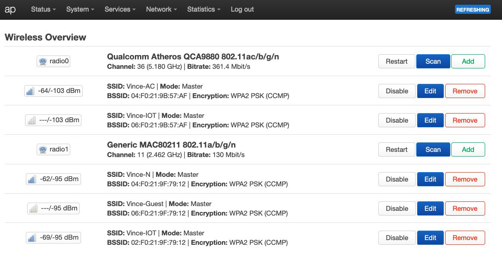

**Config AP (interfaces) :**

```
config interface 'lan_iot'
    option device 'br-lan.30'
    option proto 'static'
    option ipaddr '192.168.30.2'
    option gateway '192.168.30.1'

config interface 'lan_guest'
    option device 'br-lan.40'
    option proto 'static'
    option ipaddr '192.168.40.2'
    option netmask '255.255.255.0'
    option gateway '192.168.40.1'
```

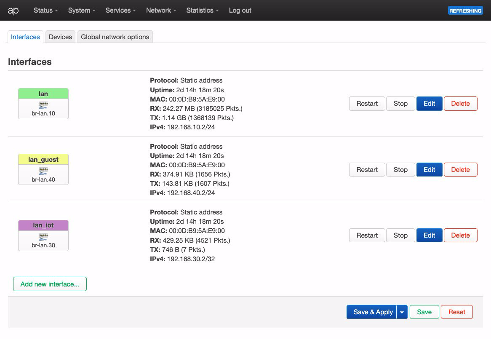

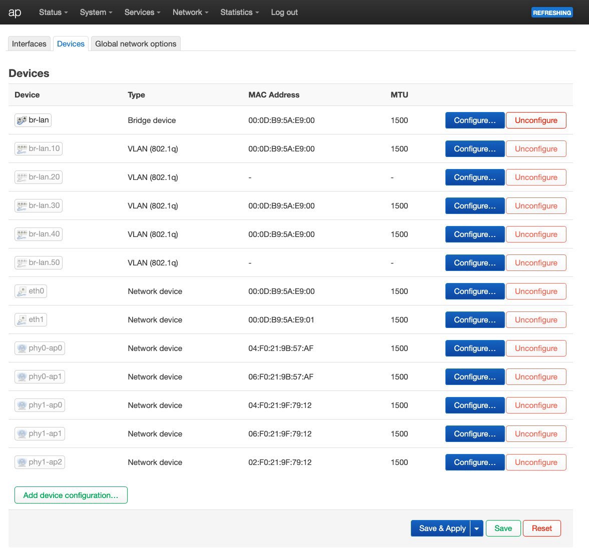

**Modèle de règles firewall OPNsense par VLAN (copier/coller, adapter la source) :**

> **ℹ️ Il s'agit du firewall OPNsense** (la passerelle qui filtre entre les VLANs) — **pas** du firewall OpenWrt (celui de l'AP/répéteur, qui ne concerne que le trafic local de ces équipements). Les règles ci-dessous se configurent dans **OPNsense → Firewall → Rules**.

| # | Action | Protocol | Source | Port | Destination | Port | Gateway | Description |
|:-:|:------:|:--------:|:------:|:----:|:-----------:|:----:|:-------:|-------------|
| 1 | ✅ **PASS** | TCP/UDP | VLAN net | * | This Firewall | 53 | * | VLAN → DNS (Unbound) |
| 2 | ✅ **PASS** | ICMP | VLAN net | * | This Firewall | * | * | VLAN → ping gateway |
| 3 | 🚫 **BLOCK** | * | VLAN net | * | autres VLANs + lan | * | * | VLAN → pas de réseaux privés (Log ☑️) |
| 4 | ✅ **PASS** | * | VLAN net | * | any | * | * | VLAN → Internet |

> **⚠️ Ordre des règles :** OPNsense (basé sur pf) évalue les règles **de haut en bas**, et **la première règle qui correspond gagne** (le trafic est traité par la 1re règle match, les suivantes sont ignorées). L'ordre est donc **déterminant** :
>
> - Les règles **PASS spécifiques** (DNS, ICMP) doivent être **en premier**
> - Le **BLOCK** des réseaux privés (règle 3) doit venir **avant** le PASS Internet (règle 4), sinon le trafic vers les autres VLANs passerait via la règle Internet
> - Respecter cet ordre garantit que seuls les flux voulus sortent du VLAN, et que l'isolation inter-VLAN est réellement effective

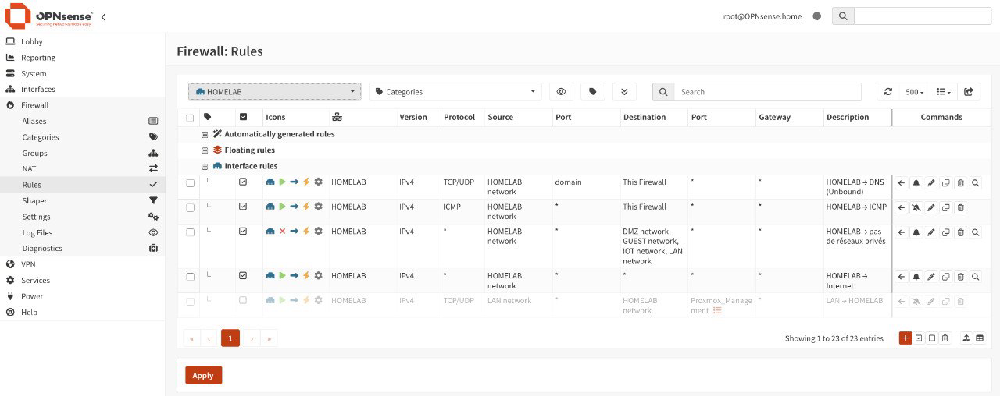

**Exemple concret — règles firewall OPNsense pour IOT :**

| # | Action | Protocol | Source | Port | Destination | Port | Gateway | Description |
|:-:|:------:|:--------:|:------:|:----:|:-----------:|:----:|:-------:|-------------|
| 1 | ✅ **PASS** | TCP/UDP | IOT network | * | This Firewall | 53 | * | IOT → DNS (Unbound) |
| 2 | ✅ **PASS** | ICMP | IOT network | * | This Firewall | * | * | IOT → ICMP |
| 3 | 🚫 **BLOCK** | * | IOT network | * | `DMZ network`, `GUEST network`, `HOMELAB network`, `LAN network` | * | * | IOT → pas de réseaux privés |
| 4 | ✅ **PASS** | * | IOT network | * | * | * | * | IOT → Internet |

**Liste des autres VLANs par interface (avec les alias dynamiques OPNsense) :**

- **Guest (opt10)** : BLOCK → `DMZ networks`, `HOMELAB networks`, `IOT networks`, `LAN net` (alias dynamiques auto-créés)
- **IOT (opt9)** : BLOCK → `DMZ networks`, `HOMELAB networks`, `Guest networks`, `LAN net`

**⚠️ Différence clé :** le BLOCK IOT doit inclure **Guest networks** (IOT ne joint pas Guest) ; le BLOCK Guest inclut IOT networks. Le WAN et le réseau de l'interface elle-même ne sont JAMAIS dans le BLOCK — d'où l'utilisation des **alias dynamiques d'OPNsense** (ex: `IOT networks`, `DMZ networks`...) plutôt que l'alias RFC1918 `PrivateNetworks` qui couvrirait le WAN (192.168.1.14 — Livebox) et casserait Internet.

**Résultats de validation :**

```
                    ┌────────────────────────────────────────────────┐
                    │                 OPNsense                       │
                    │                                                │
                    │  bridge2 (IOT .30.1)   bridge3 (Guest .40.1)   │
                    │      ▲                        ▲                │
                    │      │ VLAN 30                │ VLAN 40        │
                    │   igb2 (vlan0.2.30)       igb2 (vlan0.2.40)   │
                    └──────┼────────────────────────┼────────────────┘
                           │                        │
                    ┌──────┴────────────────────────┴──────┐
                    │             AP OpenWrt .2            │
                    │        (vlan_filtering actif)        │
                    │                                      │
                    │  br-lan.30 (lan_iot)   br-lan.40     │
                    │      ▲   phy0-ap1          ▲  phy1-ap1│
                    │      │   Vince-IOT         │  Vince-G │
                    │      │   (5GHz)            │  uest    │
                    └──────┼────────────────────┼──────────┘
                           │                    │   (2.4GHz)
                           │                    │
                    ┌──────┴───┐          ┌─────┴──────┐
                    │ iPhone    │          │ iPad       │
                    │ 192.168.30│          │ 192.168.40.│
                    │ .102      │          │ 102        │
                    │ [WiFi]    │          │ [WiFi]     │
                    └───────────┘          └────────────┘
```

**Résultats des tests :**

| Test | Résultat |
|------|:--------:|
| iPhone → Vince-IOT → IP 192.168.30.102 | ✅ |
| iPad → Vince-Guest → IP 192.168.40.102 | ✅ |
| Internet depuis IOT et Guest | ✅ (après règle DNS + BLOCK corrigé) |
| IOT → LAN (.9:7000, .180:7000 AirPlay) | 🚫 bloqué + loggé |
| Guest → LAN (.10:8006 pve0) | 🚫 bloqué + loggé |
| Isolation inter-VLAN | ✅ |

```
                    ┌──────────────────────────────────────┐
                    │      Flux de test pendant la phase   │
                    │                                       │
                    │  iPhone (IOT) → .9:7000  ──🚫 BLOCK──▶│
                    │  iPhone (IOT) → Internet ──✅ PASS───▶│
                    │  iPad (Guest) → .10:8006 ──🚫 BLOCK──▶│
                    │  iPad (Guest) → Internet ──✅ PASS───▶│
                    └──────────────────────────────────────┘
```

**Anecdote identifiée :** le port 7000 + 5000 sur .9/.180 = appareils AirPlay (Apple TV/HomePod) — l'iPhone IOT tentait de diffuser vers le LAN, bloqué par la règle IOT ✅

#### ✅ Point d'étape — où en est-on à la fin de la section 6

À ce stade du rollout, la **segmentation par SSID** est **fonctionnelle** :

- **OPNsense** : les 4 bridges VLAN (DMZ 20, IOT 30, GUEST 40, HOMELAB 50) sont créés et routent (section 5)
- **AP OpenWrt** : `vlan_filtering` actif, les SSIDs **Vince-IOT** (→ VLAN 30) et **Vince-Guest** (→ VLAN 40) sont opérationnels (sections 6.6-6.8)
- **VLANs fonctionnels via WiFi** : **IOT** et **GUEST** traversent l'AP et rejoignent leurs subnets respectifs, avec isolation inter-VLAN + accès Internet validés (section 6.8)

**Il reste un chaînon à couvrir :** le **répéteur WiFi** (et derrière lui le **switch MikroTik**) ne peuvent **pas encore** transporter les VLANs — le WiFi ne transporte pas le 802.1Q (section 6.1) et ni relayd ni WDS ne suffisent sur ce matériel (sections 6.4-6.5). C'est l'objet de la **section 7 (VXLAN)**, qui va permettre de faire traverser les VLANs 20/30/40/50 au répéteur et au switch.

---

## 7. VXLAN — transporter les VLANs sur le WiFi

L'**AP** (Qualcomm QCA9880/ath10k) **strippe les tags 802.1Q** sur les trames reçues du WiFi (section 6.5), même en WDS 4-adresses — les VLANs ne pouvaient donc pas traverser le lien WiFi directement.

**Solution : VXLAN (encapsulation UDP)**. La trame Ethernet complète (avec son tag VLAN) est encapsulée dans un **paquet UDP/IP** entre **OPNsense** et le **répéteur** : OPNsense crée un tunnel VXLAN (vxlan1-4), l'AP joue le rôle de **bridge L2 transparent** (elle forwarde l'UDP 4789 sans toucher au contenu), et le répéteur décapsule pour exposer les VLANs. Le résultat : les VLANs 20/30/40/50 traversent le WiFi de bout en bout.

### 7.1. Qu'est-ce que VXLAN ?

**VXLAN** (Virtual eXtensible LAN) est un protocole d'**overlay L2 sur réseau L3** (RFC 7348) :

- Il **encapsule des trames Ethernet complètes** (avec leur tag VLAN) dans des **paquets UDP/IP**
- **VNI** (VNET Identifier, 24 bits) = identifiant du réseau virtuel
- **Port UDP 4789** (par défaut)
- Les flags `[I]` (0x08) indiquent une trame VNI (observés en capture)

```
| Ethernet ext (14) | IP (20) | UDP (8) | VXLAN (8) | Trame Ethernet interne (avec tag VLAN) |
```

**Overhead :** 14 + 20 + 8 + 8 = **50 octets** → MTU interne max = 1500 − 50 = **1450**.

### 7.2. Pourquoi l'utiliser ici

Le **WiFi (ath10k)** strippe les tags 802.1Q (section 6.2), et **relayd** fait du routage de trames (section 6.4). **VXLAN encapsule la trame VLAN complète dans UDP/IP**, qui lui **traverse normalement le WiFi** :

- L'**AP** est un **bridge transparent** — elle forwarde l'UDP sans toucher au contenu
- Le **répéteur** décapsule et expose les VLANs

### 7.3. Architecture cible

```
┌──────────────────────────────────────────────────────────────────────┐
│  OPNsense (.1) — FreeBSD                                             │
│                                                                      │
│  igb0 ── WAN (Livebox)                                               │
│                                                                      │
│  bridge1 = DMZ   (.20.1)  ◄── vxlan1 (VNI 20, descr vxlan20)         │
│  bridge2 = IOT   (.30.1)  ◄── vxlan2 (VNI 30, descr vxlan30)         │
│  bridge3 = GUEST (.40.1)  ◄── vxlan3 (VNI 40, descr vxlan40)         │
│  bridge4 = HOMELAB (.50.1) ◄─ vxlan4 (VNI 50, descr vxlan50)         │
│                                                                      │
│  vxlan1-4 : local 192.168.10.1:4789  →  remote 192.168.10.254:4789   │
│     │                │                │                │             │
└─────┼────────────────┼────────────────┼────────────────┼─────────────┘
      │                │  UDP 4789 (VXLAN encapsulé en IP — L3)
      │                ▼
┌─────┴────────────────────────────────────────────────────────────────┐
│  AP OpenWrt (.2) — bridge L2 TRANSPARENT                             │
│  (ne fait AUCUN VXLAN — forwarde l'UDP 4789 sans y toucher)          │
│  igb2 ← OPNsense      eth1                                           │
│  br-lan [eth0 + eth1]  vlan_filtering=1                              │
│  phy1-ap0 ──► [WiFi WDS]                                             │
└──────┬───────────────────────────────────────────────────────────────┘
       │  UDP 4789 (VXLAN encapsulé — traverse le WiFi en IP)
       │  [WiFi] ~~~~ phy1-sta0
┌──────┴───────────────────────────────────────────────────────────────┐
│  Répéteur (.254) — OpenWrt                                           │
│  phy1-sta0 ← [WiFi WDS]  (uplink AP)                                 │
│  br-lan [lan1 + lan2 + lan3 + phy1-sta0]                             │
│  vxlan20/30/40/50  (Décapsulation UDP → trames VLAN exposées)        │
│  br-vx20 [lan1.20+lan2.20+vxlan20]   (idem 30/40/50)                 │
└──┬──────────────────────┬────────────────────────────────────────────┘
   │ lan1.X (trunk)       │ lan2.X (test ALIX)      
   ▼                      ▼                         
┌──────────────────┐  ┌─────────────┐               
│ Switch CSS610    │  │ ALIX (.X)   │               
│ VLANs 20-50      │  │ VLAN 20-50  │               
└──────┬───────────┘  └─────────────┘               
       ▼
   pve0/2/3/4 + NAS
```

**Le VXLAN encapsule la trame Ethernet complète (avec son tag 802.1Q) dans UDP 4789.** Le WiFi transporte l'IP (ça marche), VXLAN transporte la trame VLAN dedans — **les tags survivent**.

#### Point clé : l'AP est transparente

L'AP ne fait **aucun VXLAN** — elle est un **bridge L2 transparent** qui forwarde l'UDP 4789 entre eth1 (OPNsense) et le WiFi (répéteur). Ses bridge-vlan (20/30/40/50 taggés sur eth0+eth1) ne concernent que le trafic direct AP→OPNsense, pas le VXLAN.

### 7.4. Mise en place sur OPNsense

#### Prérequis : charger le module `if_vxlan`

Le module **`if_vxlan`** (pilote VXLAN FreeBSD) **n'est pas chargé par défaut** sur OPNsense. Il doit être **chargé et persisté au boot** avant de créer les devices VXLAN.

**Chargement immédiat (CLI) :**

```bash
root@opnsense:~# kldload if_vxlan
```

**Persistance au boot (via l'UI OPNsense) — System → Settings → Tunables → Add :**

```
Tunable      : if_vxlan_load
Value        : 1
Description  : Charger le module VXLAN (if_vxlan) au démarrage
```

*Ceci génère `<tunable>if_vxlan_load</tunable>` dans `/conf/config.xml` — le module se charge à chaque boot.*

**Vérification :**

```bash
root@opnsense:~# kldstat | grep vxlan
25    1 0xffffffff83881000     7420 if_vxlan.ko
```

#### Config OPNsense (via l'UI)

**Interfaces → Other Types → VXLAN → Add** (×4, mode unicast) :

| # | Device (auto) | Description | VNI | Source | Remote |
|:-:|:------------:|:-----------:|:---:|:------:|:------:|
| 1 | `vxlan1` | `vxlan20` | 20 | 192.168.10.1 | 192.168.10.254 |
| 2 | `vxlan2` | `vxlan30` | 30 | 192.168.10.1 | 192.168.10.254 |
| 3 | `vxlan3` | `vxlan40` | 40 | 192.168.10.1 | 192.168.10.254 |
| 4 | `vxlan4` | `vxlan50` | 50 | 192.168.10.1 | 192.168.10.254 |

*Multicast group + Device : VIDES (mode unicast). Le device auto (`vxlan<N>`) n'est pas renommable ; la Description (`vxlan<vlan_id>`) est le nom logique.*

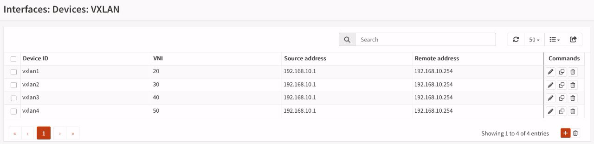

**Puis Interfaces → Assignments** : créer une interface par device VXLAN (SANS IP, membre de bridge).
**Puis Interfaces → Bridges** : ajouter chaque vxlanX à son bridge.

**Bridges finaux OPNsense :**

| Bridge | Membres | IP (SVI) | VLAN |
|:------:|---------|:--------:|:----:|
| bridge0 | igb2, igb3, igb1 | 192.168.10.1 | 10 (natif) |
| bridge1 | vlan0.1.20 + vlan0.2.20 + vlan0.3.20 + vxlan1 | 192.168.20.1 | 20 (DMZ) |
| bridge2 | vlan0.1.30 + vlan0.2.30 + vlan0.3.30 + vxlan2 | 192.168.30.1 | 30 (IOT) |
| bridge3 | vlan0.1.40 + vlan0.2.40 + vlan0.3.40 + vxlan3 | 192.168.40.1 | 40 (GUEST) |
| bridge4 | vlan0.1.50 + vlan0.2.50 + vlan0.3.50 + vxlan4 | 192.168.50.1 | 50 (HOMELAB) |

**Chaque bridge transporte :**

- **Le VLAN** (via les sous-interfaces ou le natif) : `vlan0.1.X` (igb1), `vlan0.2.X` (igb2/AP), `vlan0.3.X` (igb3/pve1), ou natif pour bridge0
- **Le VXLAN** : `vxlan1-4` (le tunnel WiFi) — sur bridge1-4 uniquement
- **Le SVI** : l'IP gateway du bridge lui-même

> **⚠️ Nuance "trafic brut" :** les bridges transportent le trafic **taggé** (VLAN) et le **VXLAN**, **pas** du "trafic brut non taggé" — chaque bridge est dédié à **UN VLAN précis**. Le trafic brut/non taggé reste sur **bridge0** (VLAN 10 natif).

### 7.5. Mise en place sur le répéteur

#### Prérequis : packages VXLAN (OpenWrt)

Sur OpenWrt, le VXLAN nécessite le **module noyau `vxlan`** fourni par le package **`kmod-vxlan`**, ainsi que les packages de configuration. Sur OpenWrt 25.12 (répéteur), le gestionnaire de paquets est **`apk`** (et non `opkg`).

**Packages à installer (via `apk`) :**

```bash
root@repeater:~# apk add kmod-vxlan vxlan luci-proto-vxlan
```

**Vérification du module chargé :**

```bash
root@repeater:~# lsmod | grep vxlan
ip6_udp_tunnel         12288  1 vxlan
udp_tunnel             16384  1 vxlan
vxlan                  94208  0
```

**Vérification des packages installés :**

```bash
root@repeater:~# apk list --installed | grep -i vxlan
kmod-vxlan-6.12.94-r1 ... [installed]
luci-proto-vxlan-26.218.70234 ... [installed]
vxlan-7 ... [installed]
```

*Sans `kmod-vxlan`, le noyau ne peut pas créer les interfaces vxlanX (échec netifd).*

#### Config répéteur (/etc/config/network)

```bash
# VXLANs (créés via l'UI LuCI, protocol VXLAN)
config interface 'vxlan20'
    option proto 'vxlan'
    option peeraddr '192.168.10.1'
    option vid '20'
    option multipath 'off'
    option mtu '1446'
# ... idem pour vxlan30/40/50 (vid 30/40/50)

# Bridges (créés via l'UI LuCI, type bridge)
config device
    option type 'bridge'
    option name 'br-vx30'
    list ports 'lan1.30'
    list ports 'vxlan30'
# ... br-vx20/40/50 identiques

# Sous-interfaces 8021q sur lan1 (port switch)
config device
    option type '8021q'
    option ifname 'lan1'
    option vid '20'
    option name 'lan1.20'
# ... lan1.30/40/50 identiques
```

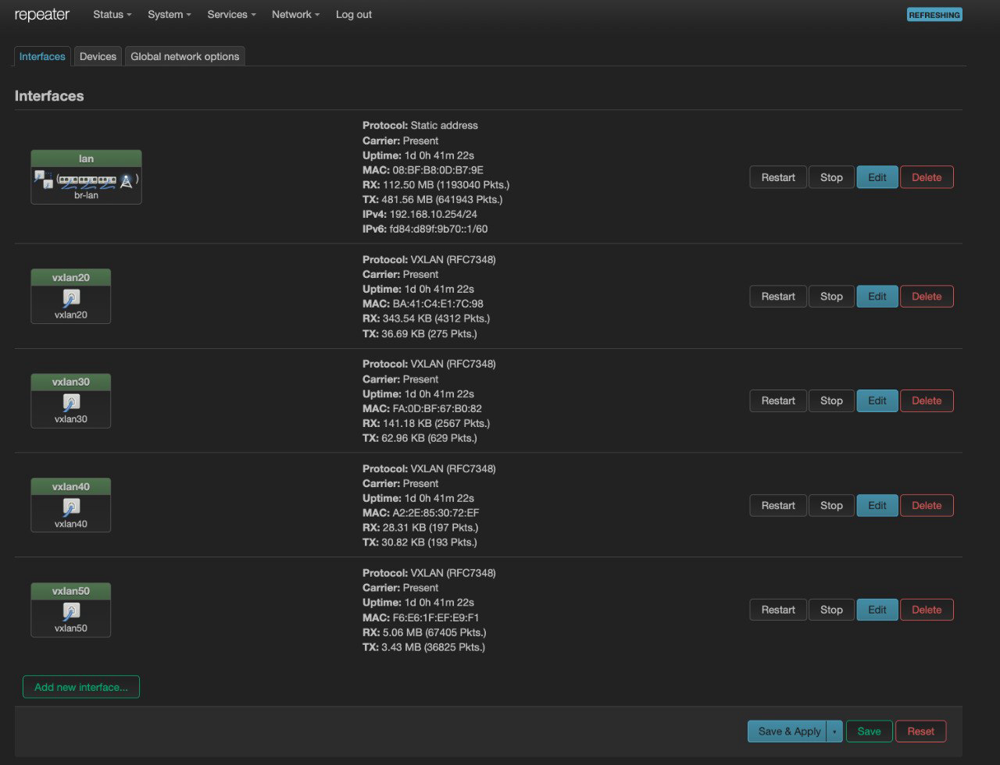

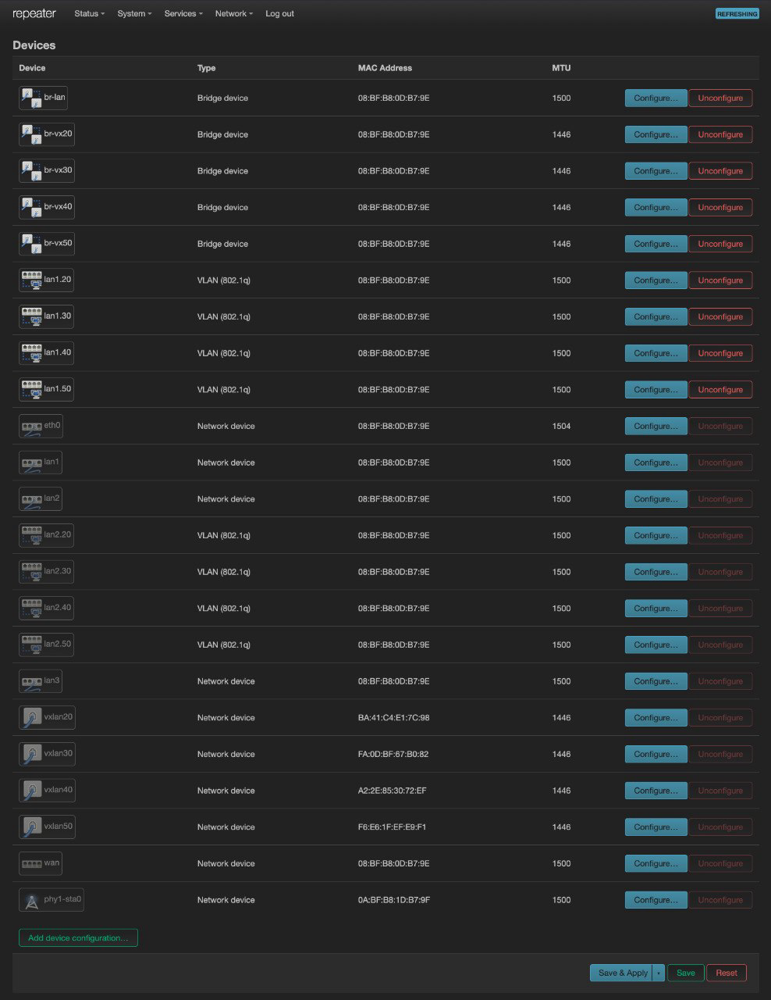

#### Config répéteur (/etc/rc.local) — persistance des sous-interfaces

**⚠️ netifd ne crée PAS les sous-interfaces 8021q** (bug DSA sur MT7986) → persistance via rc.local :

```bash
# --- VLANs 20/30/40/50 : sous-interfaces + bridges VXLAN ---
for pair in "lan1 20" "lan1 30" "lan1 40" "lan1 50" "lan2 20" "lan2 30" "lan2 40" "lan2 50"; do
    set -- $pair
    parent=$1; vid=$2
    iface=${parent}.${vid}
    if ! ip link show $iface >/dev/null 2>&1; then
        ip link add link $parent name $iface type vlan id $vid
        ip link set $iface up
    fi
done
for v in 20 30 40 50; do
    if ! ip link show br-vx$v >/dev/null 2>&1; then
        ip link add br-vx$v type bridge
        ip link set br-vx$v up
    fi
    ip link set lan1.$v master br-vx$v 2>/dev/null
    ip link set lan2.$v master br-vx$v 2>/dev/null
    ip link set vxlan$v master br-vx$v 2>/dev/null
done
exit 0
```

> **ℹ️ Note sur `lan2.X` :** ces sous-interfaces (port de test ALIX) apparaissent en `NO-CARRIER` / `LOWERLAYERDOWN` tant que rien n'est branché sur lan2 — c'est normal, l'interface est UP mais sans lien. Elles ne deviennent actives qu'à la connexion d'un équipement.

#### Firewall OpenWrt (répéteur)

Chaque interface vxlanX doit être dans la **zone lan** (sinon rejet → `Destination Port Unreachable`) :

```bash
root@repeater:~# uci add_list firewall.@zone[0].network='vxlan20'
root@repeater:~# uci add_list firewall.@zone[0].network='vxlan30'
root@repeater:~# uci add_list firewall.@zone[0].network='vxlan40'
root@repeater:~# uci add_list firewall.@zone[0].network='vxlan50'
root@repeater:~# uci commit firewall
root@repeater:~# /etc/init.d/firewall reload
```

### 7.6. Impact du MTU sur le VXLAN

Le VXLAN a un **coût inhérent : 50 octets d'overhead** par trame. Chaque trame Ethernet encapsulée dans VXLAN ajoute :

> Ethernet ext (14) + IP (20) + UDP (8) + VXLAN (8) = **50 octets**

**Conséquence :** le MTU effectif du tunnel est **1500 − 50 = 1450**. Le lien **entre OPNsense et le répéteur** (le tunnel VXLAN) est donc configuré à **MTU 1446**. Ce coût doit être **pris en compte** dans le setup VXLAN, pas seulement corrigé a posteriori : tout équipement derrière le tunnel (VMs VLAN 20-50) doit s'y adapter.

#### Symptôme : `Connection reset` sur SSH

**Symptôme :** depuis le LAN, `ping` vers une VM VLAN (20-50) fonctionne, mais `ssh` échoue avec `Connection reset by ... port 22`.

**Cause : trou noir MTU (MTU blackhole).** Le tunnel a un MTU de **1446** (1500 − 50 d'overhead). Les gros paquets TCP (1500, typiques du handshake SSH/KEX) ne passent pas dans le tunnel et sont perdus. Le ping passe car il utilise de petits paquets (56 octets).

**Diagnostic :** tester la fragmentation depuis la VM :

```bash
root@alix:~# ping -c2 -s 1400 192.168.50.1   # ✅ passe
root@alix:~# ping -c2 -s 1472 192.168.50.1   # ❌ 100% perte → MTU blackhole confirmé
```

**Solution : réduire le MTU à 1400.**

- **Proxmox** : Hardware → Network Device → `mtu=1400`
- **FreeBSD** (`/etc/rc.conf`) : `ifconfig_vtnet0="DHCP mtu 1400"` (ou statique + mtu)
- **NetBSD** (`/etc/ifconfig.vioif0`) : `up` + `mtu 1400` (fichier d'interface, lu au boot)
- **Haiku** (`~/config/settings/boot/UserBootscript`) : `ifconfig /dev/net/virtio/0 mtu 1400`
- **Linux (LXC/VM)** : PMTUD gère souvent, mais `mtu=1400` recommandé pour la fiabilité

**⚠️ Pourquoi pas le PMTUD :** l'option `net.inet.tcp.pmtud_blackhole_detection=1` (FreeBSD) **ne suffit pas** — le handshake SSH KEX envoie des paquets pleine taille dès le début, cassant la connexion avant toute ré-adaptation du MSS. Le MTU 1400 est la solution **à la racine** : en réduisant le MTU de la VM, le système émet directement des segments de taille adaptée (≤ 1400), donc les gros paquets de 1500 ne sont jamais générés et n'ont pas à être fragmentés.

**➡️ Le détail des changements de config MTU par VM** (netbsd, freebsd, haiku) est traité en **section 9.2 (VLAN sur les hyperviseurs)**.

### 7.7. Résultat final validé

#### Résultat final validé

```
ALIX (4 VLANs) → répéteur lan2 → br-vxX → vxlanX → [WiFi] → OPNsense → gateways
```

| VLAN | Gateway | Test ALIX | Statut |
|:----:|:-------:|:---------:|:------:|
| 20 (DMZ) | 192.168.20.1 | ✅ ping + DHCP | ✅ |
| 30 (IOT) | 192.168.30.1 | ✅ ping + DHCP | ✅ |
| 40 (GUEST) | 192.168.40.1 | ✅ ping + DHCP | ✅ |
| 50 (HOMELAB) | 192.168.50.1 | ✅ ping + DHCP | ✅ |

**Persistance validée après reboot** (interfaces VXLAN créées par netifd, sous-interfaces + bridges par rc.local).

**Test d'isolation complet depuis l'ALIX (à travers le VXLAN) :**

```bash
$ sh ./test-vlans.sh
=== TEST ISOLATION VLAN (gateway = doit répondre, autres = bloqués) ===

--- VLAN 20 (DMZ) source 192.168.20.101 ---
  gateway 192.168.20.1     : ✅ RÉPOND
  vers 192.168.30.1 (IOT) : ✅ bloqué
  vers 192.168.10.1 (LAN) : ✅ bloqué

--- VLAN 30 (IOT) source 192.168.30.102 ---
  gateway 192.168.30.1     : ✅ RÉPOND
  vers 192.168.10.1 (LAN) : ✅ bloqué
  vers 192.168.20.1 (DMZ) : ✅ bloqué

--- VLAN 40 (GUEST) source 192.168.40.100 ---
  gateway 192.168.40.1     : ✅ RÉPOND
  vers 192.168.10.1 (LAN) : ✅ bloqué

--- VLAN 50 (HOMELAB) source 192.168.50.100 ---
  gateway 192.168.50.1     : ✅ RÉPOND
  vers 192.168.10.1 (LAN) : ✅ bloqué

=== RÉSULTAT ===
  ✅ = conforme au comportement attendu
  ⚠️ = anomalie (un flux qui devrait être bloqué passe)
  ❌ = la gateway du VLAN ne répond pas (problème VLAN)
```

*(Ce test valide l'isolation inter-VLAN **de bout en bout à travers le VXLAN** — le même script que la validation OPNsense en section 5.9, mais en passant par le répéteur + le WiFi.)*

### 7.8. Convention de nommage VXLAN OPNsense

- Device : `vxlan<N>` (auto, Device ID — non renommable)
- Description : `vxlan<vlan_id>` (ex: `vxlan20`)
- VNI = VLAN ID (20/30/40/50)
- Source/Remote : IP LAN OPNsense / IP répéteur

#### ✅ Point d'étape — où en est-on à la fin de la section 7

Le **VXLAN** est **opérationnel de bout en bout** :

- **OPNsense** : les devices `vxlan1-4` (VNI 20/30/40/50) sont créés et rattachés aux bridges 1-4 (section 7.4)
- **Répéteur** : le tunnel VXLAN (netifd, MTU 1446) + les bridges `br-vx20-50` décapsulent et exposent les VLANs (section 7.5)
- **AP** : bridge L2 transparent — elle forwarde l'UDP 4789 sans y toucher
- **Résultat** : les VLANs 20/30/40/50 traversent le **WiFi** de bout en bout, avec isolation inter-VLAN validée par le test `test-vlans.sh` (section 7.7)
- **MTU** : le coût VXLAN (50 octets) est pris en compte (section 7.6) ; l'ajustement des VMs est détaillé en section 9.2

**Il reste à couvrir :** le **switch MikroTik** (section 8), qui doit étendre ces VLANs aux services Proxmox et au NAS derrière le répéteur.

---

## 8. Switch MikroTik CSS610

### 8.1. Configurer le switch (VLANs opérationnels)

#### Objectif

Le switch CSS610 (derrière le répéteur) doit donner aux services Proxmox (pve0/2/3/4) et au NAS l'accès aux VLANs 20-50. Le chemin complet : **switch → répéteur → VXLAN → WiFi → OPNsense**.

#### Configuration SwOS

**Table VLANs (VLAN membership) :**

| VLAN | Ports membres | Équipements |
|:----:|:-------------:|-------------|
| 20 (DMZ) | 1, 2, 3, 4, 5, 8 | répéteur, pve2, pve0, pve3, pve4, ALIX vr1 |
| 30 (IOT) | 1, 2, 3, 4, 5, 8 | idem |
| 40 (GUEST) | 1, 2, 3, 4, 5, 8 | idem |
| 50 (HOMELAB) | 1, 2, 3, 4, 5, 8 | idem |

*(Les 4 VLANs ont les mêmes membres — la table ne gère que l'appartenance (VLAN membership), il n'y a pas de notion tagged/untagged ici.)*

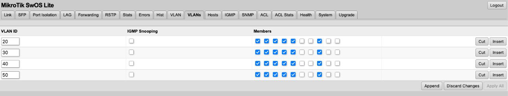

**Ports (menu VLAN) :** tout en mode **permissif** :

- VLAN Mode : `optional`
- VLAN Receive : `any` (accepte taggé + non taggé)
- Default VID : 1 (transparent, ne pas modifier)

> **ℹ️ Nuance SwOS :** en SwOS, la distinction tagged/untagged se fait via **VLAN Receive** et **Default VLAN ID**, pas dans la table VLAN. Ici en mode `any`, le switch laisse passer le trafic taggé (VLANs 20-50 selon la table) ET non taggé (VLAN 10 via PVID 1) sans coupure.

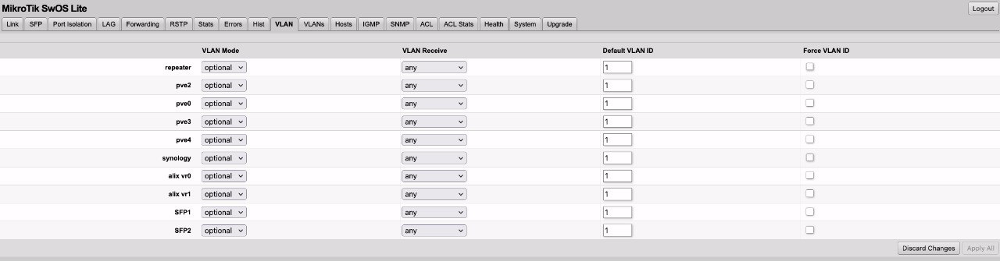

**⚠️ Pourquoi laisser en `optional` :** le mode permissif fonctionne pour le rollout progressif. Passer en `strict` (durcissement) plus tard, une fois tous les services migrés.

#### Chemin validé (test ALIX sur port 8)

```
ALIX (VLAN 20-50) → Switch port 8 → port 1 → Répéteur lan1 → br-vxX → VXLAN → [WiFi] → OPNsense → gateways
```

**Validation tcpdump (3 points d'écoute simultanés) :**

| Point d'écoute | Trafic observé | Conclusion |
|----------------|:--------------:|:----------:|
| ALIX vlan20 | ICMP echo request + reply | ✅ émission + retour |
| Répéteur lan1.20 | ICMP echo request + reply | ✅ switch → répéteur |
| OPNsense vxlan1 | ICMP echo request + reply | ✅ VXLAN → OPNsense |

**Ping des 4 VLANs depuis l'ALIX (port 8) :**

| VLAN | Gateway | Ping | Statut |
|:----:|:-------:|:----:|:------:|
| 20 (DMZ) | 192.168.20.1 | 0% perte | ✅ |
| 30 (IOT) | 192.168.30.1 | 0% perte | ✅ |
| 40 (GUEST) | 192.168.40.1 | 0% perte | ✅ |
| 50 (HOMELAB) | 192.168.50.1 | 0% perte | ✅ |

#### Convention de câblage (rappel, section 8.1)

| Port | Équipement | Rôle |
|:----:|-----------|------|
| 1 | Répéteur (lan1) | Uplink → VXLAN (chemin critique) |
| 2 | pve2 | Hyperviseur |
| 3 | pve0 | Hyperviseur |
| 4 | pve3 | Hyperviseur |
| 5 | pve4 | Hyperviseur |
| 6 | NAS | Access PVID 10 |
| 7 | ALIX (vr0) | Test VLAN |
| 8 | ALIX (vr1) | Test VLAN |

#### ✅ Point d'étape — où en est-on à la fin de la section 8

**Toutes les appliances réseau sont maintenant configurées** pour les VLANs et le VXLAN :

| Équipement | Rôle | VLANs |
|-----------|------|:-----:|
| **OPNsense** | bridges + VXLAN (section 7) | 10, 20, 30, 40, 50 |
| **AP OpenWrt** | SSIDs + vlan_filtering (section 6) | 10, 30, 40 |
| **Répéteur OpenWrt** | VXLAN + bridges br-vxX (section 7) | 10, 20, 30, 40, 50 |
| **Switch CSS610** | VLAN membership (section 8) | 10, 20, 30, 40, 50 |

**Le réseau (cœur, WiFi, switch) transporte désormais tous les VLANs** : les 4 VLANs (DMZ, IOT, GUEST, HOMELAB) traversent le switch, le répéteur, le WiFi et OPNsense de bout en bout.

**Il reste à couvrir :** les **derniers équipements — les hyperviseurs Proxmox (PVE) et les VMs** (section 9), qui doivent consommer ces VLANs (trunk sur pve1, MTU ajusté sur les VMs, etc.).

---

## 9. VLAN sur les hyperviseurs

### 9.1. VLAN sur les hyperviseurs (config identique sur tous les pve)

**Contexte :** la configuration VLAN est **identique sur les 5 nœuds Proxmox** (pve0, pve1, pve2, pve3, pve4) : `vmbr0` VLAN-aware + une sous-interface `vmbr0.50` pour le management. Seuls les IPs changent. pve1 est connecté **directement** à OPNsense (igb3, chemin filaire sans VXLAN) ; les autres passent par le switch + le WiFi.

| Nœud | IP LAN (vmbr0) | IP management (vmbr0.50) | Chemin |
|:----:|:--------------:|:------------------------:|--------|
| pve0 | 192.168.10.10 | 192.168.50.10 | switch → WiFi |
| pve1 | 192.168.10.11 | 192.168.50.11 | **direct igb3** |
| pve2 | 192.168.10.12 | 192.168.50.12 | switch → WiFi |
| pve3 | 192.168.10.13 | 192.168.50.13 | switch → WiFi |
| pve4 | 192.168.10.14 | 192.168.50.14 | switch → WiFi |

#### Architecture

```
pve1 (enp1s0) → igb3 → vlan0.3.20/30/40/50 → bridge1-4 → gateways    [chemin filaire direct]
pve0/2/3/4 → switch → répéteur → VXLAN → OPNsense → gateways          [chemin WiFi]
```

**OPNsense :** igb3 est membre de bridge0 (VLAN 10 natif) ET porte les VLANs enfants (vlan0.3.20/30/40/50, membres de bridge1-4). Sur les autres pve, le trafic passe par le switch et le VXLAN (section 7).

#### Config pve — vmbr0 VLAN-aware

**`/etc/network/interfaces` (identique sur tous les pve, seule l'adresse IP change) :**

```
auto lo
iface lo inet loopback
iface <interface physique> inet manual

auto vmbr0
iface vmbr0 inet static
    address <IP_LAN>/24           # ex: 192.168.10.11 (pve1)
    gateway 192.168.10.1
    bridge-ports <interface physique>
    bridge-stp off
    bridge-fd 0
    bridge-vlan-aware yes
    bridge-vids 2-4094

auto vmbr0.50
iface vmbr0.50 inet static
    address <IP_MGMT>/24          # ex: 192.168.50.11 (pve1)
source /etc/network/interfaces.d/*
```

*(Exemple réel pve1 : interface `enp1s0`, IP LAN `192.168.10.11`, IP mgmt `192.168.50.11` — voir le tableau des IPs ci-dessus pour les autres nœuds.)*

**Le `bridge-vlan-aware yes`** permet aux VMs/CTs d'utiliser le tag VLAN via `bridge=vmbr0,tag=XX`.

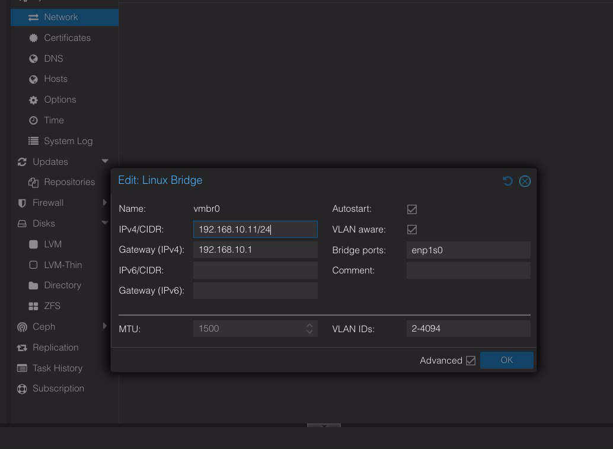

#### Utilisation dans une VM/CT

Le VLAN est choisi par le **tag** sur l'interface de la VM :

- `net0: bridge=vmbr0, tag=20, ip=dhcp` → VLAN 20 (DMZ)
- `net0: bridge=vmbr0, tag=50, ip=dhcp` → VLAN 50 (HOMELAB)

**Validation LXC 112 (Debian) :** 4 interfaces avec tags 20/30/40/50, toutes ont obtenu une IP DHCP via OPNsense Kea.

Sortie `ip a` du LXC Debian (les 4 interfaces VLAN) :

```bash
root@debian:~# ip a
2: eth0@if28: <BROADCAST,MULTICAST,UP,LOWER_UP> mtu 1500 qdisc noqueue state UP group default qlen 1000
    link/ether bc:24:11:e2:01:5a brd ff:ff:ff:ff:ff:ff link-netnsid 0
    inet 192.168.20.100/24 brd 192.168.20.255 scope global dynamic eth0
3: eth1@if29: <BROADCAST,MULTICAST,UP,LOWER_UP> mtu 1500 qdisc noqueue state UP group default qlen 1000
    link/ether bc:24:11:59:c3:e6 brd ff:ff:ff:ff:ff:ff link-netnsid 0
    inet 192.168.30.103/24 brd 192.168.30.255 scope global dynamic eth1
4: eth2@if30: <BROADCAST,MULTICAST,UP,LOWER_UP> mtu 1500 qdisc noqueue state UP group default qlen 1000
    link/ether bc:24:11:91:d8:f1 brd ff:ff:ff:ff:ff:ff link-netnsid 0
    inet 192.168.40.101/24 brd 192.168.40.255 scope global dynamic eth2
5: eth3@if31: <BROADCAST,MULTICAST,UP,LOWER_UP> mtu 1500 qdisc noqueue state UP group default qlen 1000
    link/ether bc:24:11:94:a0:46 brd ff:ff:ff:ff:ff:ff link-netnsid 0
    inet 192.168.50.101/24 brd 192.168.50.255 scope global dynamic eth3
```

| Interface | Tag VLAN | IP DHCP | Subnet |
|:---------:|:--------:|:-------:|:------:|
| eth0 | 20 (DMZ) | 192.168.20.100 | .20.0/24 |
| eth1 | 30 (IOT) | 192.168.30.103 | .30.0/24 |
| eth2 | 40 (GUEST) | 192.168.40.101 | .40.0/24 |
| eth3 | 50 (HOMELAB) | 192.168.50.101 | .50.0/24 |

*(Chaque interface virtio a obtenu une IP DHCP distincte de son subnet via OPNsense Kea — les 4 VLANs sont opérationnels sur le LXC.)*

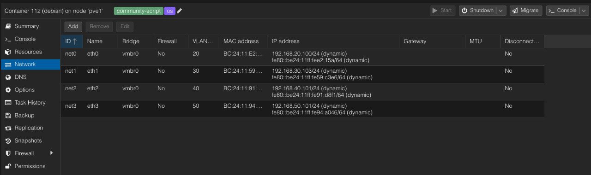

**Script de test d'isolation (LXC Debian, équivalent de `test-vlans.sh` sur ALIX) :**

```bash
#!/bin/sh
# test-vlans-lxc.sh — Test d'isolation inter-VLAN (Debian/LXC)
# Usage: sh test-vlans-lxc.sh
# Les IPs sources sont récupérées dynamiquement (DHCP)

echo "=== TEST ISOLATION VLAN (gateway = doit répondre, autres = bloqués) ==="
echo ""

# Récupérer l'IP d'une interface
get_ip() {
    ip -4 -o addr show "$1" 2>/dev/null | awk '{print $4}' | cut -d/ -f1
}

# Tester un flux depuis une interface source vers une destination
test_ping() {
    if ping -I "$1" -c2 -w2 "$2" >/dev/null 2>&1; then
        echo "  vers $2 ($3) : ⚠️ RÉPOND (attendu: BLOQUÉ)"
    else
        echo "  vers $2 ($3) : ✅ bloqué"
    fi
}

# Tester la gateway d'un VLAN : doit répondre
test_gateway() {
    if ping -I "$1" -c2 -w2 "$2" >/dev/null 2>&1; then
        echo "  gateway $2     : ✅ RÉPOND"
    else
        echo "  gateway $2     : ❌ PERDU (attendu: répond)"
    fi
}

# --- VLAN 20 (DMZ) — eth0 ---
IP20=$(get_ip eth0)
[ -n "$IP20" ] && echo "--- VLAN 20 (DMZ) interface eth0 source $IP20 ---" || echo "--- VLAN 20 (DMZ) eth0 ❌ pas d'IP ---"
if [ -n "$IP20" ]; then
    test_gateway eth0 192.168.20.1
    test_ping eth0 192.168.30.1 "IOT"
    test_ping eth0 192.168.10.1 "LAN"
fi
echo ""

# --- VLAN 30 (IOT) — eth1 ---
IP30=$(get_ip eth1)
[ -n "$IP30" ] && echo "--- VLAN 30 (IOT) interface eth1 source $IP30 ---" || echo "--- VLAN 30 (IOT) eth1 ❌ pas d'IP ---"
if [ -n "$IP30" ]; then
    test_gateway eth1 192.168.30.1
    test_ping eth1 192.168.10.1 "LAN"
    test_ping eth1 192.168.20.1 "DMZ"
fi
echo ""

# --- VLAN 40 (GUEST) — eth2 ---
IP40=$(get_ip eth2)
[ -n "$IP40" ] && echo "--- VLAN 40 (GUEST) interface eth2 source $IP40 ---" || echo "--- VLAN 40 (GUEST) eth2 ❌ pas d'IP ---"
if [ -n "$IP40" ]; then
    test_gateway eth2 192.168.40.1
    test_ping eth2 192.168.10.1 "LAN"
fi
echo ""

# --- VLAN 50 (HOMELAB) — eth3 ---
IP50=$(get_ip eth3)
[ -n "$IP50" ] && echo "--- VLAN 50 (HOMELAB) interface eth3 source $IP50 ---" || echo "--- VLAN 50 (HOMELAB) eth3 ❌ pas d'IP ---"
if [ -n "$IP50" ]; then
    test_gateway eth3 192.168.50.1
    test_ping eth3 192.168.10.1 "LAN"
fi
echo ""

echo "=== RÉSULTAT ==="
echo "  ✅ = conforme au comportement attendu"
echo "  ⚠️ = anomalie (un flux qui devrait être bloqué passe)"
echo "  ❌ = la gateway du VLAN ne répond pas (problème VLAN)"
```

*(Équivalent Linux de `test-vlans.sh` : les interfaces `eth0-3` correspondent aux VLANs 20-50, la source est spécifiée par `ping -I <interface>` au lieu de `-S <IP>`.)*

**Sortie réelle du script exécuté sur le LXC :**

```bash
$ sh ./test-vlans-lxc.sh
=== TEST ISOLATION VLAN (gateway = doit répondre, autres = bloqués) ===

--- VLAN 20 (DMZ) interface eth0 source 192.168.20.100 ---
  gateway 192.168.20.1     : ✅ RÉPOND
  vers 192.168.30.1 (IOT) : ⚠️ RÉPOND (attendu: BLOQUÉ)
  vers 192.168.10.1 (LAN) : ⚠️ RÉPOND (attendu: BLOQUÉ)

--- VLAN 30 (IOT) interface eth1 source 192.168.30.103 ---
  gateway 192.168.30.1     : ✅ RÉPOND
  vers 192.168.10.1 (LAN) : ✅ bloqué
  vers 192.168.20.1 (DMZ) : ✅ bloqué

--- VLAN 40 (GUEST) interface eth2 source 192.168.40.101 ---
  gateway 192.168.40.1     : ✅ RÉPOND
  vers 192.168.10.1 (LAN) : ✅ bloqué

--- VLAN 50 (HOMELAB) interface eth3 source 192.168.50.101 ---
  gateway 192.168.50.1     : ✅ RÉPOND
  vers 192.168.10.1 (LAN) : ✅ bloqué

=== RÉSULTAT ===
  ✅ = conforme au comportement attendu
  ⚠️ = anomalie (un flux qui devrait être bloqué passe)
  ❌ = la gateway du VLAN ne répond pas (problème VLAN)
```

> **⚠️ Remarque :** ce test révèle que **certaines règles firewall sont encore à revoir et ajuster**. Le **VLAN 20 (DMZ)** répond vers IOT et LAN alors qu'il devrait être bloqué — la cause suspectée est la règle ICMP `(self)` (qui autorise le ping vers toutes les IPs d'OPNsense, voir piège #11) et/ou l'ordre des règles DMZ. À traiter lors du durcissement (phase zero trust). Les VLANs IOT, GUEST et HOMELAB sont correctement isolés.

#### Accès admin VLAN 50 (management PVE)

- L'IP de gestion `vmbr0.50` = 192.168.50.X (ex: .11 pour pve1, voir tableau des IPs)
- Le Mac (VLAN 10) joint le pve via la règle **`pass lan → any`** (défaut)
- L'accès SSH (22) + Proxmox GUI (8006) validé sur tous les nœuds

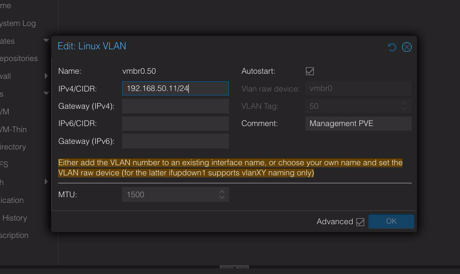

---

### 9.2. Réglage MTU sur les VMs VLAN (chemin VXLAN)

Suite au **réglage MTU VXLAN** (section 7.6), les **VMs des VLAN 20-50** doivent avoir leur MTU réduit à **1400** (elles passent par le tunnel VXLAN). Ce réglage se fait **après** la configuration du switch et des hyperviseurs.

**Neptune (VM 1000, NetBSD, pve4) — VLAN 50 (.50.103) :**

Fichier créé/modifié `/etc/ifconfig.vioif0` :

```bash
up
mtu 1400
```

*(Fichier d'interface NetBSD, lu au boot — méthode native NetBSD pour la persistance)*

Commande immédiate : `ifconfig vioif0 up mtu 1400`

**Saturne (VM 1001, FreeBSD, pve4) — VLAN 50 (.50.104) :**

Fichier `/etc/rc.conf` — ligne modifiée :

```bash
ifconfig_vtnet0="DHCP mtu 1400"
```

*(DHCP conservé, `mtu 1400` ajouté — FreeBSD n'applique pas le MTU de l'hyperviseur)*

Commande immédiate : `ifconfig vtnet0 mtu 1400`

**Haiku (VM 111, Haiku OS, pve4) — VLAN 50 (.50.105) :**

Fichier `~/config/settings/boot/UserBootscript` — ligne ajoutée :

```bash
ifconfig /dev/net/virtio/0 mtu 1400
```

*(UserBootscript Haiku exécuté à chaque démarrage)*

Commande immédiate : `ifconfig /dev/net/virtio/0 mtu 1400`

**Toutes (Proxmox, côté hyperviseur) :** `net0` de chaque VM reçoit `mtu=1400` (Hardware → Network Device).

**⚠️ Important :** le `mtu=1400` dans Proxmox ne suffit PAS seul pour FreeBSD (qui garde 1500) — il faut le mettre dans l'OS. Pour NetBSD/Haiku, le fichier d'interface/bootscript est la persistance.

**⚠️ Portée :** ce piège concerne tout accès à une VM VLAN 20-50 **depuis le LAN** (via le chemin VXLAN). Le trafic inter-VM sur le même pve (même bridge, sans VXLAN) n'est pas affecté.

#### Nuances et validation

**⚠️ Nuance NetBSD/Haiku :** neptune (NetBSD) et haiku (Haiku) peuvent se connecter en SSH à MTU 1500 **depuis une VM du même pve** (chemin local sans VXLAN), et même parfois depuis le LAN grâce à une meilleure gestion PMTUD — mais c'est **lent** (retransmissions) et **fragile**. Configurer à 1400 rend la connexion rapide et fiable.

**⚠️ Piège du test depuis le même pve :** tester le SSH depuis neptune vers une autre VM du même pve4 **ne valide PAS** le chemin VXLAN (bridge local, pas de tunnel). **Le test valide est depuis le Mac/LAN** (qui traverse le VXLAN).

**✅ Validé (2026-08-12) :** neptune (NetBSD, /etc/ifconfig.vioif0), saturne (FreeBSD, rc.conf) et haiku (Haiku, UserBootscript) — tous à MTU 1400, SSH fonctionnel depuis le Mac.

---

## 10. Conclusion

La **migration VLAN** de tout le réseau est **opérationnelle** : segmentation par usage (USER, DMZ, IOT, GUEST, HOMELAB), transport des VLANs sur le WiFi via VXLAN, isolation inter-VLAN assurée par le firewall OPNsense.

**La configuration VLAN est en place sur toutes les briques :**

| Équipement | État VLAN |
|-----------|-----------|
| **Appliances réseau** (OPNsense, AP, répéteur, switch) | ✅ Configurées pour les VLANs + VXLAN (sections 5-8) |
| **Hyperviseurs pve** (pve0-4) | ✅ `vmbr0` VLAN-aware + `vmbr0.50` management (section 9.1) |
| **VMs/LXC de test** | ✅ En **VLAN 50** (HOMELAB) pour valider : haiku, neptune, saturne (+ debian/alpine multi-VLAN) |

**Quelques VMs et LXC ont été configurés en VLAN 50** pour **valider et tester** le chemin complet (recensement : haiku, neptune, saturne sur VLAN 50 ; debian et alpine sur les 4 VLANs 20-50).

**Les équipements IOT ont aussi été reconfigurés** pour utiliser le **VLAN 30 (IOT)** : caméra, robot aspirateur (Ecovacs), chaudière connectée.

### Prochaines étapes

La migration des services actifs (portainer, caddy, prometheus, grafana, haos, devbox, etc.) depuis le VLAN natif vers leurs VLANs cibles, ainsi que le **durcissement zero trust** (règles firewall granulaires, passage en `strict` sur le switch), pourront faire l'objet d'un **prochain article** — cette configuration de test sur quelques VMs/LXC suffit à documenter la méthode.

### Architecture finale

```
┌───────────┐
│  Livebox  │
│  .1.1 WAN │
└─────┬─────┘
      │ igb0
┌─────┴───────────────────────────────────────────────────────────────┐
│  OPNsense (.1) — FreeBSD                                            │
│                                                                     │
│  igb0 ── WAN                                                        │
│                                                                     │
│  bridge0 = LAN (.10.1)  [igb2 + igb3 + igb1]                        │
│     │               │               │                               │
│  igb1 (trunk)      igb2 (AP)      igb3 (pve1)                       │
│  │   vlan0.1.20-50   │   vlan0.2.20-50   │   vlan0.3.20-50          │
│  │                   │                   │                          │
│  ├─ bridge1 = DMZ (.20.1)   [vlan0.1/2/3.20 + vxlan1]               │
│  ├─ bridge2 = IOT  (.30.1)  [vlan0.1/2/3.30 + vxlan2]               │
│  ├─ bridge3 = GUEST(.40.1)  [vlan0.1/2/3.40 + vxlan3]               │
│  ├─ bridge4 = HOMELAB(.50.1)[vlan0.1/2/3.50 + vxlan4]               │
│  │                                                                  │
│  vxlan1-4 (VNI 20/30/40/50, UDP 4789)                               │
└─────┼───────────────────────────────────────────────────────────────┘
      │ igb2 (filaire) — porte VLANs taggés + VXLAN (UDP 4789)
┌─────┴───────────────────────────────────────────────────────────────┐
│  AP OpenWrt (.2)                                                    │
│  br-lan vlan_filtering=1                                            │
│  eth1 ← igb2                                                        │
│  bridge-vlan: 10 natif 20-50 taggé                                  │
│  SSIDs: Vince-AC → VLAN 10, Vince-IOT → VLAN 30, Vince-Guest → 40   │
│  (l'AP forwarde le VXLAN : eth1 ↔ phy1-ap0, bridge transparent)     │
└──────┬──────────────────────────────────────────────────────────────┘
       │ [WiFi WDS] — encapsule les VXLANs (UDP 4789) + VLAN 10
       │ phy1-ap0 ~~~~~~~~~~  phy1-sta0
┌──────┴──────────────────────────────────────────────────────────────┐
│  Répéteur (.254) — MT7986 filogic                                   │
│  br-lan [lan1+lan2+lan3+phy1-sta0]                                  │
│  vxlan20/30/40/50 (VNI 20-50) — décapsule depuis le WiFi WDS        │
│  br-vx20 = lan1.20+lan2.20+vxlan20                                  │
│  br-vx30 = lan1.30+lan2.30+vxlan30                                  │
│  br-vx40 = lan1.40+lan2.40+vxlan40                                  │
│  br-vx50 = lan1.50+lan2.50+vxlan50  (lanX.Y créées par rc.local)    │
└──────┬──────────────────────────────────────────────────────────────┘
       │ lan1 (filaire)
┌──────┴──────────────────────────────────────────────────────────────┐
│  Switch CSS610 (.5) — SwOS                                          │
│  VLANs 20/30/40/50 = ports 1+2+3+4+5+6+8                            │
│  (tagged, mode permissif PVID 1)                                    │
└──┬───────────┬───────────┬───────────┬────────────────┬────────┬────┘
   │           │           │           │                │        │
┌──┴───────┐┌──┴───────┐┌──┴───────┐┌──┴───────┐┌───────┴────┐┌──┴───────┐
│ alix(.23)││ pve0(.10)││ pve2(.12)││ pve3(.13)││ pve4(.14)  ││ nas(.3)  │
│ OpenBSD  ││ Proxmox  ││ Proxmox  ││ Proxmox  ││ Proxmox    ││ Synology │
└──────────┘└──────────┘└──────────┘└──────────┘└────────────┘└──────────┘
```

**Chemin du VXLAN :**

```
OPNsense vxlan1-4 → igb2 → AP eth1 → [WiFi WDS] → répéteur phy1-sta0 → br-vxX
```

**Bridges OPNsense (après implémentation VLAN + VXLAN) :**

| Bridge | IP (SVI) | VLAN | Membres |
|:------:|:--------:|:----:|---------|
| bridge0 | 192.168.10.1 | 10 (natif) | igb2, igb3, igb1 |
| bridge1 | 192.168.20.1 | 20 (DMZ) | vlan0.1.20, vlan0.2.20, vlan0.3.20, vxlan1 |
| bridge2 | 192.168.30.1 | 30 (IOT) | vlan0.1.30, vlan0.2.30, vlan0.3.30, vxlan2 |
| bridge3 | 192.168.40.1 | 40 (GUEST) | vlan0.1.40, vlan0.2.40, vlan0.3.40, vxlan3 |
| bridge4 | 192.168.50.1 | 50 (HOMELAB) | vlan0.1.50, vlan0.2.50, vlan0.3.50, vxlan4 |

**Mapping AP OpenWrt (.2) :**

| Élément | Valeur | Rôle |
|---------|--------|------|
| eth0 | Libre | Port physique disponible |
| eth1 | igb2 (OPNsense) | Uplink filaire |
| br-lan | eth0 + eth1 | Bridge principal, `vlan_filtering=1` |
| br-lan.10 | 192.168.10.2 | VLAN 10 natif (LAN) |
| br-lan.30 | 192.168.30.2 | VLAN 30 (IOT) — IP gestion |
| br-lan.40 | 192.168.40.2 | VLAN 40 (GUEST) — IP gestion |
| Vince-AC | 5 GHz, wds=1 | SSID principal → VLAN 10 |
| Vince-IOT | 5 GHz | SSID IOT → VLAN 30 |
| Vince-Guest | 2.4 GHz | SSID GUEST → VLAN 40 |

**bridge-vlan (trunk eth0 + eth1) :** VLAN 10 `u*` (natif) + VLAN 20/30/40/50 `t` (taggés).

**Mapping Répéteur (.254) :**

| Élément | Valeur | Rôle |
|---------|--------|------|
| lan1 | Switch MikroTik (port 1) | Port switch |
| lan2 | ALIX vr1 | Port test VLAN |
| lan3 | Libre | Port disponible |
| br-lan | lan1 + lan2 + lan3 + phy1-sta0 | Bridge principal, 192.168.10.254 |
| phy1-sta0 | [WiFi WDS] → AP | Lien uplink WiFi (Vince-AC) |
| vxlan20 | VNI 20, remote 192.168.10.1 | Tunnel VXLAN → OPNsense (DMZ) |
| vxlan30 | VNI 30 | Tunnel VXLAN → OPNsense (IOT) |
| vxlan40 | VNI 40 | Tunnel VXLAN → OPNsense (GUEST) |
| vxlan50 | VNI 50 | Tunnel VXLAN → OPNsense (HOMELAB) |

**Bridges VXLAN du répéteur :**

| Bridge | Membres | VLAN |
|:------:|---------|:----:|
| br-vx20 | lan1.20 + lan2.20 + vxlan20 | 20 |
| br-vx30 | lan1.30 + lan2.30 + vxlan30 | 30 |
| br-vx40 | lan1.40 + lan2.40 + vxlan40 | 40 |
| br-vx50 | lan1.50 + lan2.50 + vxlan50 | 50 |

*Les sous-interfaces `lanX.Y` (8021q) sont créées par `/etc/rc.local` (netifd ne les crée pas sur DSA MT7986).*

---

---

## Annexes

### Pièges rencontrés (leçons apprises)

Tableau unifié des pièges, classés par catégorie (équipement ou sujet) :

| # | Catégorie | Piège | Symptôme | Solution / Contournement |
|:-:|:---------:|-------|----------|--------------------------|
| 1 | OPNsense | Module `if_vxlan` non chargé | VXLAN ne fonctionne pas | `kldload if_vxlan` (persister via tunables) |
| 2 | OPNsense | Bridge FreeBSD non VLAN-aware | ARP ne répond pas | Créer des sous-interfaces VLAN + bridge par VLAN |
| 3 | OPNsense | Parent VLAN doit être une **interface physique** | Impossible de créer sur un bridge | Choisir igbX, pas bridge0 |
| 4 | OPNsense | Nommage imposé (`vlan0.1.20`, `bridgeX`) | `vlan20` refusé | Utiliser la Description comme nom logique |
| 5 | OPNsense | ICMP `(self)` = This Firewall = toutes les IPs | Le VLAN 50 pouvait pinger le LAN (.10.1) | Destination = IP de la gateway uniquement |
| 6 | OPNsense | Syntaxe FreeBSD VXLAN (`vxlanport 4799`) | `Invalid argument` | `ifconfig vxlan create vxlanid <vni> vxlanlocal <ip> vxlanremote <ip>` (port 4789) |
| 7 | OPNsense | Default deny bloque le ping vers la gateway | Ping gateway sans réponse | Ajouter une règle ICMP → gateway |
| 8 | OPNsense | Slots opt réutilisés (opt3 réutilisé) | Confusion d'interfaces | Ne pas se fier aux numéros opt, vérifier la Description |
| 9 | OPNsense | Retirer un membre de bridge à chaud corrompt l'apprentissage MAC | ARP sans réponse, DHCP passe mais pas l'unicast | Retrait via l'UI (persistant) + reboot |
| 10 | OPNsense | Bridge multi-membres (vlan0.1.20 + vlan0.2.20) | Apprentissage MAC ambigu | Légitime (2 chemins) mais valider chaque membre séparément |
| 11 | OpenWrt | BusyBox `ip link add type vxlan` NE supporte PAS VXLAN | Interface Ethernet générique (type=1) | Utiliser netifd via UCI/UI (`proto vxlan`) |
| 12 | OpenWrt | netifd échoue à créer les sous-interfaces 8021q (DSA MT7986) | Sous-interfaces absentes | rc.local (créations manuelles `ip link`) |
| 13 | OpenWrt | VXLAN : `ifup` seul ne crée pas l'interface | `ip addr show vxlan20` → device not found | `network restart` obligatoire |
| 14 | OpenWrt | VXLAN : `peeraddr` requis (pas seulement `remote`) | Interface sans remote noyau | Définir `remote` ET `peeraddr` |
| 15 | OpenWrt | VXLAN : `vtep` n'existe pas | Config invalide | Ne pas définir `vtep` (proto netifd natif) |
| 16 | OpenWrt | Firewall : vxlanX hors zone lan | `Destination Port Unreachable` | Ajouter vxlanX à la zone lan |
| 17 | OpenWrt | `ip link show <iface1> <iface2>` multi-args | Pas de sortie | Vérifier interface par interface |
| 18 | OpenWrt | UI LuCI vs UCI manuel | Syntaxe UCI directe peut échouer | Privilégier l'UI LuCI (syntaxe exacte) |
| 19 | OpenWrt | MAC du bridge change au reload | IP instable | Réserver par MAC stable ou IP statique |
| 20 | OpenWrt | AP : IP sur br-lan brut avec vlan_filtering | Perte de connectivité, rollback LuCI | IP sur `br-lan.10` (sous-interface VLAN) |
| 21 | VXLAN | MTU 1446 obligatoire (overhead 50 octets) | Fragmentation, SSH `Connection reset` | `mtu 1446` tunnel + `mtu 1400` sur VMs |
| 22 | VXLAN | Un port physique dans UN seul bridge | Trafic mal routé (br-lan + br-vx20) | Retirer le port de br-lan avant br-vx20 |
| 23 | PVE | `bridge-vlan-aware yes` + `bridge-vids 2-4094` manquants | Tags VLAN ignorés | Ajouter ces options au trunk |
| 24 | PVE | La sous-interface `vmbr0.50` donne une IP admin cross-VLAN | — | Pratique pour l'admin VLAN 50 |
| 25 | PVE | Firewall OPNsense : accès LAN → HOMELAB | Passage par règle `pass lan → any` | Règle granulaire à préparer (durcissement) |
| 26 | SwOS | Modifier le PVID des ports existants | Coupure réseau | Rester en PVID 1 transparent |
| 27 | SwOS | Câble mal branché = faux négatif | Test switch échoue à tort | Vérifier physiquement le port avant de douter |
| 28 | SwOS | Mode `optional`/`any` permissif | Trafic entre ports non configurés | Fonctionnel pour rollout, durcissement `strict` plus tard |
| 29 | Firewall | RFC1918 en bloc quand le WAN est en 192.168.x | Internet coupé (WAN NATé bloqué) | Alias dynamiques (`IOT networks`...) ou interfaces comme dest |
| 30 | Firewall | Règle DNS manquante pour les VLANs | Internet bloqué (DNS self:53 non couvert) | `PASS VLAN → self:53` AVANT la règle Internet |
| 31 | Firewall | Ordre des règles = sécurité | Isolation ou DNS cassé | 1re règle qui matche gagne ; BLOCK avant PASS Internet |
| 32 | Firewall | Trafic L2 local jamais filtré | Guest→Guest (même VLAN) passe | Ne pas inclure le réseau de l'interface dans le BLOCK |
| 33 | Firewall | Log désactivé sur les règles BLOCK | Blocages invisibles | `Log = ☑️` sur chaque règle BLOCK |
| 34 | ALIX | Parent OpenBSD non UP | Ping 100% perte, tcpdump vide | `ifconfig vr1 up` (le parent doit être monté) |
| 35 | ALIX | `ping -I vlan20` invalide | Commande refusée | Utiliser `ping -S <IP_source>` |
| 36 | ALIX | `dhclient` absent | Pas d'IP DHCP | Fichier `/etc/hostname.vlanXX` + netstart |
| 37 | ALIX | IPs "gateway" dans `netstat -rn` = IP locales | Confusion | Normal, routes connectées |
| 38 | WiFi | ath10k strippe les tags VLAN même en WDS (4-adresses) | 0 paquet 802.1Q | Encapsuler : VXLAN ou SSIDs dédiés |

### Diagnostic et troubleshooting

Comment diagnostiquer un problème et avec quels outils :

| Outil | Usage | Exemple de diagnostic |
|-------|-------|----------------------|
| `tcpdump` | Écouter des **deux côtés** (émetteur + récepteur) | Localiser l'arrêt d'un flux VLAN/VXLAN |
| `arp -n <gateway>` | Tester le chemin L2 | Séparer "le VLAN traverse" de "le firewall bloque" |
| `ping -s <taille>` | Tester la fragmentation/MTU | Détecter un trou noir MTU (blackhole) |
| `ifconfig` / `ip link` | Vérifier interfaces et bridges | Membres de bridge, sous-interfaces créées |
| `lsmod` / `kldstat` | Vérifier les modules noyau | `vxlan` (OpenWrt), `if_vxlan` (FreeBSD) |
| Logs firewall | Vérifier les blocages | Le default deny n'a pas de logging → ne pas conclure "pas de trafic" d'un log vide |

---

### Tableau de suivi des étapes

| Phase | Action | Risque | Statut |
|:-----:|--------|:------:|:------:|
| 2b | **WiFi Guest (VLAN 40) + IOT (VLAN 30) sur l'AP** — SSIDs dédiés, isolation + Internet validés | — | ✅ Fait |
| 2c | **Répéteur converti en WDS** — lien 4-adresses ponté dans br-lan (section 6.5) | — | ✅ Fait |
| 3 | **Switch MikroTik CSS610 : VLANs opérationnels** — table VLANs 20-50, 4 VLANs traversent (section 8.1) | — | ✅ Fait |
| 3b | **Test chemin complet : ALIX sur le switch** — valide Switch → Répéteur → VXLAN → OPNsense | — | ✅ Fait |
| 3c | **VXLAN OPNsense ↔ répéteur** — encapsulation UDP 4789, 4 VLANs traversent le WiFi (section 7) | — | ✅ Fait |
| 3d | **VLAN sur les pve** — vmbr0 VLAN-aware, tags validés (section 9.1) | — | ✅ Fait |
| 4 | Configurer les **ports services (pve, NAS) en trunk/access** sur le switch | Moyen | À faire |
| 5 | Migrer les services vers **HOMELAB (50)** | Moyen | À faire |
| 6 | Migrer **Caddy vers DMZ (20)** | Moyen | À faire |
| 7 | Migrer **haos vers IOT (30)** | Moyen | À faire |
| 8 | **Durcissement zero trust** (règles firewall granulaires) | Faible | À faire |
| 9 | **Durcissement SwOS** (passage en `strict`) | Faible | À faire |

---

### Convention de câblage du switch MikroTik CSS610

| Port | Équipement | Mode SwOS prévu | Rôle |
|:----:|-----------|:---------------:|------|
| 1 | Répéteur | Trunk 10-50 | Uplink → OPNsense (chemin critique) |
| 2 | pve2 | Trunk 10-50 | Hyperviseur |
| 3 | pve0 | Trunk 10-50 | Hyperviseur |
| 4 | pve3 | Trunk 10-50 | Hyperviseur |
| 5 | pve4 | Trunk 10-50 | Hyperviseur |
| 6 | NAS | Access PVID 10 | Synology (reste sur USER) |
| 7 | ALIX (vr0) | Access PVID 20 | Test VLAN 20 sans tagging |
| 8 | ALIX (vr1) | Trunk 10-50 | Test multi-VLAN taggé |
| 9-10 | SFP+ | Désactivés | Inutilisés |

**Logique :** uplink + pve en trunk (porteront les VLANs à la Phase 4), NAS en access 10 (confiance), ALIX sur 2 ports (access 20 + trunk) pour tester les 2 modes en parallèle.

---

### Références officielles

Documents officiels utiles pour approfondir chaque sujet :

| Sujet | Lien |
|-------|------|
| **WiFi — Extender/Repeater WDS** | [OpenWrt Wiki](https://openwrt.org/docs/guide-user/network/wifi/wifiextenders/wds) |
| **WiFi — Extender/Repeater relayd** | [OpenWrt Wiki](https://openwrt.org/docs/guide-user/network/wifi/relay_configuration) |
| **VLAN OpenWrt (DSA/8021q)** | [OpenWrt Wiki](https://openwrt.org/docs/guide-user/network/vlan/switch_configuration) |
| **VLAN SwOS (MikroTik)** | [CSS610 series Manual](https://help.mikrotik.com/docs/spaces/SWOS/pages/76939305/CSS610+series+Manual#CSS610seriesManual-VLANandVLANs) |
| **IEEE 802.1Q (VLANs)** | [Wikipedia](https://en.wikipedia.org/wiki/IEEE_802.1Q) |
| **VXLAN (RFC 7348)** | [IETF RFC 7348](https://datatracker.ietf.org/doc/html/rfc7348) |
| **VXLAN OPNsense** | [OPNsense Docs](https://docs.opnsense.org/manual/how-tos/vxlan_bridge.html) |
| **VLAN et LAGG OPNsense** | [OPNsense Docs](https://docs.opnsense.org/manual/how-tos/vlan_and_lagg.html) |
| **VXLAN OpenWrt** | [OpenWrt Wiki](https://openwrt.org/docs/guide-user/network/tunneling_interface_protocols) |
| **VLAN Proxmox** | [Proxmox Wiki](https://pve.proxmox.com/wiki/Network_Configuration#sysadmin_network_vlan) |
| **Kea DHCP OPNsense** | [OPNsense Docs](https://docs.opnsense.org/manual/dhcp.html#kea-dhcp) |
| **Unbound DNS OPNsense** | [OPNsense Docs](https://docs.opnsense.org/manual/dns.html) |
| **OpenBSD vlan(4)** | [OpenBSD man page](https://man.openbsd.org/vlan) |
