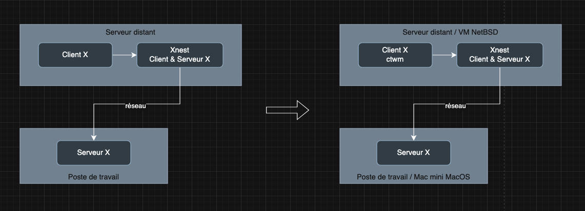
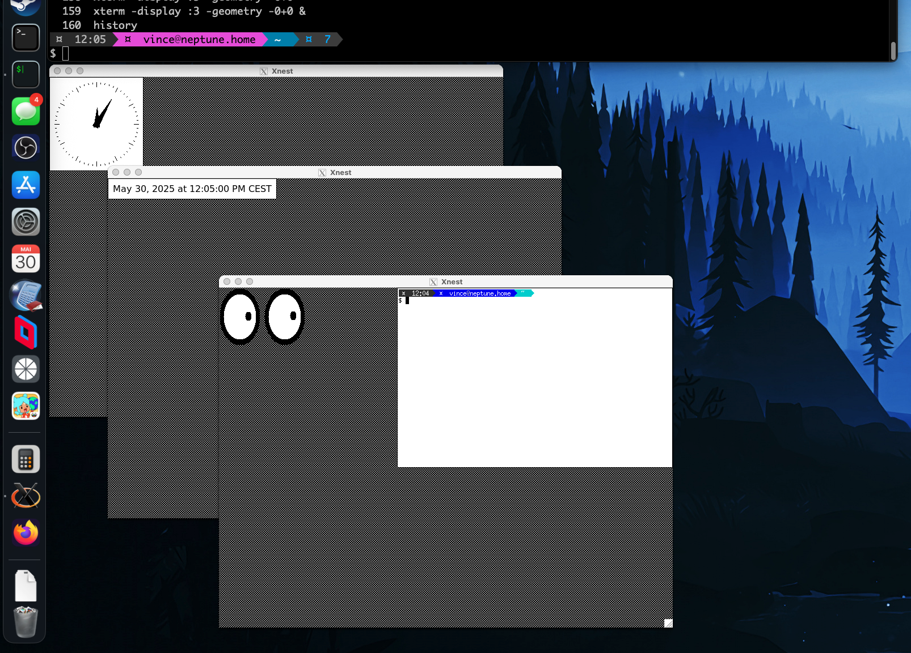

+++
title = "Bureau à distance avec Xnest"
tags = ["unix", "bsd"]
date = "2025-05-30"
+++

Comme je suis nostalgique des vieux Unix, BSD, Linux, des différents gestionnaires de fenêtres et environnements de bureau vintages (twm, ctwm, CDE, Window Maker, Afterstep, XFce, twm, i3, ~~Gnone~~, ~~KDE~~...), j'avais envie de me réinstaller un environnement de bureau et configurer de l'accès à un bureau à distance, comme à la bonne époque!

Pour cela je vais utiliser le bon vieux système de fenêtrage **[X Window System](https://fr.wikipedia.org/wiki/X_Window_System)** (plutôt que VNC ou bien RDP) ainsi qu'un **gestionnaire de fenêtres** ou **environnement de bureau**.

On va également utiliser **Xnest**.

## X Window System

Un rapide rappel sur **[X Window System](https://fr.wikipedia.org/wiki/X_Window_System)** (ou **X** ou **X11**):

c'est donc un système de fenêtrage en mode client/serveur, qui gère écran, clavier et souris.

Comme c'est important de comprendre les notions de client/serveur et les concepts généraux, voici un petit schéma provenant de <https://fr.wikipedia.org/wiki/X_Window_System> pour illuster:


Sources des schémas:

- <https://fr.wikipedia.org/wiki/X_Window_System>
- <https://fr.wikipedia.org/wiki/X.Org>

La notion de client et serveur X n'est pas toujours bien comprise car les rôles du client/serveur semblent inversés.

En fait c'est parce que **X** se place du point de vue de l'_application_ et non de l'_utilisateur_.

- le **serveur X** s'exécute sur un poste de travail de l'utilisateur (poste client, terminal) pour gérer les entrées (claviers et souris) et sortie (l'écran)
- le **client X**, c'est à dire l'application elle même (navigateur, xterm, etc...) s'exécute soit:
  - sur le poste de travail (dans ce cas le serveur et client X sont sur la même machine, tout est exécuté en local)
  - sur un serveur distant (dans le cas la connexion entre le client et le serveur X se fait à distance en réseau via TCPI/IP)

## Cas d'usage

Pour cela mon cas d'usage j'ai sous la main:

- **poste de travail**: un Mac mini Apple avec macOS et le serveur X Quartz déjà installé
- **serveur distant**:une VM NetBSD 10.1 qui tourne sur Proxmox qui héberge donc les applications à lancer et à afficher sur le poste de travail

Ce que je veux c'est lancer tout un environnement graphique complet, c'est à dire un gestionnaire de fenêtres ou environnement de bureau sur mon poste de travail MacOS pour y afficher les applications hébergées et exécutées sur la VM NetBSD: en somme mon bureau à distance.

Mais je ne veux pas juste afficher une seule fenêtre, en effet on pourrait simplement exécuter un serveur X sur le Mac (XQuartz) et lancer une application depuis la VM NetBSD en indiquant que l'affichage se fera sur le Mac.

Je veux bien tout l'environnement et non juste une seule application ou une fenêtre.

Commençons par le prérequis.

## Configuration du X11 Forwarding avec SSH

On a besoin de configuer le démon SSH pour qu'il permette de rediriger les connections X11 depuis le serveur distant vers le poste de travail.

Pour cela, sur notre serveur distant, ici la VM NetBSD, on modifie la configuration du daemon SSH pour autoriser le forwarding X11.

> le X11 forwarding permet de faire du déport d'affichage entre 2 machines avec SSH

```sh
ssh vince@neptune
$ ssh  vince@neptune
Last login: Fri May 30 11:57:32 2025 from 192.168.10.101
NetBSD 10.1 (GENERIC) #0: Mon Dec 16 13:08:11 UTC 2024

Welcome to NetBSD!
$ su
Password:
# vi /etc/ssh/sshd_config
```

```sh
X11Forwarding yes
```

On pourrait faire mieux niveau sécurité et autoriser le X11 forwarding pour un seul utilisateur uniquement, mais là on fait simple!

On redémarre notre démon SSH sur notre machine NetBSD.

```sh
# /etc/rc.d/sshd restart
Stopping sshd.
Starting sshd.
```

Une fois le démon redémarré avec X11 forwarding activé, on se connecte à notre serveur distant (la VM NetBSD) depuis notre poste de travail (Mac mini macOS):

```sh
ssh -X vince@neptune
```

On peut regarder la man page de la commande ssh pour avoir les détails des options **-X** et **-Y** pour activer X11 forwarding:

```text
     -X      Enables X11 forwarding.  This can also be specified on a per-host
             basis in a configuration file.

             X11 forwarding should be enabled with caution.  Users with the
             ability to bypass file permissions on the remote host (for the
             user's X authorization database) can access the local X11 display
             through the forwarded connection.  An attacker may then be able
             to perform activities such as keystroke monitoring.

             For this reason, X11 forwarding is subjected to X11 SECURITY
             extension restrictions by default.  Refer to the ssh -Y option
             and the ForwardX11Trusted directive in ssh_config(5) for more
             information.

     -x      Disables X11 forwarding.

     -Y      Enables trusted X11 forwarding.  Trusted X11 forwardings are not
             subjected to the X11 SECURITY extension controls.
```

```sh
$ ssh -X vince@neptune
Last login: Fri May 30 09:41:28 2025 from 192.168.10.101
NetBSD 10.1 (GENERIC) #0: Mon Dec 16 13:08:11 UTC 2024

Welcome to NetBSD!
$
```

Maintenant pour tester, on lance une application depuis la VM NetBSD, ici on lance l'application de démo **xeyes** juste pour vérifier que c'est ok:

```sh
xeyes
```

L'application **xeyes** exécutée sur la VM NetBSD s'affiche bien sur le poste de travail (et donc l'affichage est prise en charge par le serveur XQuartz installé sur macOS).


Maintenant qu'on a validé que cela fonctionne, passons à notre cas d'usage, c'est à dire l'affichage d'un environnement complet à l'aide de **Xnest**.

## Xnest

C'est là qu'entre en jeu **Xnest**: c'est à la fois un **client X** et un **serveur X**.

Voyons voir la man page de **Xnest**:

```sh
man Xnest
```

```text
NAME
       Xnest - a nested X server

SYNOPSIS
       Xnest [ options ]

DESCRIPTION
       Xnest is both an X client and an X server.  Xnest is a client of the
       real server which manages windows and graphics requests on its behalf.
       Xnest is a server to its own clients.  Xnest manages windows and
       graphics requests on their behalf.  To these clients, Xnest appears to
       be a conventional server.
```

C'est vraiment très pratique car en fait on va exécuter Xnest en tant que serveur X sur la VM NetBSD.

Comme il est également aussi un client X, on va l'afficher sur notre poste de travail sur lequel on a notre serveur X11 XQuartz (XQuartz considérant ainsi que Xnest est un client X).

Un schéma sera plus simple pour comprendre de quoi on parle:



- **Xnest** (exécuté depuis le serveur distant NetBSD) est le serveur X d'un point de vue du client X exécuté lui aussi sur le même serveur distant (notre VM NetBSD)
- Notre client X sera l'application xclock (ctwm sur le schéma, il s'agit d'un gestionnaire de feneêtres mais c'est le même principe, c'est un client X)
- **Xnest** est le client X d'un point de vue du serveur X XQuartz qui lui tourne sur le poste de travail, c'est à dire le Mac mini MacOS.

C'est parti, on voit comment on fait ça!

```sh
Xnest -geometry 800x600 :1 &
```

Ici on lance un serveur X Xnest en précisant la taille souhaitée (800x600) et l'affichage (:1).

Ensuite on lance une application (client X) qui esont donc affichée sur ce serveur X Xnest.

```sh
xclock -display :1 &
```


On voit notre fenêtre Xnest qui est donc le serveur X affiché comme client X par XQuartz sur le poste de travail Mac mini macOS.

Dans cette fenêtre Xnest, on peut voir notre client X xclock qui s'affiche.

> On reconnaît bien le serveur X avec l'affichage caractéristique avec la trame grise en arrière plan.
> A ce stade, on n'a pas encore lancé de gestionnaire de fênêtre ni environnement de bureau, c'est pourquoi xclock s'affiche en haut à gauche et qu'on ne voit aucun système de fénêtrage

Avant de lancer un gestionnaire de fenêtre, on va s'amuser un peu en lançant plusieurs serveurs X et clients X, après tout rien ne nous en empêche !

```sh
Xnest -ac -geometry 800x600 :2 &
Xnest -ac -geometry 800x600 :3 &
xclock -digital -display :2 &
xeyes -display :3 &
xterm -display :3 -geometry -0+0 &
```



On voit donc bien apparaître nos 3 fenêtres Xnest et les applications xclock, xeyes et xterm exéctuées et affichées sur ces 3 serveurs Xnest.

Ces 3 serveur X Xnest étant aussi des clients X, ils sont donc affichés par le serveur X XQuartz sur le poste de travail.

> Cela ne sert strictement à rien, c'est juste pour montrer à titre d'exemple qu'on peut exécuter autant de serveurs et clients X que l'on veut!

## Maintenant l'environnement de bureau

Quand on parle de gestionnaire de fenêtres ou/et d'environment de bureau, c'est bien 2 choses différentes:

- **gestionnaire de fenêtres**: comme son nom l'indique il gère les fenêtres! Il permet de déplacer, redimensionner, iconifier, minimiser, agrandir, fermer les fenêtres
- **environnnement de bureau**: il comprend le gestionnaire de fenêtres plus tout ce qu'il faut pour gérer un environment de bureau: barre des tâches et/ou d'outils, une gestionnaire de fichiers, des bureaux virtuels et parfois aussi de nombreuses applications supplémentaires, etc...

Avant tout, il faut terminer les processus qu'on a lancé précédemment pour éviter d'avoir des problèmes avec des serveurs X déjà lancés.

Pour commencer on va installer un environnement de bureau **xfce4** puis on essayera également **CDE (Common Desktop Environment)**.

### XFCE

Sur notre serveur distant, on va installer le package **xfce4**, ici le serveur distant est la VM NetBSD, l'installation du package et la configuration sont donc propre à NetBSD.

Installation du package:

```sh
# pkgin install xfce4
```

Configuration de dbus nécessaire à xfce4:

```sh
# cp /usr/pkg/share/examples/rc.d/dbus /etc/rc.d
# echo dbus=YES >> /etc/rc.conf
# service dbus start
```

Une fois les packages installés, on va lancer notre client et serveur X Xnest puis notre environnement de bureau **xfce4**:

On a juste 2 commandes à lancer:

- Xnest qu'on a vu déjà plus haut
- et le gestionnaire de bureau xfce4

```sh
Xnest -ac -geometry 1980x1200 :1 &
dbus-launch xfce4-session --display :1 &
```

On a notre environnement de bureau **xfce4** de la VM NetBSD lancé sur notre poste de travail macOS:


### CDE (Common Desktop Environment)

Maintenant on va faire pareil avec l'environnement de bureau CDE pour le côté vintage!

Idem on recherche et installe le package:

```sh
# pkgin search cde
abcde-2.9.3nb5       Command-line utility to rip and encode an audio CD
cde-2.5.2nb1 =       Common Desktop Environment
cdecl-2.5nb3         Utility to explain and compose C and C++ declarations
kdebugsettings-23.08.4nb6  Application to enable/disable qCDebug
libmpcdec-1.2.6      Portable Musepack decoder library (V7)
p5-DBIx-Class-DynamicDefault-0.04nb11  DBIx::Class component to automatically set and update fields
p5-Parse-RecDescent-1.967.15nb8  Perl5 module to generate recursive-descent parsers
py27-cdecimal-2.3nb1  Arbitrary precision decimal floating point arithmetic

=: package is installed and up-to-date
<: package is installed but newer version is available
>: installed package has a greater version than available package
```

```sh
# pkgin install cde
```

La configuration de CDE pour NetBSD est expliquée dans ce fichier: _/usr/pkg/share/doc/cde/README.netbsd_

```sh
$ cat /usr/pkg/share/doc/cde/README.netbsd
-----------------------------------------------------------------------
For CDE to properly work on NetBSD,
the following information must be registered by hand.

/etc/rc.conf:
rpcbind=YES
rpcbind_flags="-l"

/etc/inetd.conf:
dtspcd  stream tcp nowait root /usr/pkg/dt/bin/dtspcd dtspcd
cmsd/2-5 dgram rpc/udp wait root /usr/pkg/dt/bin/rpc.cmsd rpc.cmsd
ttdbserver/1 stream rpc/tcp wait root /usr/pkg/dt/bin/rpc.ttdbserver rpc.ttdbserver

/etc/rpc:
cmsd  100068 dtcalendar
ttdbserver 100083 ttooltalk

/etc/hosts
::1                     <hostname>        localhost       localhost.
127.0.0.1               <hostname>        localhost       localhost.
-----------------------------------------------------------------------
```

Voila nous n'avons plus qu'à lancer l'environnement de bureau **CDE**:

```sh
Xnest -ac -geometry 1980x1200 :1 &
export DISPLAY=:1 && /usr/pkg/dt/bin/Xsession
```

Me voici de retour dans les années 90 quand j'étais étudiant en DUT et ensuite école d'ingénieur.

On travaillait sur des stations Sun SPARCStation sous Solaris et on se connectait depuis des terminaux X.


## Conclusion

Vous allez me dire, on sait faire la même chose avec VNC, RDP: oui mais bon c'est juste pour s'amuser et le côté ludique!

Je n'ai pas tout expliqué en détail, ni non plus des inconvénients de cette solution:

- je n'ai pas expliqué la variable DISPLAY: on affiche sur une machine mais aussi sur un écran. Variable à connaître quand on utilise X11
- on aurait pu faire pareil sans X11 forwarding (avec ```xhost +``` et ```export DISPLAY=...```)
- inconvénients:
  - performance: c'est lent. Il faudrait sans doute compresser et changer le cypher utilisé par ssh avec X11 forwarding
  - problème de sécurité et vulnérabilité
  - très sensible à la latence
  - ...
- XFree86 versus XOrg vesus Wayland

## Références

- [X Window System](https://fr.wikipedia.org/wiki/X_Window_System)
- [NetBSD - X Window System](https://www.netbsd.org/docs/guide/en/chap-x.html)
- [XQuartz pour macOS](https://www.xquartz.org/index.html)
- [CDE - Common Desktop Environment](https://sourceforge.net/p/cdesktopenv/wiki/Home/)
